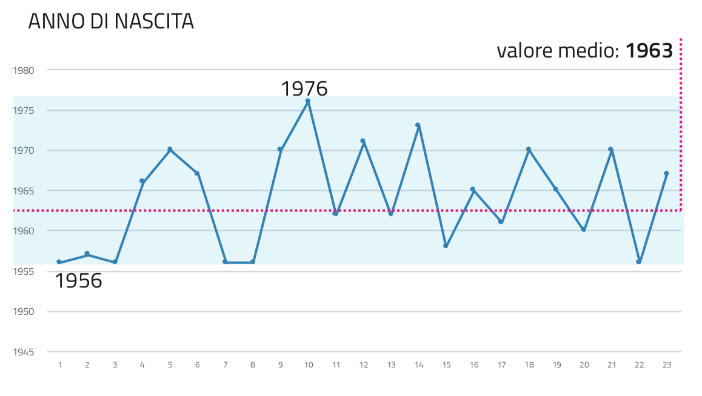
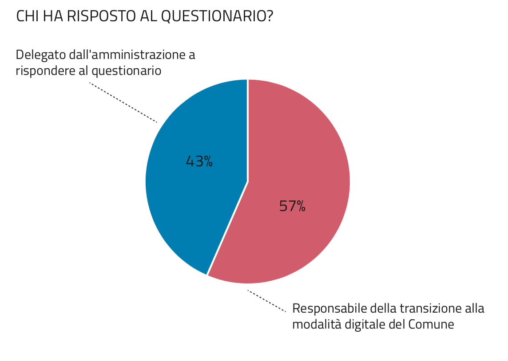
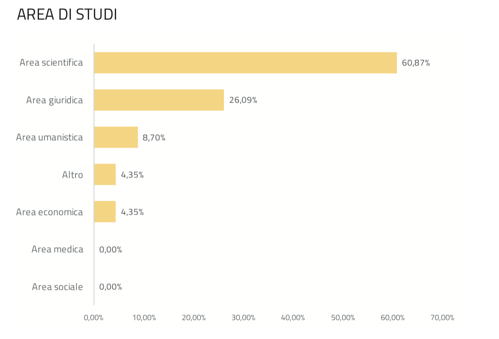
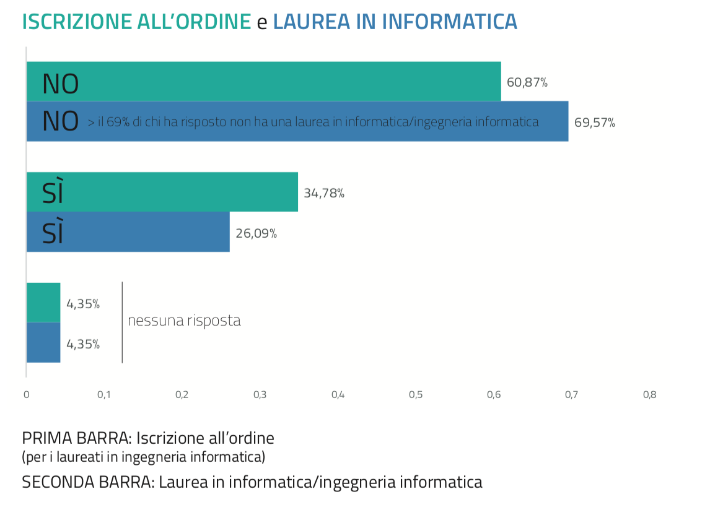
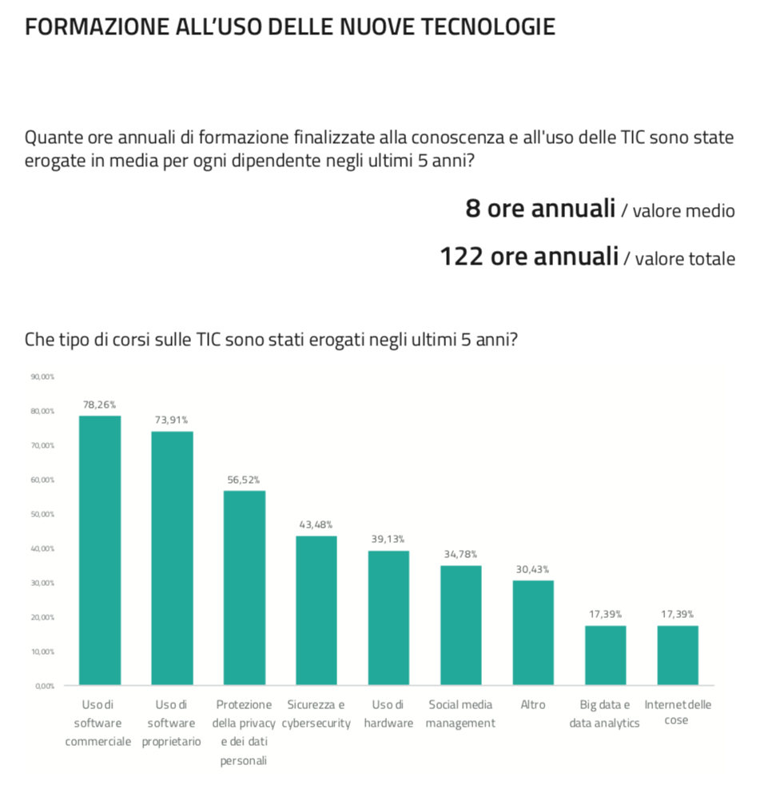
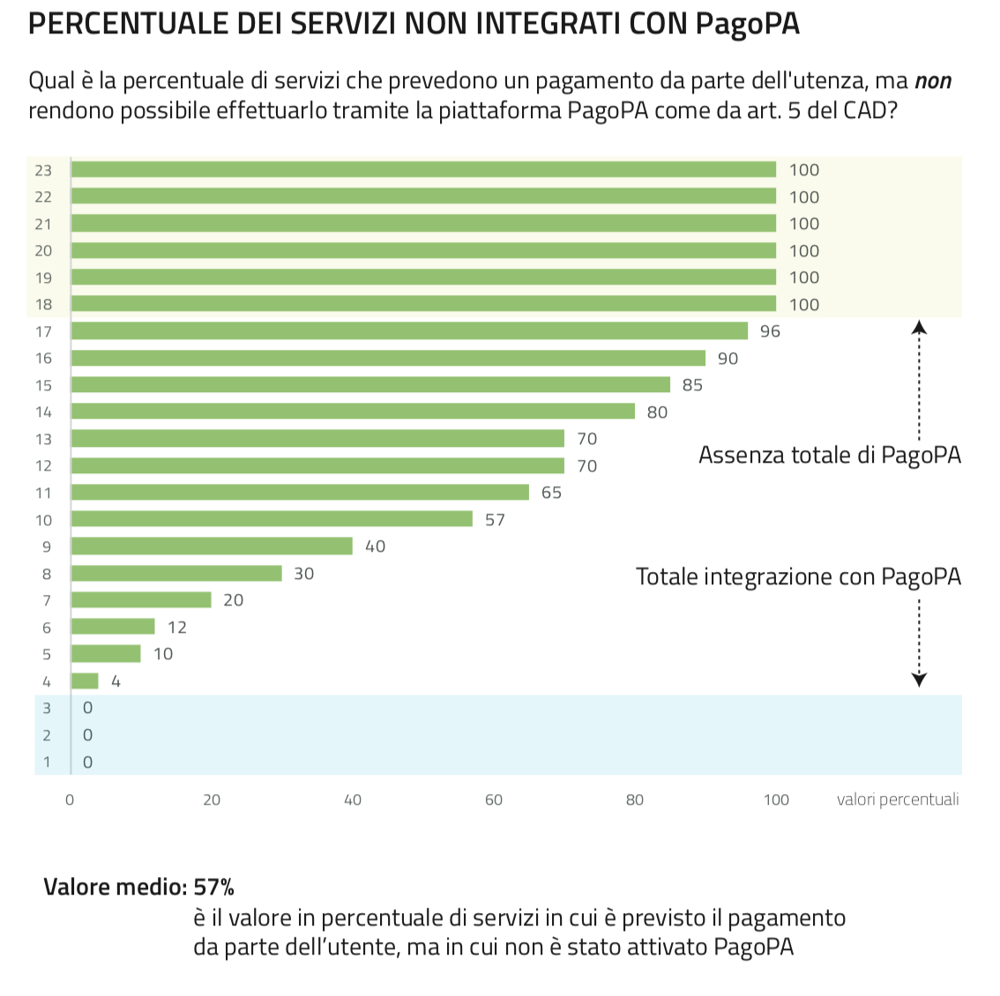
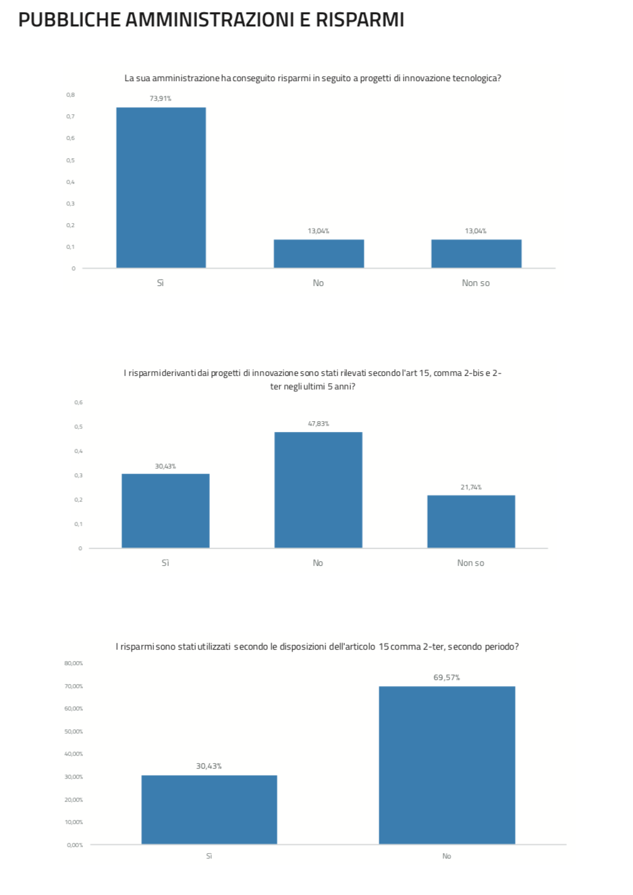

======================================================
Cap 4 | Le criticità della digitalizzazione in Italia
======================================================

   ABSTRACT | *Il Capitolo presenta le criticità, gli ostacoli e le problematiche che le pubbliche amministrazioni devono affrontare nel           
   processo di trasformazione digitale delle pubbliche amministrazioni che sono emersi nel corso dei filoni di inchiesta. La prima      
   indagine è quella relativa allo stato di attuazione del Codice dell’Amministrazione Digitale (CAD), da cui emerge un inadeguato livello 
   di conoscenza e di applicazione delle disposizioni di legge da parte delle PA ed una carenza di competenze informatiche e manageriali 
   dei dirigenti pubblici.* 
   
   *La seconda inchiesta è quella relativa all’Anagrafe Nazionale della Popolazione Residente (ANPR), che ha voluto fare luce sui continui 
   ritardi nell’implementazione di tale progetto dovuti ad uno scarso coinvolgimento degli stakeholder nella fase di progettazione e 
   sviluppo e ad un inefficiente approccio top-down, con la posizione dominante del soggetto incaricato di sviluppare il sistema favorita 
   dalle poche competenze competenze tecnologiche e manageriali in capo al Ministero dell’Interno.* 
   
   *Il terzo filone d’inchiesta ha riguardato i presunti malfunzionamenti del Sistema Informativo Agricolo Nazionale (SIAN) che negli anni 
   sono stati oggetto di indagine sia da parte della magistratura, sia degli organi di stampa. Come per ANPR, anche in questo caso la 
   Commissione ha rilevato come le maggiori criticità emerse siano relative da una parte, a una governance troppo sbilanciata a favore 
   della società esterna incaricata di sviluppare e gestire il SIAN, dall’altra, a un progressivo depauperamento di competenze, anche a 
   causa della volontà del Legislatore, dal Ministero e dall’Agea.*   

   *Il quarto tema d’indagine si è concentrato sul Ministero dell'Istruzione, dell'Università e della Ricerca, in particolare si è 
   indagato sulle disfunzioni dall'algoritmo programmato per gestire la procedura automatizzata dei trasferimenti interprovinciali degli 
   insegnanti. Sempre nell'ambito del MIUR, è stato fatto un approfondimento sulle spese sostenuto dal Ministero in relazione alle 
   postazioni di lavoro, in quanto il contratto quadro comprende forniture che sono possibili anche attraverso altre convenzioni Consip.* 
   
   *Infine, il quinto argomento d’inchiesta è quello relativo al sistema informativo di gestione dei migranti, da cui sono emersi, in 
   particolare dall'audizione del Ministero dell'Interno, notevoli ritardi nella messa in opera del software. In un primo momento, 
   l'implementazione era prevista per giugno 2017, scadenza in seguito prorogata a dicembre di quest'anno. La Commissione ha quindi preso 
   atto dell'ulteriore rinvio, sospendendo l'indagine in attesa di nuovi sviluppi.*
   

4.1 Il responsabile alla transizione digitale
^^^^^^^^^^^^^^^^^^^^^^^^^^^^^^^^^^^^^^^^^^^^^
La Commissione, nel corso della sua indagine, ha ritenuto opportuno verificare il grado di competenze possedute dai responsabili del settore delle ICT nelle pubbliche amministrazioni, con particolare riferimento al livello di adempimento dell’articolo 17 del Codice dell’Amministrazione Digitale (CAD), che prevede l’istituzione del responsabile della transizione alla modalità operativa digitale. 

.. important::
   Nello specifico, `l'articolo 17 <http://cad.readthedocs.io/it/ver_2017-12-13/capo1_sezione3_art17.html>`_, così come novellato dal 
   decreto legislativo 26 agosto 2016, n. 179, stabilisce che ogni Pubblica       
   Amministrazione *“affida ad un unico ufficio dirigenziale generale, la transizione alla modalità operativa digitale e i conseguenti    
   processi di riorganizzazione finalizzati alla realizzazione di un’amministrazione digitale e aperta, di servizi facilmente utilizzabili 
   e di qualità, attraverso una maggiore efficienza ed economicità”.* 
   
La Commissione,  ritenendo centrale il ruolo di progettazione e coordinamento strategico del responsabile sopracitato, al fine di una corretta, efficace ed efficiente transizione digitale, ha richiesto alle amministrazioni dei diversi livelli di governo – ministeri, regioni, città metropolitane e maggiori comuni  – i decreti di nomina degli uffici dirigenziali generali, ex articolo 17 del CAD. **Il primo problema, di conseguenza, che la Commissione si è trovata ad affrontare è stato quello di reperire le informazioni richieste, a causa di una scarsa  reattività delle amministrazioni, che hanno fatto pervenire le risposte con notevole ritardo rispetto alle richieste.** Si noti come le richieste dei decreti di nomina ai ministeri siano state inviate dalla Commissione il 24 marzo 2017 e come la prima risposta sia pervenuta solamente l’11 aprile 2017, mentre nella metà dei casi – 25 su 49 – le amministrazioni non hanno fatto pervenire alcuna risposta, nonostante ripetuti solleciti.

La seconda criticità è riferita al contenuto delle informazioni che la Commissione ha raccolto, che ha messo in risalto come il numero degli uffici dirigenziali generali ex art. 17 del CAD, nominati dalle amministrazioni, risulti basso e insoddisfacente. Infatti, **la maggioranza delle pubbliche amministrazioni non ha provveduto alla nomina del responsabile alla transizione alla modalità operativa digitale, facendo emergere un ingiustificato ritardo verso un adempimento obbligatorio, entrato in vigore dal settembre del 2016, circostanza che ha messo in luce un diffuso livello di inadempimento della legge da parte delle amministrazioni.** Va sottolineato come, sebbene l’ultima formulazione dell’articolo 17 del CAD risalga al settembre 2016, la richiesta di individuare un unico centro di competenza all’interno delle amministrazioni centrali, invece, fosse prevista sin dalla versione originale dell’art. 17 in vigore nel 2005. Il Legislatore, inoltre aveva modificato nel 2011 la norma, specificando che si dovesse identificare un unico ufficio dirigenziale generale. Va, infine, fatto notare come già nel 1993, l’articolo 10 del decreto legislativo n. 39 imponesse alle pubbliche amministrazioni di individuare *“un dirigente generale (...) quale responsabile per i sistemi informativi automatizzati”.*

.. note::

   Entrando nel dettaglio, su 13 ministeri, 8 [#]_ hanno provveduto alla nomina, su 14 città metropolitane soltanto 5 [#]_ hanno 
   rispettato l’obbligo di legge, mentre i dati peggiorano se si prendono in esame le Regioni, dove ci sono state soltanto 7 [#]_ nomine 
   su 21. 
   
Ad aggravare ulteriormente il quadro, il fatto che tutte queste nomine siano avvenute successivamente all’invio delle richieste da parte della Commissione e su impulso di questa, che ha agito da pungolo nei confronti delle amministrazioni, col fine di adempiere a quanto previsto dalla normativa. Per quanto riguarda i maggiori comuni italiani, su 27 solo 11 hanno nominato un responsabile alla transizione digitale.

Il terzo problema è emerso rispetto alla qualità delle nomine, con particolare riferimento al tipo e al livello di competenze in possesso dei responsabili ex art. 17 del CAD, requisiti che lo stesso Codice stabilisce nell’articolo 17, comma 1-ter: *“il responsabile dell’ufficio di cui al comma 1 è dotato di adeguate competenze tecnologiche, di informatica giuridica e manageriale”.* 

La Commissione ha scelto quattro criteri indicativi, per valutare in prima approssimazione il livello di adempimento dell’art. 17, comma 1-ter:
- iscrizione all’ordine degli ingegneri informatici;
- laurea in informatica o equivalenti; 
- esperienza almeno quinquennale nel settore privato nel campo dell’ICT; 
- esperienza almeno quinquennale nel settore pubblico nel campo dell’ICT.

Stabiliti i criteri di analisi, la Commissione ha analizzato i *curricula* dei dirigenti generali nominati responsabili alla transizione digitale evidenziando il rischio di assenza dei requisiti richiesti dalla normativa vigente. **Degli otto responsabili ex art. 17, nominati dai ministeri, uno solamente è risultato essere in possesso di una laurea idonea al ruolo ricoperto, nel caso specifico in ingegneria informatica.** Nei rimanenti sette casi: cinque sono in possesso di una laurea in giurisprudenza, uno in medicina e chirurgia ed uno in ingegneria civile. Di questi profili, solamente in tre casi la formazione universitaria è stata integrata da una esperienza almeno quinquennale nel settore pubblico nel campo delle ICT. 

Situazione analoga per le Regioni, dove solo due nomine delle sette totali, presentano i requisiti sul possesso della laurea informatica o equivalente richiesta dal CAD, mentre delle cinque nomine relative alle città metropolitane, soltanto una rispetta i requisiti.

------------
   
NOTE paragafo 4.1

.. [#] Mibact, Giustizia, MIT, Difesa, Interno, Salute, Mise, Ambiente.
.. [#] Genova, Napoli, Palermo, Roma, e Venezia.
.. [#] Campania, Liguria, P.A. Trento, Sardegna, Toscana, Piemonte, Friuli Venezia Giulia.

------------

4.1.1 Lo stato di attuazione del CAD, tra inadempienze e criticità
^^^^^^^^^^^^^^^^^^^^^^^^^^^^^^^^^^^^^^^^^^^^^^^^^^^^^^^^^^^^^^^^^^^
Successivamente all’analisi dei *curricula*, la Commissione ha ritenuto opportuno convocare in audizione alcuni dei dirigenti nominati responsabili ex art. 17, in modo da verificare lo stato di attuazione del CAD da parte delle loro organizzazioni e quali siano le iniziative che sono state o verranno prese in tale direzione. Queste audizioni hanno avuto un duplice obiettivo: da una parte, la Commissione ha voluto verificare il livello di competenza digitale e manageriale dei responsabili nominati; dall’altra, si è cercato di comprendere a che punto si trovi il processo di trasformazione digitale delle pubbliche amministrazioni, quale sia la qualità degli interventi e se la riorganizzazione in senso digitale stia avvenendo in modo coordinato, corretto e coerente con quanto prescritto dal CAD. 

Nel corso dell’indagine sono stati rilevati degli elementi trasversali e comuni tra le pubbliche amministrazioni audite, che la Commissione ritiene si possano estendere dal campione di riferimento alla totalità delle amministrazioni. **Dalle diverse audizioni con i responsabili della transazione digitale dei ministeri, è emersa un’amministrazione che viaggia a due velocità: da un parte il front office che fa registrare risultati perlomeno soddisfacenti, di contro il back office, che evidenzia tutta la difficoltà delle amministrazioni nell’utilizzo dell’ICT nei suoi processi interni.** Per quanto riguarda il *front office*, la Commissione ha potuto rilevare un buon livello di digitalizzazione in riferimento all’interazione tra amministrazione e cittadino. Le pubbliche amministrazioni dimostrano attenzione nel digitalizzare i canali di comunicazione con i privati e nella totalità dei casi, le imprese scambiano informazioni e documentazione con le amministrazioni esclusivamente tramite canali telematici, con la conseguente eliminazione dell’uso del *fax*. I siti web delle amministrazioni tendono ad offrire contenuti sempre più uniformi e standardizzati, anche se non si prevede, nella maggior parte dei casi, la possibilità per l’utente di esprimere la propria soddisfazione sul servizio, come invece stabilito dall’`articolo 63 <http://cad.readthedocs.io/it/ver_2017-12-13/capo5_sezione3_art63.html>`_ del CAD. Inoltre c’è un impegno da parte delle pubbliche amministrazioni nel favorire gli *open data* anche se, da questo punto di vista, non c’è una piena consapevolezza dell’importanza dell’utilizzo del dato, il quale spesso viene vissuto più come mero orpello di trasparenza amministrativa, che come un utile strumento di efficientamento dei procedimenti e delle decisioni amministrative. 

Altro aspetto positivo emerso dalle audizioni è quello riferito alle principali piattaforme abilitanti previste dal nostro ordinamento, tra queste le più diffuse sono la *fatturazione elettronica*, *PagoPA* e *NoiPA*, mentre appare in crescita l’attenzione delle pubbliche amministrazioni nel prevedere l’allaccio dei propri servizi a *SPID*. Ad esclusione della fatturazione elettronica, che la Commissione può ritenere realizzata e utilizzata nella totalità delle esperienze audite, i progetti sopra citati sono tutte azioni in corso che verranno completate, a seconda delle amministrazioni, tra la fine dell’anno 2017 e primi mesi del 2018. Nonostante i progetti siano in fase di realizzazione e scontino un ingiustificato ritardo, dalle audizioni si evidenzia come le pubbliche amministrazioni non siano ferme al palo, ma abbiano avviato, seppur con fatica e resistenze interne, un processo di trasformazione digitale, quantomeno dal lato *front office*, con una particolare accelerazione a partire dal 2014. 

Di segno opposto il giudizio relativo al *back office*, dove le amministrazioni palesano gravi criticità, ritardi, resistenze ed inadempienze della legge. Dalle risposte e dalle informazioni raccolte durante le audizioni, alla Commissione è apparsa chiara una serie di problematiche comuni a tutte le amministrazioni audite, relativa ad una ingiustificata e reiterata inadempienza delle disposizioni contenute nel CAD. Le dichiarazioni rilasciate in audizione fotografano una pubblica amministrazione che si affida ancora troppo alla carta, disattendendo la legge che impone di formare gli originali dei propri documenti con mezzi informatici sin dalla prima versione dell’`articolo 40 <http://cad.readthedocs.io/it/ver_2017-12-13/capo3_art40.html>`_ del CAD, mentre la dematerializzazione degli atti è ancora a livelli insufficienti ed insoddisfacenti. Alcuni segnali positivi si registrano nelle comunicazioni interne che avvengono nella maggior parte dei casi tramite posta elettronica, ma la cultura analogica dell’amministrazione novecentesca, diffusa tra i funzionari e i dirigenti pubblici, mantiene ancora in vita i faldoni di documenti cartacei, diffonde ritrosia nell’utilizzo della firma digitale ed impedisce la completa produzione dei documenti nativi digitali. 

.. note::

   A titolo esemplificativo, si riporta il caso di due ministeri, che hanno risposto ad una richiesta della Commissione facendo pervenire 
   un documento cartaceo contenuto in una busta, trasportata e consegnata per mezzo di un motociclista, nonostante il CAD stabilisca che 
   le comunicazioni tra amministrazioni debbano avvenire solamente in formato digitale e la Commissione avesse richiesto la documentazione 
   tramite PEC richiedendo esplicitamente di ottenerla per via telematica. 
   
Altre disposizioni disattese sono quelle relative ai piani delle performance, che di solito non prevedono indicatori riferiti alla trasformazione digitale, non contengono obiettivi precisi e definiti riguardo alle azioni da intraprendere e non tengono conto del grado di digitalizzazione raggiunta nella valutazione delle responsabilità del dirigente, nonostante le prescrizioni degli articoli 3-*bis*, 12 e 52 del CAD. Inoltre quando sono presenti, i risparmi di costo, generati dall’utilizzo della ICT, non vengono quantificati e, ancora più grave, non vengono nemmeno reinvestiti nel fondo premialità dei dipendenti, come previsto dall’`articolo 15 <http://cad.readthedocs.io/it/ver_2017-12-13/capo1_sezione3_art15.html>`_ del CAD sin dal 2011. 

In generale, quindi, la Commissione ha rilevato nelle pubbliche amministrazioni delle carenti competenze digitali, alle quali non viene posto rimedio tramite la formazione continua, le cui ore di formazione in ICT, somministrate ai dipendenti in ottemperanza a quanto previsto dall’`articolo 13 del CAD <http://cad.readthedocs.io/it/ver_2017-12-13/capo1_sezione3_art13.html>`_ sin dal 2006, risultano limitate ed insufficienti. **L’inadeguata presenza di competenze ICT, l’assenza di piani di performance e la mancanza di indicatori di obiettivo in linea con il CAD, si traducono nell’incapacità delle amministrazioni di trasformare le proprie organizzazioni interne in senso innovativo.**

4.1.2  Il questionario sui comuni
^^^^^^^^^^^^^^^^^^^^^^^^^^^^^^^^^^^^^^^^^^^^^^^^^^^^^^^^^^^^^^^^^^^

Al fine di raccogliere in maniera più veloce i dati riguardo all’applicazione del CAD a livello comunale, la Commissione ha deliberato, nella fase finale dei suoi lavori, di sottoporre ai maggiori comuni italiani un questionario *oline*. Per determinare quali comuni coinvolgere sono stati utilizzati più criteri contemporaneamente: tutti i comuni con popolazione superiore a 250 mila abitanti, tutti i comuni capoluogo di regione, tutti i comuni corrispondenti a città metropolitane. I comuni selezionati in questo modo sono stati in tutto 26, e di questi, 23 hanno effettivamente partecipato al questionario [4]_. 

In prima battuta, a ciascun sindaco è stato richiesto il nominativo del responsabile della transizione alla modalità digitale del comune (12 comuni hanno risposto positivamente). A quei comuni che non avevano ancora effettuato la nomina è stato chiesto di indicare un delegato per la compilazione del questionario (11 comuni rientrano in questa categoria). Tre comuni non hanno dato alcuna risposta alle richieste della Commissione.

Successivamente si è passati alla somministrazione del questionario. Si è utilizzata come traccia la scaletta di domande utilizzata nelle audizioni dei responsabili alla transizione digitale di ministeri e regioni, arricchendola con alcune domande riguardo al titolo di studio e all’esperienza lavorativa del compilante, le tipologie di interventi formativi in campo ITC, i rapporti con i fornitori e le tipologie di professionalità utilizzate. Per consentire un’analisi anche quantitativa dei risultati, le risposte sono state, ove possibile, incasellate in griglie, e ove opportuno, rese obbligatorie.

Il numero dei dirigenti responsabili alla transizione digitale segue il *trend* negativo delle PPAA centrali; infatti poco più della metà dei comuni ha effettuato tale nomina.

Altro elemento, in linea con ciò che accade nei ministeri, è la carenza di titoli dei responsabili alla transizione. In realtà, il 61 per cento del campione esaminato ha una laurea in ambito scientifico e servirebbe un’analisi più approfondita per chiarire le specifiche conoscenze. Rimane comunque il dato riferito alla laurea in ingegneria informatica o in informatica, di cui sono in possesso solamente sei responsabili. Solo in parte questa carenza del titolo di studio è sopperita dall’esperienza nel settore privato, mentre molto di più incide l’esperienza pregressa nel settore pubblico, nell’86 per cento dei casi.

|
|

   
|
|

   
|
|

   
|
|

   
|
|
|

I comuni sono impegnati nel trasmettere le competenze ai propri dipendenti attraverso corsi di formazione, anche se le ore utilizzate a tale scopo – **ammontano a circa 8 ore l’anno** – sembrano essere troppo poche, ma, allo stesso tempo, maggiori rispetto ad alcuni ministeri. La maggior parte dei corsi viene realizzata in presenza, anche se si segnala un buon utilizzo anche degli strumenti formativi on line, come *webinar* e *e-learning*. La grande fetta dei contenuti formativi riguarda le competenze informatiche di base, quali l’utilizzo di *software*, la protezione della privacy e dei dati personali, la sicurezza e la *cybersecurity*, mentre solo in piccola parte la formazione si dedica ai nuovi bisogni delle PA, come ad esempio *big data*, *data analytics* e IoT (*Internet of Things*).

|
|

   
|
|
|

Per quanto riguarda la questione procedimentale e quella della dematerializzazione, **i risultati che emergono dal questionario sono peggiori rispetto alle PA centrali**: i procedimenti amministrativi che prevedono lo scambio di documenti cartacei con le imprese sono ben il 31 per cento, l’82 per cento delle comunicazione tra PA avviene in formato digitale, ma non si comprende perché esista ancora un 18 per cento in modalità analogica. Inoltre, e il dato è decisamente anacronistico, il 26 per cento dei comuni intervistati mantiene ancora in vita il *fax*, mentre all’interno delle PA locali le comunicazioni tra e con i dipendenti rimangono in modalità analogica nel 28,5 per cento dei casi, in palese violazione di legge.

**Sulla dematerializzazione la strada da percorrere è ancora molta. Il 40 per cento dei documenti originali risulta non essere formato esclusivamente con mezzi informatici. L’87 per cento dei comuni prevede ancora dei procedimenti che hanno bisogno di apposizione di timbri, di firme autografe, di sigle a margine, di bollinature o altre procedure analogiche.** In questo caso esistono degli indicatori e degli obiettivi assegnati ai dirigenti nel piano delle performance, ma non si conoscono le conseguenze sanzionatorie.

|
|

.. figure:: imgrel/Elaborazione_10.png
   :alt: Elaborazione 6
   :align: center
   
|
|

   
|
|

.. figure:: imgrel/Elaborazione_9.png
   :alt: Elaborazione 8
   :align: center
   
|
|
|

Un’altra criticità emersa dal questionario è la scarsa interoperabilità del fascicolo elettronico, infatti solo nel 22 per cento dei casi le PPAA coinvolte nel procedimento amministrativo possono direttamente consultare e alimentare il fascicolo.

Meglio invece sembra essere la trasformazione digitale nei confronti dei cittadini, per quanto riguarda la modalità con cui gli interessati possono esercitare i diritti di cui all’articolo 10 della legge n. 241/1990 sono molto alte, se non la totalità, le percentuali di utilizzo di canali digitali. Sembra essere basso il 26 per cento dei servizi che consentono l’accesso tramite SPID, ma soddisfacente in questa prima fase, in quanto risulta un dato in linea con le PPAA centrali e comunque tale piattaforma vede un’accelerazione avvenuta solamente negli ultimi mesi.

**Un ultimo dato allarmante è quello relativo ai risparmi di costo generati dall’utilizzo delle ICT**, infatti, se da un lato c’è un positivo 74 per cento dei comuni che ha realizzato dei risparmi, dall’altra parte oltre due terzi degli intervistati non hanno rilevato i risparmi e nemmeno li hanno reinvestiti nella contrattazione del personale, come previsto dall’`articolo 15 <http://cad.readthedocs.io/it/ver_2017-12-13/capo1_sezione3_art15.html>`_, comma 2-*bis* e 2-ter del CAD.

|
|

   
|
|
|

In sintesi, le risposte emerse dal questionario descrivono una situazione dei comuni non troppo dissimile a quella delle PPAA centrali: i risultati possono essere considerati soddisfacenti sul lato *front-office*, con gli enti locali sempre più attenti a digitalizzare i servizi e i canali di comunicazione con i cittadini, mentre più negativa è la situazione del *back-office* dove sopravvivono ancora delle consuetudini e delle pratiche di tipo analogico e dove è più difficile realizzare quella trasformazione digitale che ci si attende da una parte per la scarsa attenzione, anche a livello locale come in quello centrale, nel rispetto delle disposizioni del CAD, dall’altra, per la solita assenza di competenze, in particolare nei ruoli apicali.

|
|

.. figure:: imgrel/Elaborazione_14.png
   :alt: Elaborazione 14
   :align: center
   
|
|
|

------------
   
NOTE paragafo 4.1.2

.. [4] I comuni che hanno partecipato al questionario sono: Ancona, Aosta, L’Aquila, Bari, Bologna, Bolzano, Cagliari, Campobasso, Catania, Catanzaro, Firenze, Genova, Napoli, Milano, Padova, Palermo, Perugia, Reggio Calabria, Roma, Trento, Trieste, Venezia, Verona

------------

4.2 L’Anagrafe nazionale della popolazione residente
^^^^^^^^^^^^^^^^^^^^^^^^^^^^^^^^^^^^^^^^^^^^^^^^^^^^^^^^^^^^^^^^^^^

La Commissione d’inchiesta, anche in seguito a quanto emerso durante l’audizione della dottoressa Poggiani, di cui si dirà più oltre, ha analizzato lo stato relativo ad ANPR, l’Anagrafe Nazionale della Popolazione Residente come esempio di progetto strategico di interesse nazionale che, nonostante veda riconosciuta l’importanza, non riesce ad essere completato negli anni e continua ad essere riproposto di legislatura in legislatura, seppure va sottolineata un’accelerazione nell’ultimo periodo. Il progetto, in origine, prevedeva la realizzazione di un’unica banca dati contenente le informazioni anagrafiche della popolazione residente a cui sia i Comuni, sia le pubbliche amministrazioni dovrebbero fare riferimento e tutti coloro che sono interessati ai dati anagrafici, in particolare i gestori di pubblici servizi. Il progetto dell’Anagrafe, per la sua implementazione, è disciplinato attraverso una serie di atti normativi. L’art. 2 del D.L. n.  179/2012, convertito dalla L. n. 221/2012, sostituisce l’art. 62 del Dlgs. 7 marzo 2005, n. 85 e istituisce l’Anagrafe Nazionale della Popolazione Residente. ANPR è quindi subentrata all’INA [5]_ e all’AIRE. [6]_ La progettazione, l’implementazione e la gestione di ANPR è stata affidata a Sogei S.p.a. [7]_ e, con il DPCM del 23 agosto 2013, n. 109, recante le disposizioni per l’attuazione dell’art. 62 del CAD, si è stabilito il subentro dei comuni entro il 31 dicembre 2014. Con l’art. 10 del D.L 19 giugno 2015, n. 78, convertito, con modificazioni, dalla L. 6 agosto 2015, n. 125, si è infine disposto che vengano integrati in ANPR, entro il 31 dicembre 2018, sia l'archivio nazionale informatizzato dei registri di stato civile sia l’archivio del servizio di leva, entrambi gestiti dai comuni. Sotto il profilo dei costi, la Commissione ha stabilito che l’ammontare degli stanziamenti - sommando i contratti esecutivi - risulta essere di 23 milioni di euro. Tra il Ministero dell’Interno e Sogei S.p.a., sono stati stipulati 9 contratti esecutivi, l’ultimo sottoscritto ad aprile 2017. 

------------
   
NOTE paragafo 4.2

.. [5] Indice Nazionale delle Anagrafi
.. [6] Anagrafe della popolazione Italiana Residente all'Estero
.. [7] Art. 1, comma 306 della legge n. 228/2012

------------

4.2.1 I pareri di AgID sui contratti esecutivi
^^^^^^^^^^^^^^^^^^^^^^^^^^^^^^^^^^^^^^^^^^^^^
In riferimento ai contratti esecutivi, sottoscritti dal Ministero dell’Interno e Sogei S.p.a., AgID ha espresso alcuni pareri che la Commissione ha ritenuto opportuno raccogliere ai fini dell’indagine. Va sottolineato come, nonostante AgID abbia tra le sue funzioni le attività di progettazione e di coordinamento di iniziative strategiche, tali pareri siano stati richiesti per la prima volta solo nel 2013, in occasione del terzo contratto esecutivo tra Ministero dell’Interno e Sogei. In quella occasione, fu redatta la nota del 31 ottobre 2013. [8]_ Nel 2014 AgID è stata interpellata in due fasi, rispettivamente in occasione del quinto e del sesto contratto esecutivo. Su tali contratti sono stati resi i pareri nn. 17/2014 e 25/2014. [9]_ Nel dicembre 2015 il Ministero ha richiesto ad AgID un parere sul progetto collaterale “ANPR-estesa”. Tuttavia, in quella specifica occasione venne risposto che non si poteva valutare il progetto e di conseguenza la richiesta fu considerata irricevibile. Il 30 settembre 2016 il Ministero chiedeva ad AgID, con nota prot. 2154, un parere sul settimo contratto esecutivo. Anche in questo caso l’Area pareri ritenne di non poter esaminare la richiesta per profonde carenze informative e predispose quindi una lettera di irricevibilità. Tuttavia, la lettera non fu mai trasmessa ufficialmente al Ministero: se ne discusse solo informalmente con il Dicastero, che ritirò la richiesta per annullare il procedimento. A fine 2016 è stato, infine emesso un parere sull’ottavo contratto esecutivo. Dall’analisi dei pareri sono emerse diverse criticità relative sia al rapporto contrattuale tra Sogei e Ministero dell’Interno, sia alla parte di progettazione e gestione di ANPR. Una prima osservazione riguarda la parte normativa. Infatti, l’Agenzia rileva come il ritardo nell’avanzamento del progetto di ANPR sia dovuto innanzitutto alla *“laboriosa (e non sempre lineare) evoluzione delle norme di riferimento per le attività amministrative concernenti l’anagrafe e lo stato civile, ciò rende il progetto ANPR oggettivamente più complesso di una mera implementazione informatica e il suo successo dipendente anche da fattori non tecnologici e difficilmente prevedibili”.* [10]_ Inoltre, AgID ha ricordato come Sogei S.p.a. non abbia un rapporto giuridico con il Ministero dell’Interno, in quanto la società è l’in house del Ministero dell’Economia e Finanza. Questa mancata relazione tra i due attori del rapporto si ripercuote in una *“insufficiente comunanza di obiettivi tra cliente (il Ministero) e fornitore (Sogei spa), e di conseguenza una mancata sinergia per il raggiungimento degli obiettivi stessi”.* [11]_ Per quanto riguarda l’impianto complessivo della dimensione contrattuale, secondo AgID, deve essere coerente con la dimensione progettuale. ANPR è un progetto importante ed ambizioso che non giustifica la stipula di numerosi contratti esecutivi della durata di pochi mesi: al contrario, sarebbe più utile stipulare tra le parti un contratto a lungo termine. Per quanto riguarda i termini dei contratti esecutivi, emerge un problema innanzitutto di congruità economica, in quanto i corrispettivi dovuti a Sogei S.p.a. si riferiscono al “Contratto Quadro” sottoscritto con il Ministero dell’Interno che, secondo il parere di AgID, non appare coerente con i valori di mercato. Nel parere relativo al quinto contratto esecutivo, l’Agenzia ha ricordato al Ministero dell’Interno di verificare i costi complessivi e gli impegni finanziari da sostenere fino alla conclusione del progetto.

In riferimento alle prestazioni esterne affidate da Sogei Spa a subappaltatori, AgID suggerisce al Ministero di verificare la completa coerenza di quanto previsto dal contratto esecutivo con le disposizioni relative al subappalto nei contratti pubblici, di cui all’art. 118 del D. Lgs. n. 163/2006. Nei contratti esecutivi sono presenti delle voci di spesa che nulla hanno a che vedere con la natura ICT del progetto ANPR, come ad esempio le spese di viaggio e trasferte, che AgID ritiene di escludere dai pareri di congruità economica, in quanto trattasi di importi relativi ad attività non informatiche. Ai fini della presente indagine, è risultato di particolare interesse il parere di AgID in riferimento alla proroga del rapporto tra il Ministero dell’Interno e Sogei S.p.a., stabilita con la stipula dell’ottavo contratto esecutivo, firmato il 28 dicembre 2016. Nel parere fornito, l’Agenzia solleva una serie di criticità riguardanti la gestione parallela da parte di Sogei Spa dei sistemi INA-SAIA/AIRE e ANPR: in particolare, quello che emerge è una asincronia nella remunerazione, prevista a favore della società *in house*, tra il costo e i tempi effettivi di subentro dei comuni nel sistema ANPR, tale da produrre un costo complessivo che assomma i costi di entrambe le gestioni e che non tiene conto del reale utilizzo delle infrastrutture. AgID suggerisce di rivedere il contratto legando i costi ai comuni che sono subentrati effettivamente nel sistema ANPR, sottolineando come un considerevole risparmio si possa raggiungere effettuando una commisurazione del costo della remunerazione al numero dei comuni coperti. Per quanto riguarda la dimensione progettuale, AgID ha portato alla luce una gestione poco efficace e completa da parte di Sogei S.p.a. Per questo motivo l’Agenzia ha ritenuto necessario suggerire di prevedere nei contratti esecutivi l’indicazione di un responsabile tecnico del progetto, anche nella forma di team, come già raccomandato in altre valutazioni precedenti. [12]_ Sarebbero necessarie una o più figure qualificate dal punto di vista tecnico e dotate delle risorse necessarie per espletare il compito di coordinamento del progetto. Inoltre, per ovviare alla necessità di prevedere un forte impulso volto al subentro dei comuni nel sistema ANPR, AgID suggerisce l’inserimento nel gruppo di lavoro di ulteriori figure professionali qualificate, di cui il Ministero possa valutare l’effettiva efficacia nel tempo. L’Agenzia, inoltre, si è concentrata sulla necessità di mettere a disposizione del Ministero degli strumenti per il monitoraggio dell’implementazione del progetto e della qualità del servizio erogato, i cui risultati siano eventualmente analizzabili attraverso indicatori misurabili correlati a funzioni di benchmarking. AgID ha ulteriormente osservato come la parte contrattuale, nella quale si prevede che Sogei procederà *“a realizzare in proprio le applicazioni software soltanto quando le stesse non siano reperibili sul mercato, ovvero quando non sia possibile attuare il riuso delle applicazioni software di proprietà di altre PA, e comunque qualora la loro acquisizione non risulti economicamente vantaggiosa”,* non risulti coerente con l’`articolo 68 <http://cad.readthedocs.io/it/ver_2017-12-13/capo6_art68.html>`_ del CAD, ricordando come questa scelta debba essere responsabilità dell’Amministrazione, quindi del Ministero dell’interno. Infine, l’Agenzia ha sottolineato, quale ulteriore elemento di criticità, l’assenza di un ruolo attivo e partecipe dei comuni, sia nella fase contrattuale che in quella progettuale, nonostante questi siano gli utilizzatori finali del servizio ANPR.

------------
   
NOTE paragafo 4.2.1

.. [8] Capitolo 7, allegato 1, Nota AgID del 31 ottobre 2013
.. [9] Capitolo 7, allegati 2 e 3, pareri AgID 17 e 25 del 2014
.. [10] Capitolo 7, allegato 4, Determinazione AgID 382/2016
.. [11] Ibidem
.. [12] Legge n. 17/2014 e n. 25/2014

------------

4.2.2 L’esito delle audizioni
^^^^^^^^^^^^^^^^^^^^^^^^^^^^^^^^^^^^^^^^^^^^^
Il filone d’indagine su ANPR ha avuto inizio a seguito dell’audizione di **Alessandra Poggiani, ex direttrice generale di AgID**, svoltasi il 1° febbraio 2017. Nel corso dell’audizione, dedicata alla storia dell’Agenzia, Poggiani ha definito *“grave”* la situazione legata ad ANPR. Una delle prime problematiche è quella relativa alla fase di progettazione, in cui si decise di costruire solamente l'anagrafe, escludendo lo stato civile, la leva e l'elettorale. Dall’audizione è emerso come nessun comune fosse stato convocato per partecipare alla progettazione dell’ANPR, nonostante nel 2013 l’ANCI avesse espresso preoccupazioni al Ministero. A complicare le cose, la scelta di non prevedere un *budget* per l’adeguamento dei sistemi degli enti locali, decisione che, secondo Poggiani, avrebbe fatto viaggiare in parallelo e senza mai incontrarsi Sogei e Ministero, a lavoro sul progetto, e i comuni, impossibilitati ad intervenire per rinnovare i contratti con i propri fornitori. A parere di Poggiani, la responsabilità della mancata conclusione del progetto, risiede nella scelta del Ministero di affidarsi ad una società *in house* e, più in generale, in una frammentazione delle competenze, non adeguatamente coordinate, tra AgID, la Funzione Pubblica e l’ANCI. Tuttavia, Poggiani ha teso a escludere responsabilità di origine dolosa, ritenendo che la causa dei problemi risieda piuttosto nell’architettura del sistema mal realizzata e difficilmente attuabile.
 
Ai fini dell’indagine, la Commissione ha svolto quindi alcune audizioni di natura conoscitiva, con l’obiettivo di comprendere le criticità relative al progetto ANPR. Il 21 febbraio 2017 si è svolta l’audizione di **Cristiano Cannarsa, presidente e amministratore delegato di Sogei S.p.a.** Alla data dell’audizione, secondo Cannarsa, il progetto risultava completato da un punto di vista informatico, con il codice *software*, i servizi anagrafici e le funzioni previste all'interno dell'anagrafe, già pienamente operative e funzionanti. Il progetto, a giudizio del presidente di Sogei, ha scontato dei ritardi a causa di un lungo iter amministrativo e legislativo, perché soggetto a due decreti della presidenza del Consiglio dei ministri, di concerto tra Ministero dell'Economia e quello dell’Interno, oltre che un ritardo giuridico per effetto dei cambiamenti dirigenziali di AgID tra il 2014 e il 2015. Cannarsa ha inoltre sostenuto che, in fase di sperimentazione, si fosse palesata una resistenza iniziale da parte dei 7 comuni aderenti, poi divenuti 27, che avevano preferito la soluzione con i web services. Il progetto ANPR prevede infatti due modalità di adesione: web application, che sostituisce il *software* usato dal comune, e *web service*, che permette al comune di continuare ad utilizzare il *software* preesistente che però deve collegarsi all’ANPR. La *“resistenza”* sarebbe imputabile, secondo Cannarsa, a un “senso di appartenenza” e ad una sorta di “resistenza di sistema”, dovuta alla volontà di non rinunciare alla propria anagrafe, poiché i Comuni erano dotati di una copia in loco del sistema anagrafico prima che questo transitasse su quello nazionale. La scelta di sviluppare internamente il *software*, invece di bandire una gara esterna, secondo Cannarsa si è legata ad un aspetto normativo, poiché nel 2012 il legislatore ha fatto obbligo al MEF di rivolgersi a Sogei in quanto *in house: “Sogei si doveva occupare della progettazione, realizzazione ed esercizio dell'Anagrafe nazionale”.* Secondo il presidente di Sogei, per la realizzazione di ANPR, il Ministero dell'interno ha raccolto i fabbisogni, integrandoli in un progetto unitario anche con ANCI, ISTAT, e tutti i rappresentanti, inclusi i responsabili dell'AgID. In sette comuni il collaudo è avvenuto nel 2016 e non ne è stato previsto uno aggiuntivo. Le tempistiche di realizzazione, invece, per il presidente di Sogei dipendono dalle amministrazioni e dai comuni. 

L’8 marzo si è svolta l’audizione di **Paride Gullini, presidente di ANUSCA, l’Associazione Nazionale degli Ufficiali di Stato Civile e d'Anagrafe, di Alessandro Francioni, rappresentante del Comune di Cesena, di Romano Minardi, rappresentante del Comune di Bagnacavallo e di Patrizia Saggini, rappresentante del Comune di Anzola dell'Emilia.** Gullini ha confermato come ANUSCA sia sempre stata coinvolta dal punto di vista tecnico nel processo di creazione di ANPR. Infatti, attraverso i propri tecnici ha preso parte alle riunione convocate dal Ministero dell'Interno, insieme ad AgID, ANCI e Sogei, contribuendo a delineare aspetti tecnici che si dovevano osservare perché ANPR potesse avere successo. Secondo Gullini, al contrario di quanto deducibile dall’audizione di Cannarsa, da parte degli operatori demografici c’è stato il massimo interesse per lo sviluppo di ANPR. Il rappresentante del Comune di Bagnacavallo, Romano Mainardi ha affermato di aver partecipato fin dal primo momento alle riunioni, proprio per conto di ANUSCA, insieme al Comune di Cesena, al Comune di Anzola e ad altri comuni, i cosiddetti *“comuni pilota”*. Nelle intenzioni questi dovevano essere i primi comuni a subentrare, tuttavia non è stato così. L'unico comune è stato quello di Bagnacavallo. Attualmente, i comuni cosiddetti *“pilota”* hanno esclusivamente una funzione di aiuto concreto e diretto per l'azienda informatica che sta costruendo il programma di interfaccia con l'ANPR, la *web app* di Sogei, in modo che i comuni utilizzatori di questo service possano poi diventare operativi. Il progetto, per come è stato concepito e realizzato, si presenta, seppur parzialmente, come una banca dati in grado di svolgere movimentazioni anagrafiche, privo però di alcune delle fasi del procedimento, molto complesso, di iscrizione, cancellazione, annullamento e gestione delle famiglie anagrafiche. Il difetto più rilevante, sarebbe l’impossibilità di poterlo collegare con i programmi e i servizi di stato civile ed elettorale già esistenti, oltre che con gli altri servizi comunali. Appare del tutto evidente come al momento - tranne che per i comuni di ridotte dimensioni e in attesa dell' *“ANPR estesa”*, in grado di garantire anche la gestione e la funzionalità dello stato civile ed elettorale - i comuni siano costretti a continuare ad utilizzare il sistema web service, cioè quel sistema che consente di inserire i dati direttamente nel proprio programma comunale. Il programma gestionale del Comune di Bagnacavallo, ad esempio, si chiama Akropolis. Effettuando una qualsiasi operazione (il movimento, la variazione, la cancellazione e l'iscrizione) in Akropolis, automaticamente le modifiche effettuate trasmigrano anche nel sistema ANPR, quindi nella banca dati nazionale. Tuttavia Mainardi ha sottolineato come se si effettui una qualsivoglia operazione tramite *web app* e non *web service*, la stessa non venga riprodotta sulla banca dati locale. A causa di queste problematiche tecniche oggettive, al giorno delle audizioni, la web app non viene utilizzata da alcun comune. Dal momento che si effettua la scelta di passare ad ANPR, la banca dati nazionale diventa l’unica ufficiale, quella da cui tutti i certificati devono pervenire. Solo Data Management, l’azienda che ha sviluppato Akropolis, è riuscita, al momento delle audizioni, a costruire un programma per gestire la transizione dei dati verso ANPR, garantendo il completo interscambio con la banca dati nazionale. Sarebbe quindi in grado di programmare, in accordo con Sogei, il subentro di tutti i comuni, primi fra tutti Firenze e Modena, già programmati per l’anno 2017. Da quando è stato ufficializzato l’incarico al Commissario Piacentini e al Team Digitale, si sono tenuti diversi incontri tra gli stessi e le aziende.

Patrizia Saggini, rappresentante del comune di Anzola dell'Emilia, ha affermato che nel proprio comune tutti i servizi sono in fase di test già da luglio 2016. Tuttavia, la sperimentazione è stata interrotta, in quanto non era presente l'adeguamento sulle unioni civili, rilasciato alla fine di gennaio 2017 ed attualmente in fase di test. Dall’audizione sono emerse, inoltre, problematiche relative alla bonifica del dato. Ad esempio nei casi della popolazione più anziana, qualora un comune abbia cambiato nome rispetto a quando un cittadino vi è nato, c’è il rischio che i dati di quel cittadino non risultino corretti, poiché il codice catastale del comune non coincide. In questo caso occorrerebbe cambiare il codice fiscale, ma Saggini lamenta la scarsità di indicazioni sul come procedere. In particolare sul sito di ANPR sono reperibili alcuni comunicati in cui si intima di non procedere in questi casi. È evidente, secondo Saggini, che un comune procederà al subentro nel sistema soltanto quando avrà garanzie esaustive su questi aspetti. Tuttavia, il comune di Bagnacavallo ha intrapreso una strada differente, migrando verso ANPR e ritenendo che fosse importante agire immediatamente per dimostrare che fosse possibile. Su queste basi il comune di Bagnacavallo è migrato a ANPR il 24 ottobre del 2016, diventando operativo il 27 ottobre del 2016. Tuttavia secondo Mainardi sarebbe stato preferibile intraprendere un percorso diverso, con il coinvolgimento di aziende in grado di conoscere l'anagrafe in modo completo. Sarebbe stata necessaria una conoscenza piena di tutti i collegamenti dall'anagrafe, dei servizi locali (stato civile, elettorale e così via) e di tutte le banche dati nazionali, con cui già oggi è necessario essere collegati. Il primo programma di subentro, infatti, prevedeva che i comuni di Bagnacavallo e Cesena subentrassero il 14 dicembre del 2015, sebbene in quella data non fosse stata predisposta nemmeno l’infrastruttura informatica di base. Il comune di Cesena, con oltre 96 mila abitanti, è subentrato ad aprile 2017. Tuttavia, come riportato alla Commissione da Alessandro Francioni, rappresentante del comune di Cesena, le attività di bonifica dei dati, in questo caso, sono state molto laboriose. Il  fornitore *software* del comune di Cesena ha ritenuto opportuno investire sulla propria infrastruttura tecnologica, sfruttando il progetto nazionale ed investendo le sue risorse per costruire una nuova piattaforma in cloud, collegata all'ANPR. Per questa ragione si è dovuto attendere anche il completamento dello sviluppo tecnologico del software. Per migrare da un software ad un altro, da un fornitore ad un altro, sono stati necessari diversi mesi di lavoro, di interfaccia, di raffinamento dei passaggi da una banca dati all'altra, perché dal giorno successivo è necessaria l’operatività e la piena funzionalità. Molto probabilmente, secondo Alessandra Francioni, istituire una gara per acquistare un software di mercato sarebbe stata una scelta più rapida e più efficace da parte di Sogei.

Il 14 marzo 2017 la Commissione ha ascoltato **Paolo D'Attilio, direttore centrale dei servizi demografici presso il Dipartimento per gli affari interni e territoriali del Ministero dell'interno.** Secondo D’Attilio, la componente strutturale del progetto si rinviene nella legge istitutiva. La legge, cioè, ha spiegato come e quando realizzare ANPR, anche se la data di dicembre 2014, per il subentro degli ottomila comuni, rappresentava un orizzonte *“forse un po’ troppo ottimistico”. “L'Anagrafe Nazionale della Popolazione Residente è un progetto tecnologico molto complesso* – ha affermato D’Attilio – *perché insiste su materie amministrative, quali l'anagrafe e lo stato civile, che sono tipicamente soggette all'evoluzione della normativa e della prassi amministrativa”.* D’Attilio ha affermato come il Ministero dell'interno abbia sempre condiviso con tutte le varie istituzioni coinvolte dal legislatore l'iter dei vari provvedimenti attuativi della legge n. 221 del 2012. Per dimostrare la governance condivisa, gli stessi Ministri dell'interno e della semplificazione hanno indirizzato ai prefetti e ai sindaci, sempre per il tramite dei prefetti, una nota, sollecitando le varie amministrazioni comunali a programmare tutte le attività necessarie al subentro dell'ANPR. L’intervento del Commissario straordinario per l'Agenda digitale ha avviato una collaborazione con il Team digitale e Ministero dell'Interno, per cercare di imprimere un'accelerazione al progetto ANPR. L’attività di mediazione del Team digitale si fonda sullo schema di un contratto incentrato su due finalità: la manutenzione e lo sviluppo del *software* utilizzato da Sogei e la migrazione dei comuni in ANPR. In questo nuovo schema di contratto sono stati previsti l'istituzione di un programme office per il coordinamento tecnico; la creazione di una *war room* tra commissario interno e Sogei; l'adeguamento delle penali e dei livelli di servizio, come a suo tempo suggerito nel dicembre 2016; la riduzione dei costi di conduzione INA e AIRE e il dimensionamento dei corrispettivi basati sulla migrazione dei comuni in ANPR, la comunicazione al Ministero della composizione del personale di Sogei impegnato sul progetto completo di ruoli e curricula, gli eventuali subappalti. Tutti questi criteri sono indicati da un parere di AgID richiesto dal Ministero. Dall’audizione sono emerse ripetute criticità, registrate nella gestione dell'AIRE, la base dati centrale dell’anagrafe dei residenti all’estero, realizzata dal Ministero dell'interno all'inizio degli anni Novanta e dal 2003 collegata online con tutti i comuni attraverso un software, sempre realizzato dal Ministero, che nel febbraio del 2015 è stata poi consegnata a Sogei. Le criticità hanno riguardato in particolare il mancato aggiornamento dei dati e il mancato allineamento degli stessi con gli schedari consolari. Problemi che sono stati prontamente rilevati e autonomamente risolti dal Ministero dell'interno e dalla direzione centrale dei servizi elettorali. Dall’audizione è emerso che anche il secondo comune subentrato ad ANPR, Lavagna, non ha utilizzato la *web app* ma i *web service*. L’esperienza di Lavagna è stata gestita dall’azienda Maggioli a costo zero. ANPR non risulta quindi un progetto chiuso, ma in evoluzione: *“potrebbe intendersi chiuso come contenitore – ha dichiarato D’Attilio –, ma il contenitore è aperto”.*

Il 15 marzo 2017 la Commissione ha ascoltato **Antonio Colaianni, Direttore centrale per le risorse finanziarie e strumentali del Ministero dell'interno**, che ha affermato come l’ufficio del Ministero, in relazione ad ANPR, abbia esaminato i contratti, per procedere all'istruttoria e trasmetterli per il parere, limitandosi a una revisione della procedura amministrativa che ha portato alla stipula dei contratti, senza entrare nel merito degli stessi.  L’ufficio ministeriale ha verificato unicamente che siano stati rispettati i criteri previsti dalla legge sui contratti. 

Sempre nella seduta del 15 marzo è stata anche ascoltata **la vicesegretaria generale dell'ANCI Antonella Galdi, insieme a Benedetta Squittieri, assessore al Comune di Prato.** L’ANCI ha contribuito alla definizione delle caratteristiche dell'ANPR, proponendo la possibilità di mantenere una base di informazioni anagrafiche localmente, per gestire tutte le funzioni non rientranti nei servizi dell'ANPR. Secondo Squittieri, non si era considerato il fatto che nel corso del tempo la maggior parte dei comuni si sia dotato di un software gestionale integrato sia per le funzioni demografiche, sia, nel caso dei comuni più grandi, per tutti i servizi basati sull'anagrafe come dato atomico. Secondo Galdi, la supposizione a livello centrale, era quella di far sviluppare una soluzione a Sogei che automaticamente sostituisse a livello locale le funzionalità dei software gestionali che erano in funzione senza però tenere conto che quei sistemi a livello locale erano stratificati nel tempo. L’ANCI ha segnalato a tutti gli interlocutori questa difficoltà. A giudizio di Squittieri, quindi, sono stati commessi errori di valutazione, specialmente in relazione al rapporto tra comune e software house. ANCI ha voluto condividere con la Commissione quelli che secondo loro sono stati degli errori nella gestione di ANPR: la sottovalutazione dell’impatto sia organizzativo sia tecnico di ANPR sui comuni e la non previsione di risorse economiche per i necessari allenamenti tra il sistema centrale e quelli locali, lasciando ricadere gli oneri finanziari sui comuni, a fronte di un provvedimento normativo che sancisce il principio dell'invarianza finanziaria. 

Secondo ANCI ritardi si sarebbero ridotti se ci fosse stato un maggiore coinvolgimento dei comuni, che sono gli attori principali, in quanto certificatori del dato anagrafico, nella fase di definizione della norma primaria.

Riguardo alla scelta della soluzione tecnologica dei comuni, in seguito ad un’indagine del Ministero dell’interno, è emerso come tra la soluzione *web app* e quella *web service*, il 90 per cento delle amministrazioni comunali abbia privilegiato quella *web service.*  Secondo Paolo Boscolo, responsabile gestione infrastruttura ICT Comune di Prato, il tempo minimo per il subentro in ANPR da parte di un comune è di sei mesi. Sarebbe stata necessaria una trattativa a livello centrale con i fornitori dei comuni, mentre il previsto tavolo del Ministero dell’Interno, secondo Boscolo, non sarebbe stato adeguatamente ascoltato. Il problema relativo alla bonifica dei dati, secondo Boscolo, è dovuto alla disomogeneità nelle codifiche degli elementi che servono per riallineare in rete le banche dati. L’operazione sarebbe stata più semplice riallineando le tabelle possedute dai fornitori e facendole raccogliere all’Istat, così da validarle per produrne una che avesse la veste di ufficialità e potesse rappresentare il presupposto per i comuni per svolgere la migrazione. 

4.3 Il Sistema informativo agricolo nazionale (SIAN)
^^^^^^^^^^^^^^^^^^^^^^^^^^^^^^^^^^^^^^^^^^^^^

Una delle inchieste che hanno maggiormente impegnato la Commissione è stata quella sul **Sistema Informativo Agricolo Nazionale (SIAN)**, ossia quel sistema che assicura i servizi necessari alla gestione degli adempimenti derivanti dalle politiche agricole comunitarie. La Commissione, venuta a conoscenza di inchieste sia giudiziarie sia giornalistiche aventi per oggetto il SIAN e la sua *governance*, ha ritenuto opportuno approfondire l’indagine, per cercare di fare maggiore chiarezza sulla qualità del sistema informativo e sull’uso degli investimenti effettuati per la sua progettazione, lo sviluppo e la sua gestione. Prima di entrare nel merito della questione e di ciò che è emerso dall’inchiesta, si ritiene necessario delineare il quadro normativo e le modifiche legislative che hanno coinvolto il SIAN. 

4.3.1 Il quadro normativo del SIAN
^^^^^^^^^^^^^^^^^^^^^^^^^^^^^^^^^^^^^^^^^^^^^
Il Legislatore, con la legge n. 194/1984, all’articolo 15, ha autorizzato il Ministero dell’agricoltura e delle foreste all’impianto di un Sistema Informativo Agricolo Nazionale (SIAN), attraverso la stipula di una o più convenzioni con società a prevalente partecipazione statale, anche indiretta, per realizzare, mettere in funzione ed eventualmente gestire temporaneamente tale sistema informativo, in base ai criteri e alle direttive fissate dal Ministero. Al comma 2 della legge si esplicita come le convenzioni di cui sopra non debbano superare i 5 anni, possano essere eseguite anche in deroga alle norme sulla contabilità dello Stato, escludendo tuttavia la forma di gestione fuori bilancio. Nel terzo comma si stabiliscono le autorizzazioni di spesa, che per il triennio 1984-1986 vennero previste in 6 miliardi di lire.

Il D.Lgs. n. 173/1998 ha disciplinato ulteriormente il SIAN. In particolare, all’articolo 15 si prevede l’obbligo di utilizzo di tale sistema da parte del Ministero per le politiche agricole e gli enti e le agenzie da esso vigilate, delle regioni, degli enti locali e di tutte le amministrazioni pubbliche, operanti in ambito agricolo ed agroalimentare. Inoltre, si prevede l’interconnessione del SIAN con l'Anagrafe tributaria del Ministero delle finanze, i nuclei antifrode specializzati della Guardia di finanza e dell'Arma dei carabinieri, l'Istituto Nazionale della Previdenza Sociale, le camere di commercio, dell’industria e dell’artigianato. Per lo scambio dei dati il comma 4 stabilisce un’apposita convenzione tra Ministero, amministrazione ed enti coinvolti con la quale definire termini e modalità tecniche e adottare un protocollo di interscambio dati.

Con il D.Lgs. n. 165/1999, si è provveduto alla costituzione dell’Agea (Agenzia per le erogazioni in agricoltura). L’Agenzia è un organismo di coordinamento per gli interventi comunitari ed è responsabile nei confronti dell’Unione europea per gli adempimenti connessi alla gestione degli aiuti derivanti dalla Politica Agricola Comune, nonché degli interventi sul mercato e sulle strutture del settore agricolo finanziati dal FEOGA. Fra le funzioni di Agea c’è anche quella di organismo pagatore.

La convenzione quadro, sottoscritta il 15 ottobre del 2001 e relativa alla gestione, integrazione ed evoluzione dei servizi del SIAN a supporto dei procedimenti amministrativi e dei relativi adempimenti istruttori di gestione e controllo, tutti considerati di pubblico interesse, concernenti l'applicazione della normativa comunitaria e nazionale del settore agricolo, forestale e della pesca, nonché dei servizi informatici connessi, è stata integrata il 30 ottobre del 2002, stabilendo il subentro della società AgriSIAN S.c.p.a. Il D.Lgs. n. 99/2004, al comma 9, ha proceduto al trasferimento dal Ministero ad Agea dei compiti di coordinamento e di gestione per l’esercizio delle funzioni di cui all’articolo 15 della Legge n. 194/1984. Lo stesso comma ha anche mantenuto le funzioni di indirizzo e monitoraggio in capo al Ministero, mentre il comma successivo ha previsto che Agea si sostituisca in tutti i rapporti attivi e passivi relativi al SIAN e a questo scopo sono trasferite le relative risorse finanziarie, umane e strumentali. Con il D.M. 26 ottobre del 2005, al comma 4 dell’articolo 1 si è stabilito che Agea subentri al Ministero nella convenzione quadro, sottoscritta il 15 ottobre del 2001 e successivamente modificata nel 2002. Il comma 1 dell’articolo 2 ha anche affidato ad Agea le funzioni di coordinamento, sviluppo e gestione del SIAN, assegnandole il compito di assumere i provvedimenti necessari a promuovere ed eseguire gli adempimenti previsti e garantendo il raccordo con il Ministero per l'innovazione e le tecnologie, e con il CNIPA. Nei successivi articoli vengono elencati le funzioni e le fonti di finanziamento di Agea. Di particolare interesse è l’articolo 4, che affida ad Agea il parere vincolante in merito agli interventi di sviluppo dei servizi a supporto di enti ed agenzie vigilati dal Ministero o da altri soggetti pubblici e privati, delegati o finanziati dal Ministero stesso. Degno di nota anche il comma 3 dell’articolo 5, che ha trasferito all’Agea la risorsa dirigenziale del Ministero alla quale ai sensi del D.M. del 15 marzo del 2002 erano state affidate le funzioni di gestione, indirizzo, coordinamento e monitoraggio del SIAN.

La legge n. 231/2005 ha introdotto, all’articolo 14 del D.Lgs n. 99/2004, il comma 10-bis, stabilendo che l’Agea ha il compito di costituire una società a capitale misto pubblico-privato, con partecipazione pubblica maggioritaria nel limite massimo pari a 1,2 milioni di euro, alla quale affidare la gestione e lo sviluppo del SIAN. Nello specifico, al socio privato è affidata l’esecuzione dei
lavori di gestione e sviluppo del sistema; la parte pubblica opera, invece, un'attività di governo e controllo, verificando che i lavori siano svolti correttamente e in tempi congrui. La selezione del socio privato deve avvenire con una procedura ad evidenza pubblica.

La gara, svoltasi nel 2006, è stata vinta dal Raggruppamento Temporaneo di Imprese composto da Almaviva Spa, Auselda Aed Group Spa, IBM Italia Spa, Sofiter Spa, Telespazio spa, Cooprogetti e Agrifuturo, a seguito di un'offerta economica di 88 milioni di euro quale sovra-prezzo delle azioni versato all’Agea per potersi assicurare, come previsto dal bando di gara, per i soci privati, il 49 per cento nella società mista e l’esecuzione delle attività per tutto il periodo della convenzione. Circostanza interessante è che le società facenti parte dell’RTI vincitrici sono le stesse che componevano AgriSIAN, la società che si è occupata del SIAN dal 1984, collaborando con Agea e con il Ministero delle politiche agricole alimentari e forestali per lo sviluppo del SIAN. La Convenzione di “Servizio Quadro” in essere tra Agea e SIN prevede che l’affidamento alla SIN dei servizi di gestione e sviluppo del SIAN avvenga attraverso la stipula di appositi “Atti Esecutivi”, nei quali siano puntualmente disciplinate le attività da porre in essere, gli obiettivi da conseguire e le condizioni tecnico-economiche di erogazione dei servizi.

Nel 2007, il Ministero, in seguito alla sollecitazione di alcune interrogazioni parlamentari che chiedevano chiarezza sull’affidamento del SIAN ad una società pubblico-privata, ha richiesto il parere del Consiglio di Stato, il quale nella sentenza n. 456/2007173 ha escluso la riconducibilità del modello di società mista a quello dell’in house providing, aggiungendo che la parte privata, aggiudicata con
gara di selezione ad evidenza pubblica, diventi socio di lavoro, conformemente agli articoli 113 e 116 del Testo Unico degli enti locali. Si è quindi costituita la società mista SIN S.r.l., che nel 2011 è stata trasformata in SIN S.p.a.. 

Nel corso degli anni il totale della spesa impegnata dallo Stato nel progetto SIAN, dato dalla somma dei contratti esecutivi, è di 780 milioni di euro.

Il 19 settembre 2016 era previsto dagli atti di gara che cessasse la partecipazione del socio privato in SIN. Nel 2015, il Legislatore prevede, in base all’articolo 1, comma 6-*bis*, del decreto-legge 5 maggio 2015, n. 51, che la gestione e lo sviluppo del SIAN passi in capo ad Agea, salvo venga previsto un affidamento a terzi mediante procedura di evidenza pubblica. Il Ministero per le politiche agricole
decide per quest’ultima opzione e indice una gara, per il tramite di Consip e attraverso apposita convenzione con ANAC. La gara è suddivisa in 4 lotti: il lotto 1 riguarda i servizi di telerilevamento ed elaborazione grafica, il lotto 2 i servizi tecnici-agronomici; il lotto 3 i servizi applicativi e di gestione delle infrastrutture informatiche; il lotto 4 i servizi di assistenza. Chi partecipa al lotto 4 non può partecipare agli altri tre lotti poiché le attività previste sono relative a servizi di direzione, controllo e
monitoraggio degli altri lotti. Inoltre, nessun fornitore, partecipante ai lotti 1,2,3 può aggiudicarsi più di due lotti.
La gara, prorogata inizialmente fino al 30 giugno 2017, è stata ulteriormente prorogata e, alla data di redazione di questa relazione in questo periodo SIN S.p.a. svolge le proprie attività in regime di *prorogatio*, come previsto dall’articolo 23, comma 7, del decreto-legge 24 giugno 2016, n. 113, fino all’aggiudicazione della nuova gara.

4.3.2 L’esito delle audizioni
^^^^^^^^^^^^^^^^^^^^^^^^^^^^^^^^^^^^^^^^^^^^^
La Commissione ha svolto una serie di audizioni per fare chiarezza sulle vicende riguardanti il SIAN, al fine di verificare la qualità del software sviluppato a fronte dell’importante investimento effettuato. Il primo aspetto emerso dalle audizioni è la considerevole complessità, sia del sistema informativo dal punto di vista tecnico sia della governance che gestisce e governa il SIAN.

Innanzitutto, nel corso delle audizioni, è emersa una mancanza di chiarezza nei ruoli tra il soggetto pubblico e quello privato: gli auditi hanno più volte fatto riferimento ad un “SIN pubblico” e ad un “SIN privato”, come se le due anime sociali costituiscano due separate e autonome entità, invece di un’unica società. La prima criticità è data dal modello di società mista scelto dal legislatore per il governo del SIAN che, in assenza di specifiche competenze tecniche nell’amministrazione, porta i soci privati di Sin ad assumere una posizione dominante nello sviluppo e nella gestione del sistema e quindi a sottrarre il suo operato dal controllo dell’attore pubblico.

La Commissione, nel corso della sua indagine, ha acquisito la *Relazione conclusiva sulle attività relative al contratto di fornitura di servizi finalizzati alla valutazione della funzionalità e dell’adeguatezza del sistema SIAN*, redatta dal gruppo di lavoro del CNR nel luglio 2014, nella quale viene dimostrato come il modello di governance sia troppo complesso e disfunzionale a causa dei
numerosi attori ed intermediari che intervengono nella filiera del SIAN, creando nel tempo una stratificazione delle difficoltà e delle criticità. Anche Concetta Lo Conte, direttrice area amministrativa Agea, ha confermato alcune delle problematiche emerse nella relazione del CNR. Secondo Lo Conte, i soggetti privati hanno una posizione predominante dal punto di vista tecnico e lei stessa, quando era direttore di Agea organismo pagatore, svolgeva le riunioni, in particolare con i distaccati dell’RTI per capire le esigenze dell’amministrazione. Inoltre, in tutti questi anni non c’è stata un’evoluzione nei contratti in base all’evoluzione delle situazioni contingenti e delle soluzioni disponibili sul mercato. A questo problema si aggiunge l’assenza di un sistema di misurazione della
performance dei contratti e la mancanza di indicatori di qualità.

Una prima causa di questa disfunzionale complessità è certamente relativa alla previsione legislativa, come è stato fatto presente nel corso dell’audizione di **Giuseppe Cacopardi**, direttore generale degli affari generali, delle risorse umane e per i rapporti con le regioni e gli enti territoriali del Ministero delle politiche agricole, alimentari e forestali. Il direttore generale fa notare la particolare natura della gara che, invece di essere ad evidenza pubblica a seguito di esigenze informatiche da soddisfare, è stata impostata dal Legislatore come selezione di un socio privato nell’ambito di una società mista pubblico-privata (a maggioranza pubblica) a cui erano conseguentemente affidati, per regole di gara, tutti i servizi già previsti nel bando, nonché tutti i servizi aggiuntivi necessari nel SIAN per il periodo di durata della Convenzione Quadro, con i relativi ulteriori finanziamenti.

La normativa così prevista ha di fatto causato una posizione dominante dei *player* privati che ha portato ad un effetto *lock-in*, ossia una situazione in cui le decisioni di sviluppo del sistema informativo vincolano e ingabbiano le decisioni future, con inevitabili conseguenze negative sulla qualità del software.

Il quadro che vede la *governance* del SIAN completamente di SIN è emerso anche nel corso dell’audizione del responsabile del Sistema Integrato di Gestione e Controllo SIGC e Sistemi informativi e tecnologici di Agea, Francesco Vincenzo Sofia. Il dirigente di Agea, unico informatico dell’Agenzia, ha un ruolo solo marginale nella programmazione e nello sviluppo del sistema informativo, che comunque la normativa affida in capo a SIN. Come egli stesso afferma, è SIN, attraverso i suoi tecnici, a definire il progetto, a stimare i *function point* del *software* e a quantificare il costo, senza coinvolgere Agea. Quest’ultima interviene con un’azione di verifica dei requisiti e dei parametri solo una volta che il *software* è stato sviluppato, tra l’altro avvalendosi degli specialisti della misurazione che si trovano all’interno di SIN e dunque non esercita quella azione di monitoraggio e di controllo che la legge le affida.

Se il primo elemento di criticità emerso è quello relativo ad una *governance* pubblico-privato poco efficiente e troppo complessa, il secondo problema che la Commissione ha rilevato è l’assenza di un sistema di controllo e di valutazione del risultato da parte del soggetto pubblico, che impedisce un monitoraggio continuo e una rimodulazione della progettazione e dei risultati in base all’evoluzione
delle situazioni. La mancanza di un efficiente sistema di monitoraggio e controllo, la commistione in SIN del ruolo di controllore e di esecutore delle attività, peraltro criticato anche dalla Commissione europea nel corso degli *audit* all’Italia, la carenza di indicatori per misurare la qualità dei progetti, impediscono alla Commissione di avere gli strumenti oggettivi per misurare la performance e per verificare se la spesa ha raggiunto i risultati previsti. Il quasi totale affidamento di Agea nei confronti di SIN vede come principale causa l’assenza di competenze tecniche, informatiche e manageriali nei dipendenti dell’Agenzia; elemento questo più volte emerso nel corso delle audizioni, in particolare nell’audizione di **Gabriele Papa Pagliardini**, direttore di Agea, che ha confessato l’incapacità dell’Agenzia di svolgere i compiti ad essa affidati con le risorse e le competenze in dotazione. In questo caso il direttore ha puntato il dito contro una mancanza di coordinamento tra le norme che non sono lineari con le esigenze dell’amministrazione, le quali si trovano spesso sottodimensionate e non hanno spazi assunzionali e spazi finanziari per acquisire le competenze necessarie.

Anche la direttrice area amministrativa Agea, Lo Conte, nel corso della sua audizione, ha ribadito una mancanza di competenze ingegneristiche, informatiche e agronomiche nell’amministrazione e in Agea nello specifico, che invece sarebbero utili per governare il processo. Per sopperire a questa mancanza non si è nemmeno deciso di attuare un piano di assunzioni mirato sia per svolgere le
specifiche attività sia per ringiovanire un’età media dei dipendenti di 53 anni, uno in più rispetto alla Pubblica Amministrazione. Solamente nel 2011 sono state assunte 8 persone, ma tutte in possesso di laurea in giurisprudenza.

Lo sbilanciamento di competenze tecniche a favore di SIN, e in particolar modo a favore dei soci privati, porta ad un depauperamento della funzione pubblica di governo e controllo dei servizi informatici, come anche emerso dalle audizioni prima di Sofia e poi del direttore progetti per la PA di Consip, Renato Di Donna. A conclusioni simili è giunta la DG AGRI della Commissione europea nella comunicazione CEB/2015/097/ITLFLT del 16 marzo 2016 che la Commissione ha avuto modo di acquisire. Agea dunque non sembra possedere le capacità di coordinamento e di governo dal punto di vista di gestione del SIAN, ma, come affermato di Di Donna, con il nuovo bando di gara questa
situazione di sbilanciamento dovrebbe essere riequilibrata, in particolare in riferimento al quarto lotto, quello relativo al *monitoring*, che viene incontro alle esigenze di Agea.

Dall’audizione di **Silvia Lorenzini**, direttore Agrea Emilia-Romagna, è emersa un’altra criticità dovuta al modello di governance, quella relativa alla confusione nella gestione dei Piani Assicurativi Individuali dovuta ad una complessità del sistema e ai troppi soggetti che intervengono nella filiera: l’autorità gestionale è il Ministero, l’autorità competente della gestione del piano assicurativo che è Ismea, l’autorità competente per ricevere le domande ed erogare gli aiuti che è Agea pagatore. Questa numerosità di attori provoca ritardi nella gestione dei PAI. Il caso dei PAI è esplicativo di quali siano due ulteriori problemi del modello di governance prescelto: il primo aspetto negativo è quello relativo alla presenza di troppi intermediari, in particolare i Centri Assistenza Agricola (CAA), che generano incongruenze nelle informazioni presenti nella banca dati; una serie di errori che non sono causati da difetti del sistema informativo, ma, come ammesso da Cacopardi in audizione, sono errori imputabili all’essere umano, per dolo o per colpa questo la Commissione non è riuscito ad accertarlo. L’altro aspetto da far rilevare, in quanto conseguente ai dispositivi normativi del 2005 relativamente al SIAN, è la forte attenuazione del ruolo del Ministero delle Politiche agricole, alimentari e forestali nella gestione del sistema informativo. Il Ministero infatti deve esercitare su AGEA una vigilanza amministrativa, senza entrare nel merito della esecuzione delle attività dell’Agenzia che ne risponde direttamente nei confronti della Commissione Europea in merito di tempestività e correttezza dei premi corrisposti agli agricoltori.

Sotto l’aspetto tecnico, la Commissione, anche a causa del poco tempo avuto a disposizione, non è giunta a conclusioni univoche per constatare se il sistema informativo funzioni o meno, in quanto l’architettura del SIAN è complessa e multilivello, il che stratifica eventuali problemi e criticità. Nel corso dell’indagine sono state raccolte una serie di informazioni sia dalla documentazione raccolta, sia dalle audizioni che hanno consentito alla Commissione di cominciare a fare chiarezza sulla situazione del SIAN. Innanzitutto, la Commissione ha acquisito la *Relazione tecnica del 2013* redatta dall’Ing. Giuseppe Filice che valuta il sistema informativo da un punto di vista tecnico e ne descrive le numerose problematicità.

Dalla relazione emergono le queste criticità: la duplicazione dei dati, il mancato allineamento e la mancata coerenza tra fascicolo aziendale e anagrafe nazionale, l’incertezza del contenuto delle banche dati di SIAN e la coesistenza di diverse funzioni duplicate, la compresenza di banche dati duplicate e non allineate, il sistema in esercizio, ma per il 30 per cento non ancora realizzato, le anomalie e le incongruenze dei dati, l’assenza di *alert*, l’incongruenza tra i dati contenuti nel fascicolo aziendale prima e dopo l’aggiornamento avvenuto nel 2010 e le schede di validazione, i problemi nell’interfaccia *web*, tra cui l’apertura di centinaia di *pop-up* e il *login* simultaneo IP diversi, l’assenza di interoperabilità tra diversi sistemi, il *logout* che poteva essere fatto solo dal *software* e non simultaneamente alla chiusura del *browser* con il pericolo che rimanesse la sessione aperta, infine su 80 *server* solo 2 erano quelli funzionanti.

Nell’audizione del 18 luglio 2017, **Antonio Amati**, consigliere di SIN, ha comunicato alla Commissione il fatto che l’RTI aveva risposto puntualmente a tutte le osservazioni contenute nella Relazione tecnica e non risulta essere stata comminata alcuna penale a SIN a seguito dei rilievi mossi dall’ingegner Filice. La Commissione, dopo aver raccolto anche la controdeduzione di Filice, ha confrontato i diversi documenti senza però riuscire a formulare un giudizio definitivo. In ogni caso, considerato che, a seguito della estrema complessità ed eterogeneità dei servizi e dei contenuti del SIAN, anche nelle operazioni di collaudo possono intervenire fattori tali da rendere necessarie operazioni di verifica maggiormente strutturate rispetto a quelle effettuate dalle consuete commissioni di collaudo, la Commissione valuta, a tale riguardo, come l’impostazione di gara in 4 lotti individui un percorso più efficace prevedendo l’esecuzione dei collaudi direttamente da parte dell’amministrazione ed un lotto specifico (lotto 4) di assistenza tecnica in corso d’opera sulla esecuzione dei servizi. La Commissione ritiene comunque che sia Agea sia il MiPAAF debbano avere al loro interno sufficienti competenze tecniche che permettano loro di esercitare in modo adeguato l’indirizzo e il controllo e che la scelta di esternalizzare completamente il *know-how* tecnico in campo digitale sia una scelta sbagliata. A tal proposito la Commissione segnala che parte delle competenze presenti in SIN potrebbero essere utilmente recuperate nella nuova riorganizzazione di Agea.

Dalle audizioni sono emerse ulteriori criticità del SIAN. Innanzitutto la direttrice dell’area amministrativa Agea, Concetta Lo Conte, ha sottolineato una intricata complessità del sistema informativo che impedisce un utilizzo chiaro e semplice da parte dell’utente. La causa, secondo la direttrice, è dovuta alla durata di 9 anni del contratto di Agea e SIN, il che vuol dire rimanere ancorati ad una visione e ad una soluzione tecnologica ormai superata dalla contingenza. Dall’audizione del direttore di Agea, Gabriele Papa Pagliardini, è stato invece segnalato che solo tra il 2015 e 2016 sono stati introdotti nel SIAN tutta una serie di indicatori di controllo per prevenire le frodi, che quindi, finalmente, sono in grado di mettere sotto attenzione alcune domande di aiuto per le quali vengono individuati in automatico dei fattori di rischio circa l’erogazione degli importi richiesti, consentendo così all’amministrazione di poter effettuare dei controlli istruttori preventivi rispetto al pagamento. Sintomo dell’obsolescenza della attuale impostazione della gestione del SIAN, che verrà superata grazie alla nuova impostazione della gara in 4 lotti in corso di aggiudicazione, è la mancata previsione di un sistema strutturato di *disaster recovery* rispetto al quale la tecnologia attuale *cloud* consente soluzioni innovative. Inoltre, solo nei prossimi mesi verrà realizzato un *repository* di tutti i fascicoli aziendali che ora vengono conservati in cartaceo dai CAA.

I problemi del sistema informativo centrale si ripercuotono anche a livello regionale, come affermato dal direttore dell’Agenzia veneta per i pagamenti in agricoltura (AVEPA) **Fabrizio Stella**, che nel corso dell’audizione del 30 maggio 2017 ha elencato una serie di problemi che l’organismo pagatore regionale deve affrontare, tra cui la presenza di dati incoerenti o non aggiornati nel SIAN, il ritardo nell’aggiornamento dei dati relativi alle imprese, la mancata comunicazione del valore definitivo dei titoli PAC 2014-2020, l’assenza di criteri e delle procedure operative per il calcolo della quota *greening* dei premi PAC, una tempistica inadeguata nella gestione delle coperture assicurative, la carenza di indicazioni per il corretto coordinamento nella gestione delle domande, un insufficiente supporto informativo agli organismi pagatori regionali. La causa di queste difficoltà che vede coinvolti gli organismi pagatori è relativa al fatto che, come raccontato da Cacopardi in audizione, i sistemi informativi tra loro non comunicano, ossia non c’è interoperabilità tra i sistemi regionali e nemmeno tra le banche dati degli organismi pagatori regionali e quella del pagatore nazionale. Il Direttore generale ha inoltre ribadito la necessità di un sistema informativo unico e integrato lasciando alle regioni la competenza nella gestione dei contributi. Tutto questo si traduce in ritardi nell’utilizzo dei fondi comunitari per l’agricoltura, in particolare per il Programma Sviluppo Rurale, i cui ritardi nel trasferire il denaro arrivano fino a due anni per certe aziende. Secondo Silvia Lorenzini, direttore Agrea Emilia-Romagna, il PSR è un sistema troppo complesso che scarica sulle regioni un’infinità di operazioni che portano alla realizzazione applicativa in alcuni casi anche di 600 tipologie di moduli gestionali. Anche nell’audizione del Responsabile SIGC e Sistemi Informativi e tecnologici di Agea, **Francesco Vincenzo Sofia**, è emerso come ogni programma di sviluppo rurale necessiti dello sviluppo di un *software*, anche per poche domande, per ogni singola regione.

Dello stesso avviso Antonio Amati, consigliere di amministrazione di SIN, il quale in audizione ha affermato che il PSR differisce nell’esecuzione da tutti i PSR europei in quanto in Italia esistono 21 schemi regionali e si arriva ad un numero altissimo di impegni di sviluppo software da attuare in tempi ridotti. Infatti, nel 2017 si sta completando il pagamento delle domande relative alle annualità
2015 e 2016, ma comunque, a seguito della complessità dei progetti PSR, i tempi previsti dalla regolamentazione comunitaria prevedono che si possa pagare fino a 3 anni dopo l’anno di presentazione delle domande (regola n+3), quindi fine 2018 per la campagna 2015 e fine 2019 per la campagna 2016. Chiaramente la regola n+3 è valida per evitare di dover restituire i fondi europei, ma, a parere della Commissione, non può essere presa come *target* di performance in quanto gli agricoltori non possono continuare a sopportare ritardi di anni nell’erogazione dei contributi. Probabilmente l’inserimento di apposite clausole contrattuali che vincolino i tempi di pagamento dei
fornitori *software* ai ritardi di erogazione dei contributi, potrebbe essere un giusto incentivo a fornire un servizio di qualità migliore nei confronti degli agricoltori.

Solamente con la programmazione dei PSR 2014-2020, più precisamente con i primi bandi del 2015, è possibile espletare tutte le procedure in formato digitale; prima, per la programmazione 2007- 2013, le procedure venivano completate in cartaceo. Le nuove linee guida del SIAN, contenute nel Decreto del 16 giugno 2016, in realtà, rispondono a questa necessità ed intendono affrontare il problema dell’eterogeneità dei sistemi informativi degli organismi pagatori regionali, indicando come soluzione un modello organizzativo omogeneo, una uniformità dei costi di gestione dei sistemi informativi regionali, standardizzazione delle procedure e dei sistemi informativi tra i vari livelli. Come spesso accade nella storia della PA digitale italiana, le intenzioni sono ottime.

4.4 La digitalizzazione del MIUR
^^^^^^^^^^^^^^^^^^^^^^^^^^^^^^^^^^^^^^^^^^^^^
Per quanto riguarda il Ministero dell’Istruzione, dell’Università e della Ricerca, la Commissione ha avuto modo di rilevare che non è stata effettuata una nomina formale né del responsabile della transizione alla modalità digitale né del difensore civico, come invece previsto dall’`articolo 17 <http://cad.readthedocs.io/it/ver_2017-12-13/capo1_sezione3_art17.html>`_ del CAD. Nell’audizione del 29 marzo 2017 è emerso che le funzioni previste dall’articolo 17 del CAD siano in realtà svolte dalla direzione generale per i contratti, gli acquisti e per i sistemi informativi e la statistica, afferente al dipartimento per la programmazione e la gestione delle risorse umane, finanziarie e strumentali. Le funzioni sono previste dal decreto n. 98 del Presidente del Consiglio dei ministri dell’11 febbraio 2014, recante *«Regolamento di organizzazione del Ministero dell’istruzione, dell’università e della ricerca».* Il Ministero si è impegnato, in ogni caso, a procedere alle nomine il più presto possibile. Il Ministero, nella configurazione attuale, è frutto della fusione di due Ministeri precedentemente separati, il Ministero della Pubblica Istruzione (MPI) e il Ministero dell’Università e della Ricerca Scientifica e Tecnologica (MURST). Istruzione, università e ricerca sono confluiti in un unico Ministero per effetto dell’articolo 1, comma 5, del decreto-legge n. 85 del 16 maggio 2008, convertito nella legge n. 121 del 14 luglio 2008 e della normativa secondaria conseguentemente adottata. Per queste ragioni di carattere storico, la gestione dei servizi informativi di università e scuola risulta separata e poco sinergica. Anche se sono state messe a punto delle razionalizzazioni, come quella riguardante la gestione del personale amministrativo, che è gestito attraverso un’unica piattaforma, o il sistema di protocollo di gestione documentale, paiono ancora largamente insufficienti e non abbastanza organiche. Per quanto riguarda il sistema universitario, il Cineca rappresenta il consorzio di riferimento, cui aderiscono gran parte delle università italiane, il Ministero e diversi enti di ricerca pubblici. In questo momento il consorzio Cineca è in fase di revisione statutaria, per renderlo più aderente alle normative comunitarie sui consorzi di questa natura. I due principali servizi richiesti al Cineca sono il supercalcolo, ovvero il calcolo scientifico ad alte prestazioni, e la fornitura di servizi ERP174 messi a disposizione del Ministero e del sistema universitario. Negli anni sono sorti diversi contenziosi, il più noto dei quali riguarda una società terza che ha impugnato il decreto ministeriale n. 335 dell’8 giugno 2015, con il quale il Ministero ha stanziato, in favore del Cineca, a valere sul Fondo di Finanziamento Ordinario (FFO) per l’anno 2015, risorse pari a 29,7 milioni di euro, di cui 11 milioni per il supercalcolo e 18,7 milioni, come contributo al funzionamento dei servizi messi a disposizione del MIUR e del sistema universitario. Il 27 febbraio 2017 il TAR ha emesso la sentenza n. 2922, stabilendo come non si configura in aiuto di Stato la parte riguardante il supercalcolo, visto che il Cineca è un’infrastruttura di ricerca e presenta delle caratteristiche compatibili con la normativa europea sul finanziamento alla ricerca. Al contrario, ha valutato come aiuti di Stato, il finanziamento legato ai servizi ministeriali. Per questa ragione, il MIUR non ha potuto erogare la parte relativa ai servizi prevista sul FFO.

La gestione del sistema informativo del MIUR per la parte scuola si è articolata attraverso due contratti: il contratto rep. 2038 per lo sviluppo e la gestione del sistema informativo dell’istruzione - servizi di gestione e sviluppo applicativo - lotto 1175 e il contratto rep. 2037 per lo sviluppo e la gestione del sistema informativo dell’istruzione - servizi di gestione - lotto 2176. Entrambi i contratti sono in scadenza al 31 dicembre 2017. Va sottolineato che, come da comunicazione della direzione generale per i contratti, fra gli acquisti per i sistemi informativi e la statistica, nel sopra citato contratto rep. 2037, sono inclusi anche la fornitura delle postazioni di lavoro e la relativa assistenza, che vengono distinte in 3 tipologie: “dirigente”, “staff” e “operativo”. La Commissione ha rilevato come sarebbe necessaria una valutazione approfondita sul risparmio derivante dall’acquisto delle postazioni — e della relativa assistenza — attraverso una delle convenzioni Consip attive. Risulta in essere, inoltre, un contratto per il servizio di monitoraggio sui contratti di sviluppo e gestione del sistema informativo del MIUR con HSPI spa e PRS Planning Ricerche e Studi S.r.l. e un contratto di adesione a SPC. La spesa per il sistema informativo nel suo complesso ammonta a circa 40 milioni di euro l’anno. Durante l’audizione del 29 marzo 2017, la Commissione ha appreso come l’ipotesi più probabile per la gara per i nuovi contratti, a partire dal 2018, è che la parte amministrativa sia affidata a Consip e che la documentazione di gara sia redatta dall’amministrazione stessa, sempre in stretta collaborazione con Consip. E’ stata invece scartata l’idea di avvalersi di una società di consulenza esterna. Il Ministero ha individuato tra gli obiettivi della nuova gara lo sviluppo di una struttura *cloud* pubblica, valutando anche il superamento del CED di Monte Porzio ed estrapolando i relativi servizi dal contratto SPC. Dall’esame dei due contratti (rep. 2037 e 2038) appare evidente come questi non riguardino la connettività delle scuole. La Commissione ha tenuto a sottolineare come la connettività risulti centrale, anche nell’ottica della recente affermazione della logica BYOD (*Bring Your Own Device*) nella didattica. Nell’audizione del 29 marzo del 2017, la Commissione ha appreso come la competenza della digitalizzazione delle scuole sia stata attribuita alla direzione generale per gli interventi in materia di edilizia scolastica, per la gestione dei fondi strutturali per l’istruzione e per l’innovazione digitale. Va rilevato come il mancato rispetto di quanto previsto dall’articolo 17 del CAD, che affida ad un unico ufficio dirigenziale il compito di indirizzo e coordinamento dello sviluppo dei servizi, sia interni che esterni, forniti dai sistemi informativi di telecomunicazione, impatti negativamente sulla possibilità di sviluppare una progettualità organica e a lungo periodo.

Proprio in quest’ottica, la Commissione ha ritenuto di audire, il 12 aprile del 2017, Simona Montesarchio, direttore generale per gli interventi in materia di edilizia scolastica, per la gestione dei fondi strutturali per l’istruzione e per l’innovazione digitale del Ministero dell’Istruzione, dell’Università e della Ricerca. La direzione è stata creata con il regolamento di riorganizzazione, varato con il decreto del Presidente del Consiglio dei ministri n. 98 del 2014. Tra le sue competenze rientrano l’attuazione delle linee strategiche per la digitalizzazione nelle scuole, della cura dei rapporti con l’Agenzia per l’Italia Digitale per quanto attiene ai processi di innovazione nella didattica, della progettazione, dello sviluppo e del supporto di processi formativi, di innovazione digitale nelle scuole e delle azioni del Piano Nazionale Scuola Digitale e di sperimentazioni di soluzioni tecnologiche volte a favorire e a supportare i processi di insegnamento e di apprendimento. In particolare, c’è da rilevare come, alla data dell’audizione, 19 delle 35 azioni previste dal Piano Nazionale Scuola Digitale fossero state attuate. Si tratta, nella maggior parte dei casi, di attività volte alla creazione di infrastrutture, alla fornitura alle scuole di tecnologie, essenzialmente in termini di laboratori per la didattica, e di una serie di bandi rivolti a garantire che le scuole possano svolgere progetti per avere delle competenze di didattica digitale. Il piano si compone di tre macro-aree: la prima riguarda la fornitura di connettività a banda ultralarga, il cablaggio interno delle scuole, il canone di connettività, la creazione di spazi e ambienti per l’apprendimento, un piano di laboratori, ambienti per la didattica digitale integrata e una serie di azioni che porteranno all’approvazione di linee guida per l’utilizzo del BYOD (*Bring Your Own Device*) nelle scuole. Una seconda parte riguarda i contenuti e lo sviluppo delle competenze delle studentesse e degli studenti. Una terza parte riguarda la formazione del personale scolastico e l’accompagnamento e il supporto a tutte le azioni del Piano Nazionale Scuola Digitale. In particolare, è stata avviata un’azione importante per la formazione di circa 170 mila persone, tra dirigenti scolastici, docenti, personale amministrativo e tecnico, tra cui anche la figura dell’animatore digitale, una figura di accompagnamento e di sistema, che dovrà essere di stimolo per le scuole per la realizzazione del Piano Nazionale Scuola Digitale. Si calcola che l’investimento relativo, attraverso fondi strutturali, sia di 26 milioni di euro177. Per quanto riguarda la connettività è stato sottoscritto un accordo tra il MISE e il MIUR, nell’ambito del piano Banda ultralarga, che prevede di portare la fibra alla porta di ogni scuola. Nel 2013 sono stati investiti in questa direzione 15 milioni di euro, successivamente, attraverso i fondi strutturali, sono stati investiti ulteriori 88,5 milioni di euro, che hanno consentito di raggiungere 6.109 scuole su 8.406. Nel Piano Nazionale Scuola Digitale è anche previsto un contributo del Ministero fino a 10 milioni di euro, per consentire alle scuole di pagare il canone di connettività.

Sul piano dei servizi, quelli principali destinati agli utenti e gestiti dai sistemi informativi del MIUR, sono le iscrizioni *online*, da quest’anno integrata con SPID e utilizzata da circa un milione e mezzo di utenti l’anno, la piattaforma che consente alle scuole di ricevere i pagamenti in modalità telematica, agganciata a PagoPA e l’informatizzazione del processo riguardante l’esame di Stato, attraverso l’applicativo *“Commissione Web”*. L’utilizzo del sistema di iscrizioni  *online*, secondo quanto appreso dalla Commissione, ha incontrato numerose difficoltà e in particolare è maggiormente utilizzato nel Nord del Paese rispetto al Sud. Per questo sono state attivate diverse campagne pubblicitarie, finalizzate alla diffusione di queste nuove possibilità per le famiglie. Per il 2017, il costo per lo sviluppo evolutivo (principalmente relative alla piattaforma PagoPA) e la manutenzione è ammontato a circa 90 mila euro. Non è stato possibile invece apprendere i costi iniziali di implementazione. Per la stima dei costi, che è prodotta dal fornitore e in seguito approvata, viene utilizzato il sistema dei *function point*. La Commissione ha rilevato come, seppur migliore di altri sistemi, non sia particolarmente oggettivo, in quanto non in grado di fornire garanzia sull’ottimizzazione delle diverse funzioni, con effetti negativi anche sui costi.

Nell’ultimo piano della performance, quello relativo al 2016-2018, disponibile sul sito del MIUR, nella sezione amministrazione trasparente, è possibile affermare come, siano previsti diversi obiettivi che prendono in considerazione l’elemento della digitalizzazione, riguardanti in particolare, gli uffici del dipartimento per la programmazione, il dipartimento trasversale a tutto il Ministero. Si tratta, in particolare, dell’obiettivo 139, relativo a pianificazione, gestione e sviluppo del sistema informativo a supporto del processo di riforma del sistema scolastico; l’obiettivo 140, relativo alla dematerializzazione dei flussi documentali; l’obiettivo 143, riferito a pianificazione, gestione e sviluppo del sistema informativo del MIUR e l’obiettivo 144, relativo alla sicurezza del sistema informativo del MIUR. Seppure la direzione sistemi informativi sia trasversale a tutta l’attività del Ministero, la Commissione ha messo in rilievo come per le altre direzioni non esistano obiettivi relativi al digitale. La direzione sistemi informativi procede, all’inizio dell’anno solare, con una rilevazione dei fabbisogni per tutte le direzioni generali. Attraverso degli incontri con i dirigenti indicati dai diversi dirigenti generali, viene fotografato il quadro e rilevate le necessità. Queste richieste vengono raccolte in un programma ICT, per poi passare alla fase delle valutazioni, sulla base delle risorse disponibili nel budget annuale. La Commissione ha rilevato come questa modalità operativa corrisponda soltanto parzialmente a quanto previsto dal comma 1-*ter* dell’articolo 17 del CAD, che pone il responsabile della transizione alla modalità digitale in diretta comunicazione con l’organo di vertice politico e lo vede gravato di compiti di promozione e indirizzo oltre che progettazione dei servizi digitali, in una posizione, quindi, proattiva.

Negli ultimi anni è stato anche effettuato un reclutamento finalizzato ad un potenziamento delle conoscenze in ambito informatico-statistico. Sono stati assunti 75 funzionari statistico-informatici, che sono stati dislocati presso le direzioni del Ministero. Questa azione ha consentito, da un lato, di effettuare un controllo più puntuale sull’attività del fornitore e dall’altro, ha garantito alla direzione generale di interfacciarsi più efficacemente con le rispettive direzioni del Ministero. In seguito allo sblocco delle graduatorie degli idonei del precedente concorso, saranno assunti nuovi funzionari con un profilo informatico-statistico e si prevede che questo possa avere un impatto reale sulla ICT del MIUR.

A seguito di notizie di stampa riportanti possibili errori nell’algoritmo di assegnamento della sede per i docenti, la Commissione ha ritenuto di approfondire il sistema informatico per la gestione della mobilità dei docenti. La mobilità, ogni anno, interessa circa 160 mila docenti. La legge 13 luglio 2015, n. 107 ha introdotto una mobilità particolarmente complessa, frutto della contrattazione integrativa con i sindacati. Attualmente la mobilità è gestita esclusivamente attraverso il sistema informativo. La sentenza del 14 febbraio 2017 del TAR Lazio ha obbligato il MIUR a fornire ai sindacati l’algoritmo che gestisce la mobilità. La direzione generale per i contratti, gli acquisti e per i sistemi informativi e la statistica, insieme al gabinetto del Ministro, sta valutando le decisioni da assumere riguardo alla questione. Durante l’audizione della Commissione del 29 marzo 2017, il MIUR ha escluso che ci possa essere stato un errore di implementazione ed ha anzi affermato con sicurezza che il sistema informatico per la gestione della mobilità ripropone in modo esatto l’algoritmo secondo le specifiche date.

4.5 Il sistema informativo dei migranti
^^^^^^^^^^^^^^^^^^^^^^^^^^^^^^^^^^^^^^^^^^^^^
Il ciclo di audizioni svolto dalla Commissione riguardo alla verifica del rispetto del Codice dell’Amministrazione Digitale ha rappresentato l’occasione per approfondire lo stato di attuazione di alcuni processi della digitalizzazione. L’audizione di Antonio Colaianni, direttore centrale per le risorse finanziarie e strumentali del Ministero dell'Interno ha suscitato l’interesse della Commissione sui sistemi informatizzati di gestione dei migranti nel nostro Paese. Nel corso della stessa audizione, la viceprefetto Enza Maria Leone, attuale responsabile del sistema informatico del dipartimento per le libertà civili e l'immigrazione del Ministero dell'interno, ha illustrato il funzionamento del sistema. La Commissione d'inchiesta sul sistema di accoglienza, di identificazione ed espulsione, nonché sulle condizioni di trattamento dei migranti e sulle risorse pubbliche impiegate ha segnalato alla Commissione l’esito di una missione da loro svolta, durante la quale i delegati hanno notato come la maggior parte delle attività e delle procedure all’interno di un centro di accoglienza temporaneo si svolgessero senza il supporto informatico.

In risposta alle interrogazioni della Commissione nel corso della prima audizione, la viceprefetto ha spiegato come il numero dei migranti presenti all’interno dei centri venga quotidianamente segnalato alla direzione centrale dei servizi civili dalle prefetture e soprattutto dagli enti gestori, attraverso un sistema *e-mail* e dei tabulati predisposti sempre informaticamente.

La viceprefetto Leone ha precisato come la contezza del numero di migranti presenti all’interno dei Centri di Accoglienza per Richiedenti Asilo (CARA) si avesse attraverso un *“format prestabilito”* che indicava centro, ubicazione, presenze, maschi e femmine. Nel corso dell’audizione è emerso un carente controllo sulla veridicità dei dati inseriti che si traduce esclusivamente in una sorta di nulla osta ai dati in uscita delle Forze di polizia nei vari centri, come affermato dalla viceprefetto e confermato da Colaianni.

Per far fronte a queste criticità il Ministero dell’Interno ha sviluppato il sistema di gestione denominato *SGA - Sistema Gestione Accoglienza* che rappresenta uno strumento ideato e progettato con l’obiettivo di gestire in maniera sia centralizzata sia periferica il problema della pianificazione. Il sistema, quindi, ha il compito di tracciare il percorso del singolo straniero in Italia sin dal suo arrivo e fino alla fase di pianificazione dell'accoglienza. Il sistema, oltre a tracciare il migrante a partire dalla fase di sbarco al suo punto di arrivo, è interconnesso con il sistema Vestanet, ovvero un applicativo che gestisce la procedura per la richiesta della protezione internazionale e con il sistema Dublinet, che stabilisce quale sia il Paese interessato a trattare la pratica dell'asilo. Per la corretta identificazione del migrante, la viceprefetto Leone ha evidenziato la difficoltà, per le province di grandi dimensioni, di recuperare i nominativi dei migranti e identificarli. Le prefetture sono comunque state sollecitate per un lavoro *“a più mani”* con la questura sulla richiesta del codice identificativo. Al momento dell’audizione, ne erano stati recuperati 75 su 104.

Il 15 marzo del 2017, il sistema, stando a quanto affermato dalla viceprefetto, era in fase di sperimentazione. Il sistema è stato progettato all'interno dell'ufficio ed è stato affidato al fornitore, un raggruppamento di imprese facente capo ad Accenture178 . Tale sistema sarebbe dovuto entrare in funzione entro l’inizio dell’estate del 2017 e, per tale motivo, la Commissione ha ritenuto doveroso aggiornare l’audizione al 28 giugno 2017.

Durante la nuova audizione, la viceprefetto Leone ha ribadito le funzionalità del sistema SGA, soffermandosi sulle fasi del processo di accoglienza dall’ingresso del migrante nel territorio nazionale, alla raccolta dei primi dati e informazioni, dei dati anagrafici inseriti dalle questure, e delle impronte digitali attraverso il sistema informatico della polizia scientifica. Il sistema SGA riceverà il Codice Identificativo Unico (CUI) che permetterà di tracciare il migrante e di identificarlo con precisione e univocità. Il sistema SGA, inoltre, genera una bozza con richiesta di protezione internazionale, qualora ci fosse una manifestazione di volontà da parte del migrante. Tale bozza sarà generata tramite l’interconnessione con Vestanet, “quindi seguirà tutto l'iter della protezione internazionale all'interno del sistema informativo europeo. Prefetture, questure, e direzione centrale possono avere così visibilità dello stato di avanzamento della pratica del migrante per quanto riguarda la protezione internazionale. È inoltre presente la funzione relativa alla pianificazione: al momento dello sbarco, la direzione centrale inserisce i dati nel sistema e, sulla base delle quote previste dal piano di riparto nazionale, in automatico aggiornate, ci sarà la possibilità di conoscere quale sia la presenza effettiva sui territori. È inoltre utilizzabile una “reportistica del sistema” utile a conoscere quote e presenze all'interno del sistema nazionale. Sulla conferma della presenza dei migranti all’interno dei centri e sul controllo degli stessi, la viceprefetto Leone ha confermato come il sistema preveda che tale compito sia svolto dalle prefetture. *“Il sistema prevede la presenza e la conferma dell'ingresso del migrante a quella data”* ha spiegato la viceprefetto, *che ha anche aggiunto come il sistema rappresenti il primo passo, “perché è il primo elemento in cui abbiamo cercato di dare una gestione informatica. Dovrà poi sicuramente unirsi a questo sistema, quindi alla gestione dei migranti, la possibilità di permettere il collegamento con le presenze effettive. Il sistema permette, cioè, la pianificazione e l'ingresso dei migranti”.*

Secondo la viceprefetto, al momento le prefetture stanno adoperando differenti sistemi di controllo e di verifica dei migranti all'interno dei CARA. Sarà opportuno prevedere un'implementazione del sistema collegato con tutti i centri, in modo tale da garantire anche la presenza dei migranti, e quindi controllarli all'interno del sistema. Tuttavia rimane aperta la questione dell’integrazione del sistema SGA nel contesto europeo, poiché la stessa viceprefetto Leone ha precisato come al momento dell’audizione ci sia ancora una gestione esclusivamente nazionale. Il sistema SGA, alla data del 28 giugno del 2017, non era ancora entrato tecnicamente in esercizio. Il costo per la sua realizzazione, alla data dell’audizione, ammontava a circa 300 mila euro e potrà entrare in esercizio soltanto al termine della fase di verifica del dato, che rappresenta il controllo della correttezza del dato pervenuto dalle prefetture. Il Ministero ha inviato alle prefetture un file su cui inserire i dati e non sono stati inseriti direttamente dalle prefetture, in quanto, mentre per il Ministero l'azione è svolta a livello centrale, con i propri sistemi informatici e quindi in maniera più veloce, per le prefetture la situazione è diversa: è il Dicastero ad avere generato il sistema e, come tale, si assume la responsabilità del controllo, non delegandolo alle prefetture, ritenute "utenti". Di conseguenza, la data concordata per la messa in esercizio dipenderà da una decisione presa sotto vari profili.

L’attivazione avverrà, quindi, con la verifica del dato e con la conferma dell’affidabilità del sistema, che, per ammissione della viceprefetto è slittata, nonostante inizialmente fosse prevista per la fine dell’estate. Sui ritardi, la Commissione ha osservato che se si fosse utilizzato un sistema di inserimento dati, anziché utilizzare un tracciato su cui compilare gli stessi ed inviarli nuovamente al Ministero, i tempi di verifica del dato probabilmente sarebbero stati inferiori. Sul controllo relativo alle funzionalità del sistema e sulle eventuali modifiche di reingegnerizzazione dei processi alla luce del sistema informativo, sono state svolte riunioni con tutti i soggetti interessati al processo, che lo conoscono, a livello sia centrale sia periferico.

Infine, per quanto riguarda i contributi erogati per migrante la viceprefetto Leone, nel corso dell’ultima audizione, ha affermato che la gestione avveniva tramite il sistema SIN, che tuttavia è un sistema che è stato poi dismesso. Il nuovo sistema SGA dovrebbe farsi carico della gestione dei contribuiti avvalendosi di una modalità integrata, ma per il momento, come riportato dalla viceprefetto, il pagamento dei contributi non è ancora gestito dal sistema informatico del dipartimento, ma avviene sulla base delle comunicazioni che le prefetture inviano alla direzione centrale.
