==================================================
Cap. 3 | L’analisi della spesa per l’informatica nella pubblica amministrazione
==================================================

.. admonition:: Abstract

    *Il capitolo si apre con l'analisi dei dati di contesto dei costi della spesa per l'informatica nella pubblica
    amministrazione, stimata per l'Italia in 5,7 miliardi di euro. La cifra è il risultato di una stima, poiché la
    complessità e la frammentazione rendono particolarmente difficile il calcolo di una spesa esatta. Di tale
    spesa, Consip ha una capacità di penetrazione limitata al 24 per cento, dovuta all'esistenza nella
    normativa di facoltà e obblighi molto diversificati e complessi da seguire. Il capitolo mette poi in
    evidenza una serie di criticità relative agli appalti, emerse nelle audizioni di numerose società di
    consulenza, dalle quali si è potuto evincere una carenza cronica di competenze nel personale delle
    pubbliche amministrazioni ed uno scarso controllo sui risultati attesi dai piani triennali. Il capitolo,
    inoltre, analizza in maniera approfondita le gare d'appalto, attraverso l'elaborazione di dati e slide che
    spiegano nel dettaglio i diversi tipi e i tempi di aggiudicazione delle gare, le caratteristiche degli
    aggiudicatari, le tipologie di scelta del contraente e le relazioni tra fornitori e stazioni appaltanti. Il
    capitolo, inoltre, riporta le analisi sul progetto dell'Anagrafe Nazionale della Popolazione Residente, a
    partire dai questionari sottoposti ai comuni da parte del Ministero e dedica un paragrafo al tema degli
    sprechi, con l’esempio dei servizi aggiuntivi a pagamento nella telefonia mobile della PA, dal quale è
    emerso uno sperpero di oltre otto milioni di euro a partire dal 2012 ai primi mesi del 2017.*

------------

3.1 I dati di contesto dei costi dell’ICT nella pubblica amministrazione
^^^^^^^^^^^^^^^^^^^^^^^^^^^^^^^^^^^^^^^^^^^^^^^^^^^^^^^^^^^^^^^^^^^^
Il Piano triennale dei costi per l’informatica nella Pubblica Amministrazione [1]_, redatto dall’Agenzia per l’Italia Digitale, **stima in 5,7 miliardi di euro la spesa esterna ICT nel nostro Paese**, fotografando una realtà della PA particolarmente frammentata e complessa. Sono infatti 32 mila i dipendenti pubblici che lavorano nel campo dell’ICT, suddivisi fra pubbliche amministrazioni centrali (18 mila) e pubbliche amministrazioni locali (14 mila), ai quali si aggiungono altri 10 mila dipendenti delle società *in house* centrali e locali. Il piano stima anche l’esistenza di circa 11 mila *data center* delle pubbliche amministrazioni, 25 mila siti web e circa 160 mila basi dati, sui quali si appoggiano oltre 200 mila applicazioni.

La complessità e la frammentazione rendono particolarmente difficile quantificare esattamente il costo dell’ICT nella pubblica amministrazione, rendendo necessarie delle stime, elaborate incrociando i dati dell’Osservatorio Assinform, di Consip ed AgID. Come peraltro confermato nell’audizione del 24 novembre 2016 dal direttore Sourcing ICT di Consip, Gaetano Santucci: *“partendo da un mercato mondiale dell'ICT che ammonta a circa 4 mila miliardi, il mercato italiano vale circa l'1,6 per cento di questo mercato, quindi siamo intorno ai 64 miliardi, compresa una fetta di contenuti di pubblicità, che ovviamente riguarda un po’ meno l'amministrazione pubblica. Quello della pubblica amministrazione italiana vale circa – queste, purtroppo, sono stime, perché non riusciamo ad avere dati certi – il 9 per cento del mercato italiano. Pertanto, il mercato dell'ICT della pubblica amministrazione vale circa 5,5 miliardi. Questo significa, in realtà, una spesa pro capite per cittadino di 85 euro, che confrontato con quello degli altri Paesi risulta effettivamente basso”* [2]_. In questa stima dei costi rientrano 3,5 miliardi di spesa per l’informatica e circa 2 miliardi di spesa per beni e servizi delle telecomunicazioni. La metà dei 5,5 miliardi afferisce alla pubblica amministrazione centrale (Stato ed Enti previdenziali, sostanzialmente enti pubblici non economici statali); un quarto riguarda gli enti locali e la restante spesa, invece, attiene alla sanità e ad altri enti. Nonostante la pubblica amministrazione sia dotata di *software* informatizzati per la gestione del bilancio e i flussi di cassa passino, attraverso il sistema Siope, per la Banca d’Italia, la Commissione ha potuto verificare la difficoltà nel conoscere i dati reali della spesa per l’ICT. Il parere di Gaetano Santucci è che questa difficoltà dipenda *“fondamentalmente dal fatto che non sempre questa spesa viene classificata in modo adeguato nelle diverse voci e spesso i CPV132 e codici non vengono utilizzati in modo appropriato dalle amministrazioni acquirenti”*. [3]_

Su questa spesa stimata nel 2015, Consip ha avuto una capacità di penetrazione del 24 per cento, veicolando circa 1,3 miliardi di spesa ICT e riuscendo ad *“ad avere prezzi particolarmente favorevoli e competitivi sui beni per fenomeni di economie di scala e un po’ meno sui servizi, perché i servizi, soprattutto quelli ad alto contenuto di impegno professionale, scontano comunque il fatto che non possono andare al di sotto dei costi della manodopera”.* [4]_ Dall’audizione di Gaetano Santucci è emerso come la non elevata incidenza di Consip nella spesa per l’ICT derivi dall’esistenza nella normativa *“di facoltà ed obblighi molto diversificati e complessi da seguire”.* Come per i Ministeri, per i quali l’obbligo è in *“qualche modo mitigato dalla possibilità di acquisire gli stessi beni e servizi, utilizzando i prezzi di Consip come valore di benchmark”.* [5]_

Di questa parte di spesa, circa 970 milioni riguardano il programma di razionalizzazione della pubblica amministrazione, che rappresenta il settore più tradizionale di intervento di Consip. Circa 130 milioni l'anno si concentrano sulla connettività del sistema pubblico; i restanti 226 milioni fanno riferimento ad altri disciplinari, poiché Consip oltre ad essere centrale di committenza nazionale, è stazione appaltante anche di altre amministrazioni, in particolare per Sogei. Per Gaetano Santucci il *trend* di spesa è in crescita, poiché *“nel 2015 sul mercato elettronico è transitata una spesa di circa 650 milioni di euro. La nostra stima del 2016 è intorno agli 840 milioni”.* [6]_ L’obiettivo di Consip per il prossimo futuro è quello di *“raddoppiare la propria incidenza, passando dal 25 al 50 per cento di copertura della spesa ICT, andando più verso la messa a disposizione delle amministrazioni di strumenti che consentano di acquisire servizi, piuttosto che beni”.* [7]_

Gli strumenti di acquisto di Consip a favore delle pubbliche amministrazioni si diversificano in quattro modalità: le convenzioni, gli accordi quadro, il mercato elettronico e il sistema dinamico di acquisto. In tema di ICT, Consip interviene nel campo delle infrastrutture *(hardware),* con convenzioni per l'acquisizione di server, reti locali e centrali telefoniche, e nel campo dei dispositivi di accesso, dunque ancora *hardware* per personal computer, *desktop*, portatili e tablet e nel campo dei dispositivi di stampa e copia. Le iniziative più note riguardano i contratti di telefonia fissa, di telefonia mobile ed alcuni contratti che sono stati ereditati con l'Agenda Digitale, come il Sistema Pubblico di Connettività.

In audizione si è anche discusso dei contenziosi relativi ai bandi, che Consip ha sostenuto di vincere nel 95 per cento dei casi. A giudizio dell’amministratore delegato di Consip Luigi Marroni, *“la quantità di controlli formali in fase di gara è enorme, così come i tempi del contenzioso, da cui consegue una forte ricaduta sui tempi della gara”.* [8]_ A queste criticità spesso si somma anche una domanda poco qualificata, che porta ad incrementare ulteriormente le tempistiche della gara, tanto che per Gaetano Santucci *“dal concepimento di una gara alla stipula del contratto, trascorrono mediamente quindici mesi”.* [9]_

Per cercare di analizzare il grado di digitalizzazione delle pubbliche amministrazioni, la Commissione ha deciso di ascoltare i pareri delle maggiori società di consulenza che operano per il settore pubblico, avendo fra gli obiettivi *“quello di valutare il grado di maturità della spesa per i sistemi informativi di un determinato Ente”* [10]_ . Ovviamente i costi rappresentano un elemento importante per valutare lo stato di salute di un sistema informativo nel settore pubblico. Con la legge n. 196/2009 il settore pubblico ha introdotto l’utilizzo di un comune piano dei conti integrato- finanziario, economico e patrimoniale. Ciò consente alle pubbliche amministrazioni di dotarsi di un proprio bilancio e piano dei conti integrato, capace di essere letto orizzontalmente, in modo che si possano mettere a fattor comune tutte le singole voci e confrontarle fra loro. Le spese in conto capitale in ambito ICT comprendono dall’*hardware ai server* fino agli apparati di telecomunicazioni. Le spese correnti, invece, rappresentano quei servizi a canone, come le licenze dei software, la manutenzione delle applicazioni o l’accesso alle banche dati, che ogni anno vengono acquistati. L’analisi di questi costi, coniugata all’analisi storica della spesa, che ci indica come questi costi varino nel tempo, ci consente il confronto con dei benchmark di realtà confrontabili, per capire il posizionamento del Paese in termini assoluti. Dalle parole di Roberto Gatti si evince che *“spendiamo troppo, forse, in gestione della continuità e poco in investimento su nuovi servizi. Questo può essere giusto o sbagliato. Non esiste una ricetta. Dipende dalla situazione attuale in cui si trova il settore pubblico”* [11]_. In particolare, dalla seduta della Commissione del 14 dicembre 2016 è emerso come si tenda ad esternalizzare molto, con la conseguenza di incrementare la difficoltà nell’effettuare investimenti mirati e necessari. Sono diverse le analisi proposte da Gatti per comprendere quale sia il metodo corretto per effettuare la spesa. Uno dei metodi è quello funzionale, ovvero il cosiddetto grado di maturità di un’applicazione *“per sapere dove soddisfa i requisiti per cui è stata progettata e per cui si sono spesi dei soldi e dove, viceversa, ci sono delle criticità dal punto di vista funzionale e tecnico, dovute all’installazione di applicazioni su ambienti tecnologici obsoleti e/o costosi, che hanno necessità di essere rinnovati”* [12]_. C’è, poi, l’analisi del grado di riuso di alcune applicazioni, che potrebbero essere utilizzate da differenti amministrazioni in contesti diversi e per il quale servirebbe avere un catasto delle applicazioni e dei servizi disponibili per le pubbliche amministrazioni più completo ed efficace rispetto all’attuale catalogo nazionale dei programmi riutilizzabili, gestito da AgID ai sensi dell’articolo 70 del decreto legislativo n. 82/2005. Infine, c’è l’analisi relativa alle tecnologie che, grazie all’uso del *cloud computing*, consentirebbe la concentrazione dei dati in un’unica ‘nuvola’, capace di sfruttare meglio le tecnologie attuali e di ridurre l’elevato numero di unità e centri di elaborazione dei dati, distribuiti anche a livello regionale. Per decidere come spendere, diventa di fondamentale importanza ascoltare gli stakeholder, dai responsabili delle direzioni generali, agli utenti che devono utilizzare i sistemi informativi, poiché soltanto avendo chiare le necessità sarà possibile scegliere correttamente se investire nella gestione della spesa, oppure nello sviluppo e nell’innovazione. Comprendere le reali necessità degli stakeholder, diventa l’elemento di indicazione fondamentale nella scelta degli indirizzi che Governo, Parlamento e AgID dovrebbero assumere per la spesa e lo sviluppo di queste tecnologie. Tuttavia, di grande importanza è anche la governance di questa spesa, che deve essere affidata a risorse umane formate e in possesso delle competenze adeguate a rendere efficienti i servizi resi possibili dall’uso delle nuove tecnologie.

D’altro canto la razionalizzazione dei costi, imposta dalla *spending review*, risulta molto più semplice, quando si rielaborano i processi in chiave digitale. Nell’audizione della Commissione del 20 dicembre 2016, Donato Iacovone, managing partner di EY per l’Italia, la Spagna e il Portogallo, ha messo in evidenza come sia molto più semplice *“introdurre una nuova tecnologia e condividerla dall'inizio, piuttosto che tagliare il parco macchine del 20%, i carburanti del 10, la manutenzione del 30 e via dicendo. È più semplice per una prefettura, ma anche per una procura, cambiare un processo e passarlo al digitale, eliminando la carta, che ‘tagliare’ la carta da stampa del 20%. È più semplice cambiare il processo – anche in termini di accettazione – che decidere di tagliare. Ogni volta che si propone di ‘tagliare’, la risposta è che non si può, altrimenti la pena è che quel servizio non viene erogato”.* Per Andrea D’Acunto, advisory leader di EY, la *“razionalizzazione dei costi, passa per la razionalizzazione dei CED”,* poiché le tecnologie attuali consentono un *saving* significativo, trasferendo i centri di elaborazione dati sul cloud e mettendoli in rete fra le amministrazioni pubbliche. [13]_ Nel gennaio 2017 EY ha fornito alla commissione i dati di uno “Smart City Index”, che offre una misurazione dell’avanzamento dei livelli di digitalizzazione dei comuni capoluogo di provincia. Diversi i *driver* considerati per un’accelerazione digitale: tra questi la razionalizzazione, il taglio dei costi, l’evoluzione dei servizi, la rivisitazione della governance e il lancio di piattaforme di *open innovation.*

Un altro degli aspetti strategici per valutare la qualità della spesa è comprendere se all’interno delle pubbliche amministrazioni ci siano le competenze e le capacità di governare questa spesa. Il rischio è che *“potremmo spendere tanto in tecnologia e avere un dipartimento con skill e competenze che non sono adeguate a gestirla. Il tema è quindi bilanciare la spesa con l'evoluzione sia delle infrastrutture tecnologiche sia delle applicazioni, ma soprattutto delle risorse umane interne”* [14]_. La questione delle competenze, sollevata da Roberto Gatti nella citata audizione del 14 dicembre 2016, appare di grande rilevanza poiché individua nelle competenze dei CIO [15]_ una delle variabili fondamentali per la valutazione di una spesa efficiente. La fotografia che emerge dal confronto delle competenze dei CIO di sessanta Paesi nel mondo (Italia compresa), permette di comprendere come dovrebbero cambiare i profili dei nostri responsabili dei sistemi informativi. Nella ricerca di questi dirigenti si dovrebbero valutare *“meno gli aspetti tecnici e tecnologici e più la capacità manageriale”* [16]_ . L’avanzamento della tecnologia, infatti, impone la capacità di acquistare al momento giusto quello che si trova sul mercato, cercando di governare l’evoluzione e al contempo di semplificare i processi. Il tema delle competenze delle risorse umane nella pubblica amministrazione si lega direttamente a quello del lavoro di almeno un milione e mezzo di dipendenti pubblici, che, grazie alla crescita e al risparmio che la digitalizzazione può produrre, possono avere la possibilità di contribuire a migliorare i processi e i servizi.

Alcune criticità sulla gestione della spesa sono emerse anche rispetto alla costruzione dei piani triennali, la cui eccessiva lunghezza temporale, in assenza di efficaci verifiche in corso di attuazione, rischia di far emergere con eccessivo ritardo i risultati delle azioni scelte. La conferma delle necessità di verificare semestralmente l’efficacia delle linee guida individuate con i piani triennali, risulta evidente anche dalle parole di Roberto Gatti *prima bisogna avere le idee chiare sul disegnare, sul pianificare correttamente, ma bisogna avere chiara la progettazione di quello che si vuole fare per raggiungere un certo obiettivo, conoscendo il rischio del fare, ma anche quello del non fare. Alcuni costi, infatti, potrebbero insorgere a causa del fatto che non ho compiuto certe azioni. Questa matrice permette di fare delle scelte sia a livello strategico, quindi a due o tre anni, sia a livello tattico, nei prossimi sei mesi. Non possiamo permetterci di aspettare tre anni per capire che cosa abbiamo ottenuto”* [17]_.

Per comprendere se gli obiettivi siano stati raggiunti o meno, diventa quindi fondamentale verificare che i servizi siano utilizzabili dai cittadini. Non basta monitorare ogni singolo progetto, ma è necessaria una capacità di *governance* complessiva, una cabina di regia che sia in grado di formulare un reporting continuativo, per verificare le interdipendenze fra i differenti progetti e il loro impatto sull’utenza. Il più delle volte, spiega Roberto Gatti in audizione, *“il problema della pubblica amministrazione non è quello di investire male, ma di investire senza avere la contezza della ricaduta finale in termini di servizi, in questo caso al cittadino”* [18]_. Per queste ragioni è di grande rilievo lo sviluppo di sistemi integrati di controllo e contabilità, in grado di verificare costantemente l’avanzamento della spesa. Sul tema dei controlli nell’audizione del 14 dicembre 2016 Roberto Gatti ha posto la questione sul numero dei controlli stessi, affermando che *“forse oggi la pubblica amministrazione ne ha troppi. All'estero ne hanno un po’ di meno, quattro o cinque principali, ma sono costantemente monitorati e sono quelli che effettivamente servono. A fronte di anomalie, di verifica di punti di debolezza, si possono ulteriormente specializzare. È inutile partire con tanti controlli, perché anche il controllo è sempre un costo”* [19]_. Le criticità relative alla governance pubblica, sono emerse nel corso di un’audizione, svoltasi il 10 gennaio 2017, di Giancarlo Senatore, responsabile *Public Sector Consulting* per l’area EMEA (Europe, Middle East, Africa) di PwC. Si è posta evidenza sull’aspetto motivazionale di un dirigente ICT che, a giudizio del relatore, non sarebbe adeguatamente riconosciuto. Tra le altre criticità, la bassa formazione dei dipendenti pubblici in ICT e il fenomeno del *lock-in*. Tra le soluzioni proposte, l’uso di standard e modelli uniformi, l’aumento delle capacità di governance della PA e l’importanza di misurare il ritorno di investimento. Un ulteriore insieme di criticità è stato sollevato nel corso dell’audizione di Deloitte, con la partecipazione di Guido Borsani, *Public Sector Industry Leader* e Gianluca Di Cicco, partner di Deloitte ed esperto del settore A&D e svoltasi nella medesima giornata del 10 gennaio. Tra le principali criticità, la presenza di uno *skill gap* molto elevato non legato solo alla tecnologia, ma all’assenza di competenze di *project management* nelle pubbliche amministrazioni e il fatto che, nell’esperienza italiana, la norma non sia testata rispetto alle ricadute di esemplificazione che l’imprenditore o il cittadino può avere con la PA. Da tali presupposti si è giunti a suggerire un *technology assessment* delle norme.

------------
   
NOTE paragafo 3.1

.. [1] https://pianotriennale-ict.italia.it/
.. [2] Resoconto stenografico dell'audizione del 24 novembre 2016, p. 4
.. [3] CPV (Common Procurement Vocabulary): si tratta di un sistema di classificazione merceologico che varia a seconda del codice e della tipologia di fornitura
.. [4] Ibidem, p. 4.
.. [5] Ibidem, p. 6.
.. [6] Ibidem, p. 7.
.. [7] Ibidem, p. 7.
.. [8] Ibidem, p. 9.
.. [9] Ibidem, pag. 18. 
.. [10] Ibidem, pag. 12.
.. [11] Roberto Gatti, amministratore delegato di Nolan, Norton Italia, KPMG Advisory, Resoconto stenografico dell’audizione del 14   dicembre 2016.
.. [12] Ibidem, p. 6.
.. [13] Ibidem, p. 7.
.. [14] Resoconto stenografico dell'audizione del 20 dicembre 2016, p. 6.
.. [15] Ibidem, p. 6.
.. [16] Nel Regno Unito, in due anni si è registrato un risparmio di 4,4 miliardi, trasferendo i CED sul cloud e posizionandoli in rete.
.. [17] Roberto Gatti, Resoconto stenografico dell'audizione del 14 dicembre 2016, , p. 7-8 
.. [18] Chief information officer, responsabile dei sistemi informativi.
.. [19] Ibidem, p. 10.
.. [20] Ibidem, p. 9-10.
.. [21] Ibidem, p. 11. 
.. [22] Ibidem, p. 11.

------------

3.2 L'analisi delle gare d'appalto
^^^^^^^^^^^^^^^^^^^^^^^^^^^^^^
Nell’intento di supportare con delle misure i principali filoni di indagine della Commissione, è stata effettuata una serie di analisi, allo scopo di misurare con precisione alcuni fenomeni inerenti all’ambito IT della Pubblica Amministrazione italiana. Le analisi condotte hanno avuto da subito un duplice scopo: se da un lato hanno fornito un’evidenza quantitativa rispetto ad alcune questioni, dall’altro sono servite a stimolare un proficuo confronto sui risultati, che più volte ha delineato nuove linee d’azione. Un lungo periodo è stato dedicato all’acquisizione dei dati necessari alle analisi previste. I dati che la Commissione ha raccolto durante il suo periodo di lavoro riguardano esclusivamente l’ambito informatico, in accordo con gli obiettivi per cui la Commissione è nata, ma la metodologia può essere applicata anche a tutti gli altri ambiti della spesa pubblica.

Dopo un primo periodo di analisi del contesto di riferimento, assieme alla Centrale Acquisti della Pubblica Amministrazione Italiana                       (Consip) e con l’Autorità Nazionale Anticorruzione (ANAC), si è proceduto a definire il dominio di dati su cui operare attraverso un 	                percorso di confronto costante sulle analisi in atto, volto ad interpretare correttamente i risultati via via ottenuti.

.. admonition:: SI DOVREBBE

   Si dovrebbe evitare l’utilizzo di un linguaggio gergale e specialistico
   o l’uso di termini e frasi di difficile comprensione.

3.2.1 Il dominio dei dati
^^^^^^^^^^^^^^^^^^^^^^^^^
Il dominio dei dati preso in esame, a cui d’ora in avanti ci riferiremo con il termine dataset, è stato fornito alla Commissione dall’Autorità Nazionale Anticorruzione, che ha provveduto ad effettuare un’estrazione specifica dal proprio data warehouse, filtrando esclusivamente i dati afferenti ad una specifica lista di Common Procurement Vocabulary (CPV). Il CPV è il sistema di classificazione per gli appalti pubblici, che identifica i riferimenti utilizzati dalle amministrazioni e dagli enti appaltanti per descrivere l’oggetto dell’appalto. I CPV presi in esame dalla Commissione sono esclusivamente attinenti all’ambito ICT, con un focus particolare sui servizi informatici erogati alla Pubblica Amministrazione.

Di seguito sono riportati i CPV maggiormente presenti all’interno del dataset, in ordine decrescente rispetto al numero di gare che hanno fatto uso del relativo CPV:

[tabella mancante]

Il numero totale di CPV estratti è pari a 692. La lista completa dei CPV è disponibile come documento allegato a questa relazione. 

I dati richiesti ad Anac sono stati inviati alla Commissione a più riprese, poiché più volte essi risultavano non allineati o imprecisi e di conseguenza inutilizzabili. La mancanza di un formato adatto all’elaborazione del dataset ha costretto la Commissione ad attendere che quest’ultimo venisse estratto in un formato elaborabile. Inoltre, le frequenti anomalie rilevate sui dati estratti, hanno reso necessario un lungo lavoro di ripulitura del dataset. Le anomalie riscontrate sui dati hanno avuto un carattere sia sintattico che semantico. Nel primo caso, ad esempio, si è riscontato con una certa frequenza la presenza di importi di spesa errati, a causa dell’errata posizione del carattere di separazione della parte decimale; mentre nel secondo caso, sempre a titolo di esempio, alcune colonne recanti delle informazioni erano state cronologicamente invertite. L’individuare queste ed altre tipologie di errore, in un dataset di oltre 30 mila record, ha impegnato per diverso tempo la Commissione, che ha dovuto così posticipare le analisi effettive, dovendosi concentrare sul necessario raffinamento del dataset. Il lavoro di pulizia del dataset è stato svolto in stretta collaborazione con ANAC e ha visto produrre cinque diverse estrazioni dei dati, che hanno così permesso di giungere a quella che è poi stata considerata la versione finale. Rispetto alla versione finale del dataset, la Commissione ha ritenuto significativo estrarre un sottoinsieme dei dati, ovvero esclusivamente quelli inerenti alle gare bandite dal 2011 ad oggi. Il punto di partenza fissato all’anno 2011, è stato scelto poiché rappresenta il periodo temporale immediatamente successivo all’emanazione della normativa sulla tracciabilità dei flussi finanziari, relativa ai contratti di appalto di lavori, forniture e servizi. Tale normativa è contenuta nei seguenti articoli:

- nell’articolo 3 della legge 13 agosto 2010, n. 136 come modificato dalla legge n. 217/2010 di conversione del decreto legge n. 187/2010;
- nell’articolo 6 della stessa legge n. 136/2010 in tema di sanzioni;
- nell’articolo 6 del suddetto decreto legge n. 187/2010 convertito con legge n. 217/2010 che contiene la disciplina transitoria e alcune norme interpretative e di attuazione del predetto articolo 3.

Tale normativa, ha reso la pubblicazione dei dati sugli appalti più corposa e precisa rispetto al passato. Di seguito, in Figura 1, è evidenziato l’iter che ha seguito la Commissione per l’estrazione della sottotabella sopracitata.

|
|

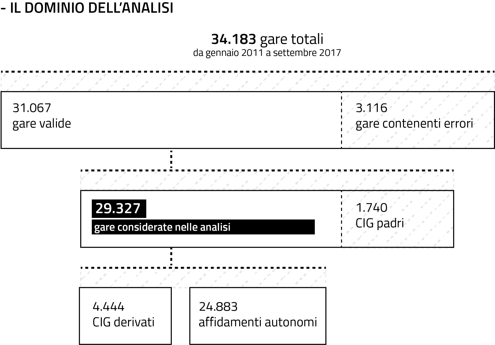
   
|
|
|
      
Il dataset inviato alla Commissione da parte di ANAC contava 34.183 gare totali, corrispondenti ai servizi ICT erogati verso la Pubblica Amministrazione a partire dal primo gennaio 2011. Il dataset in esame è aggiornato a settembre 2017.  Di queste 34.183 gare, 3.116 sono state evidenziate da Anac come “gare contenenti errori”. Non è stata specificata nel dettaglio alla Commissione la natura degli errori presenti in quelle gare. Le analisi svolte quindi, sono state condotte su un sottoinsieme del dataset di partenza, in cui sono stati sottratti anche tutti i record contenenti ‘CIG padri’, pari a 1.740. All’interno del numero di gare considerate in via definitiva nell’analisi, sono stati individuati 4.444 CIG derivati, e 24.883 affidamenti autonomi. Infine, sono stati tolti i record con i CIG ripetuti, che identificano i raggruppamenti temporanei d’impresa (RTI), mantenendo solo il record del mandatario non avendo informazioni su come ripartire la spesa all’interno dell’RTI. 

Nelle analisi effettuate, è stata considerata una sola riga rispetto all’insieme di righe rappresentanti l’RTI, affinché l’importo aggiudicato non venisse conteggiato tante volte quanti i partecipanti all’RTI, ma una volta soltanto, essendo questo poi successivamente diviso tra le imprese del raggruppamento.

La Commissione non ritiene che le operazioni preliminari sul dataset ne abbiano aumentato la qualità ad un livello sufficiente. Le analisi di questo capitolo vanno considerate come esempio di cosa sarebbe possibile fare se solo il processo di raccolta dei dati ne assicurasse la qualità. Gli esempi di incongruenze presenti in questo capitolo servono a mettere in evidenza il livello e la tipologia di errori presenti nel dataset.

Il dataset consegnato alla Commissione è stato fornito sotto forma di tabella a celle. L’elenco completo delle colonne costituenti tale tabella è riassunto dall’immagine che segue (Figura 2).

|
|

.. figure:: imgrel/fig2.png
   :alt: Figura 2
   :align: center
|
|
|

Le analisi svolte su questi dati sono state suddivise in una serie di macro categorie, che hanno posto l’attenzione su diversi aspetti di una gara d’appalto. Di seguito (Figura 3), l’elenco delle macro categorie analizzate.

|
|

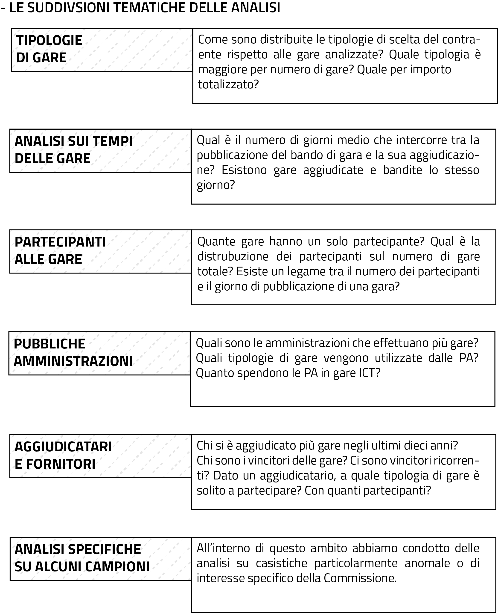
|
|
|
   

3.2.2 Analisi introduttive sui dati
^^^^^^^^^^^^^^^^^^^^^^^^^
Come introduzione alle analisi è stata raccolta una serie di informazioni di carattere generale che descrivono il dataset in esame (Figura 4). È importante far notare che già da questa analisi sommaria la differenza tra importi aggiudicati e importi messi a bando è un chiaro indice del fatto che la qualità del dataset è estremamente bassa.

|
|

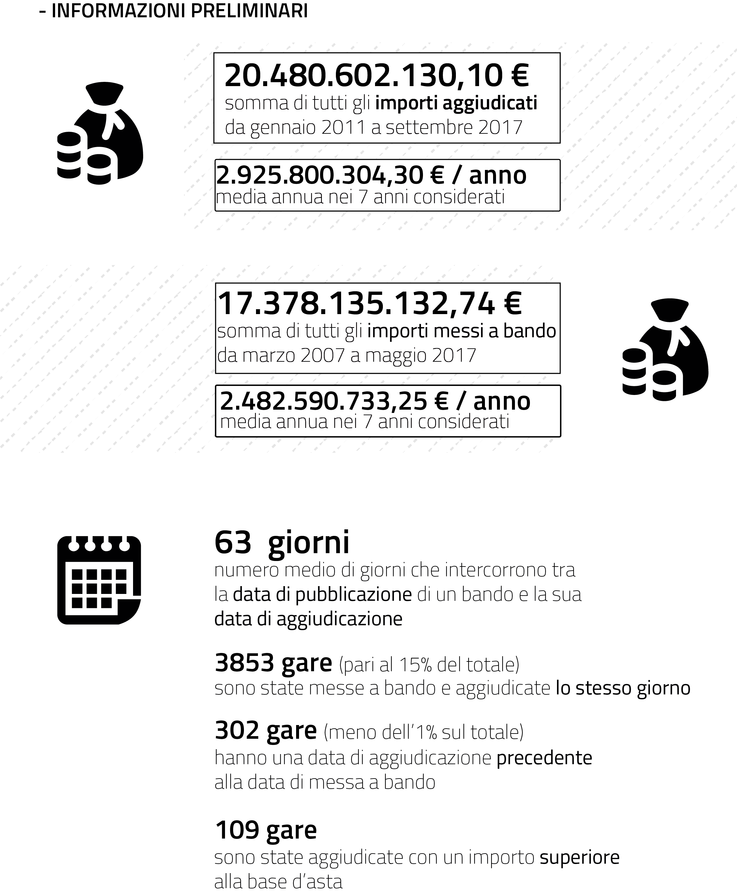
   
|
|
|
   
Per quanto riguarda le 3.853 gare messe a bando e aggiudicate lo stesso giorno, la tipologia di scelta del contraente che risulta maggiore in numero è, in ordine decrescente, *l’Affidamento diretto in adesione ad accordo quadro/convenzione*, seguito dalla *Procedura negoziata senza previa pubblicazione* e dell’*Affidamento in economia/Affidamento diretto*.

Delle 109 gare in cui l’importo di aggiudicazione risulta superiore all’importo della base d’asta, ve ne sono 17 in cui l’incremento della base d’asta supera il milione di euro. Di queste 17 gare, 4 risultano aggiudicate ad un importo di almeno un miliardo di euro maggiore rispetto alla base d’asta. È ragionevole pensare che anche in questi casi i dati siano viziati da errori, tuttavia è opportuno segnalare come queste gare non siano state segnalate da ANAC tra quelle contenenti dati non corretti.

In tutti e 4 i casi, la tipologia di scelta del contraente utilizzata è stata quella dell’affidamento diretto: in economia per la prima gara riportata in tabella, in adesione ad accordo quadro - convenzione per le altre tre righe.

|
|

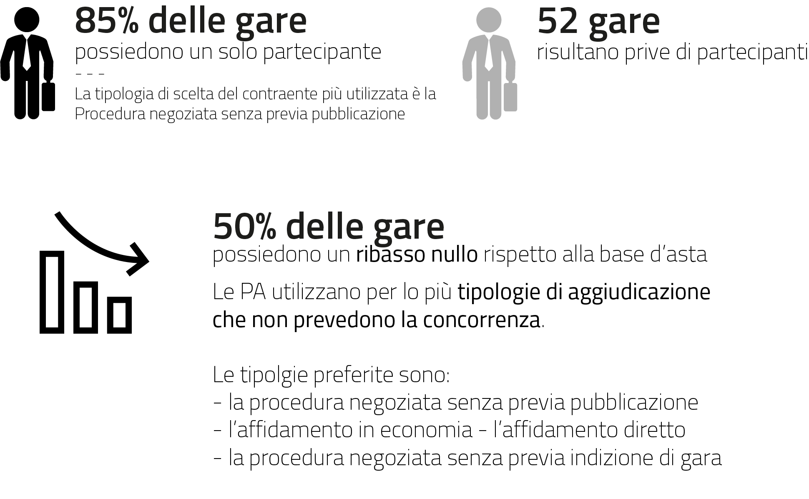
|
|
|
   
La Figura 5 evidenzia ulteriori anomalie sui dati. 
All’interno del dataset sono presenti 21.212 gare (85 per cento del totale) in cui ha partecipato un solo fornitore che è poi naturalmente risultato l’aggiudicatario. Vi sono poi 52 gare prive di partecipanti, che su indicazione di ANAC sono state analizzate trattandole al pari delle gare con un solo partecipante, nonostante nel campo *“numero partecipanti”* compaia il valore 0.

Metà delle gare riportate nel dataset sono state aggiudicate allo stesso importo con cui erano state bandite. Un’ulteriore analisi di carattere generale che è stata fatta ha riguardato le pubbliche amministrazioni e i fornitori presenti nel dataset. I risultati sono riassunti in Figura 6.

|
|

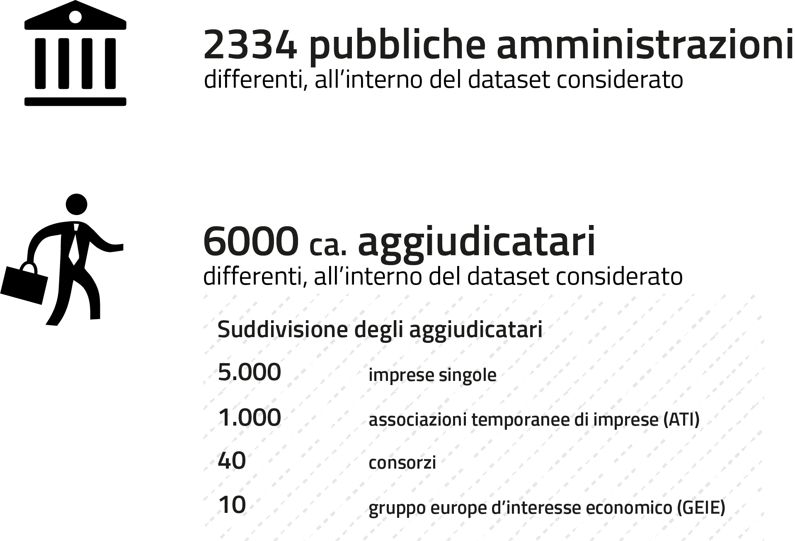
   
|
|
|
   
Mentre il numero di Pubbliche Amministrazioni presenti all’interno del *dataset* è esatto, il numero di fornitori, risultati poi aggiudicatari, risulta una stima, dovuta al fatto che in diversi casi lo stesso codice fiscale è stato associato ad aziende differenti, anche questo segno di un errore nei dati.

3.2.3 Analisi sulle tipologie di scelta del contraente
^^^^^^^^^^^^^^^^^^^^^^^^^
Segue l’analisi sulle tipologie di scelta del contraente, per numero di gare e per totale dell’importo aggiudicato.

|
|

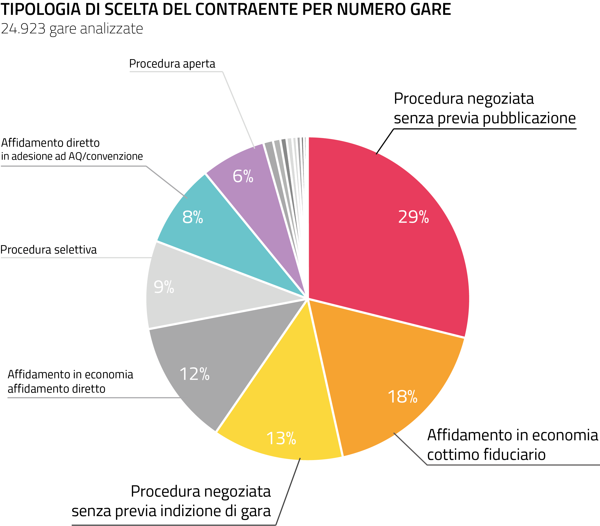
|  
.. figure:: imgrel/fig7b.png
   :alt: Figura 7b
   :align: center
|
|
|  

Nei due grafici a torta riportati in Figura 7, si è voluto confrontare le diverse tipologie di scelta del contraente, per numero di gare effettuate con ciascuna tipologia e per importo di aggiudicazione totale. Quello che emerge dal primo grafico è che le maggiori tipologie di scelta del contraente, utilizzate nelle gare d’appalto nel periodo compreso tra il 2011 e il 2017 sono:
1. **Procedura negoziata senza previa pubblicazione**, con 7198 gare, pari al 29 per cento del totale 
2. **Affidamento in economia - cottimo fiduciario**, con 4397 gare, pari al 18 per cento del totale 
3. **Procedura negoziata senza previa indizione di gara**, con 3257 gare, pari al 13 per cento del 
totale 

La somma in percentuale di queste tre prime fette del grafico a torta raggiunge il 60 per cento, superando così la metà del totale.

Nel secondo grafico a torta emerge, invece, che le tre maggiori tipologie di scelta del contraente, per totale degli importi di aggiudicazione, sono:
1. **Affidamento diretto in adesione ad accordo quadro/convenzione**, che totalizza 6.504.584.285,00€, pari al 32 per cento della spesa aggiudicata totale.
2. **Procedura aperta**, che totalizza 3.350.037.250,00€, pari 16 per cento della spesa totale.
3. **Procedura negoziata senza previa pubblicazione**, che totalizza 3.257.781.345,00€, pari al 16 per cento della spesa totale.

Una comparazione dei due grafici porta ad osservare come la *“Procedura negoziata senza previa pubblicazione”*, che si classifica al primo posto nel grafico che conteggia il numero di gare, scenda al terzo posto nel grafico dove vengono conteggiati gli importi aggiudicati.

L’*Affidamento in economia - cottimo fiduciario* che compare al secondo posto per numero gare, non si ritrova in maniera significativa nel grafico degli importi aggiudicati (risulta, in quest’ultimo grafico, con un importo del 2 per cento sul totale).

L’*Affidamento diretto in adesione ad accordo quadro/convenzione*, che è sesto per numero di gare, diventa, invece, primo per il totale di importi aggiudicati.

Un dato particolarmente interessante è rappresentato dalla *Procedura negoziata previa pubblicazione*, che si classifica quinta per il totale degli importi aggiudicati, ma non compare in maniera significativa come numero di gare svolte. Nello specifico, tale tipologia di scelta del contraente è stata utilizzata per solo 184 gare (meno dell’1 per cento del totale), per un totale aggiudicato di 1.520.664.032,00€.

Nei grafici che seguono sono stati messi in evidenza gli andamenti di alcune specifiche tipologie di scelta contraente, allo scopo di visualizzare le variazioni annue nell’intervallo di tempo considerato. La colonna grigia indica la mancanza di informazioni complete riferite all’anno 2017, non essendo ancora terminate al momento della pubblicazione di questa relazione.

|
|

.. figure:: imgrel/fig8.png
   :alt: Figura 8
   :align: center
   
|
|

.. figure:: imgrel/fig9.png
   :alt: Figura 9
   :align: center
   
|
|
 
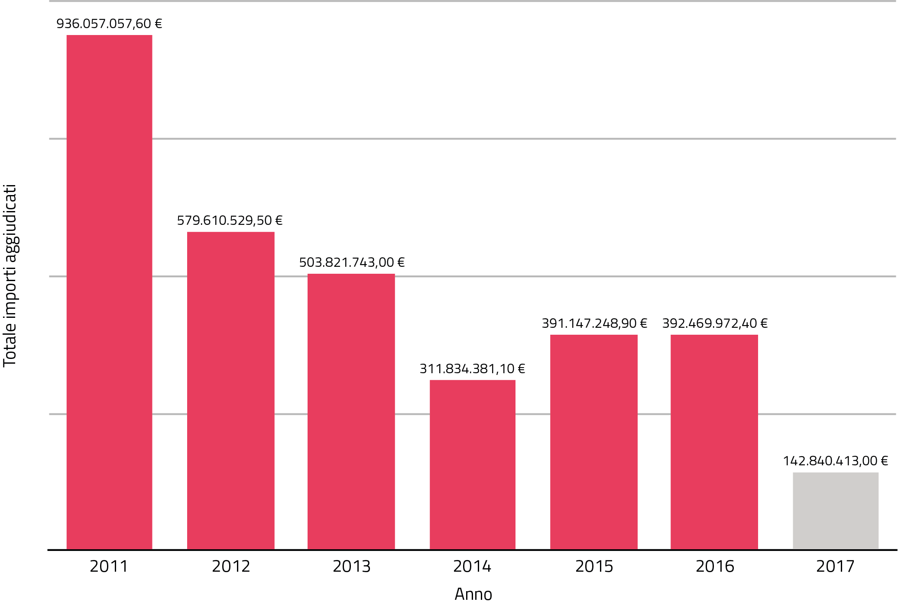
   
|
|
|  

Le analisi inerenti alle tipologie di gare sono proseguite con una suddivisione del dataset in tre partizioni, rappresentanti i bienni 2011-2012, 2013-2014 e 2015-2016. L’anno 2017 non è stato considerato in questo specifico caso, poiché non ancora terminato al momento della pubblicazione di questa relazione. In Figura 11 sono evidenziate, tramite i due grafici a torta, le gare aggiudicate negli anni 2011 e 2012. La prima torta rappresenta le diverse tipologie di scelta del contraente per numero di gare effettuate, mentre la seconda torta, per ciascuna tipologia di contraente evidenziata, ne riporta il totale dell’importo aggiudicato.

|
|

.. figure:: imgrel/fig11.png
   :alt: Figura 11
   :align: center
   
| 
|

.. figure:: imgrel/fig12.png
   :alt: Figura 12
   :align: center
|
|
|  

In Figura 12 è riportato l’andamento delle tipologie di scelta di contraente, per numero e per importo aggiudicato, nel biennio 2013-2014. La procedura aperta che risulta una fetta con poche gare nella prima torta, raggiunge il primo posto nella seconda torta, rivelandosi la tipologia di scelta del contraente con un totale degli importi di aggiudicazione (903.724.167,74 €) maggiore rispetto a tutte le altre tipologie.

|
|

.. figure:: imgrel/fig13.png
   :alt: Figura 13
   :align: center
|
|
| 

Alla luce dei risultati delle analisi relative alle tipologie di scelta del contraente, emerge come le gare d’appalto si concentrino solo su alcune delle svariate tipologie di scelta del contraente disponibili. In particolare, le tipologie che ricorrono da un biennio all’altro sono:

1. Procedura negoziata senza previa pubblicazione
2. Affidamento diretto in adesione ad accordo quadro - convenzione
3. Affidamento in economia - cottimo fiduciario
4. Procedura aperta
5. Affidamento in economia - affidamento diretto

Le diverse tipologie di scelta del contraente presenti all’interno del dataset sono 20.

3.2.4 Analisi dei tempi delle gare
^^^^^^^^^^^^^^^^^^^^^^^^^
Per quanto riguarda l’analisi sui tempi delle gare, la Commissione si è concentrata nello studio di quanto tempo, in media, sia necessario per aggiudicare una gara.
In Figura 14 è possibile visualizzare i risultati.
 
|
|

.. figure:: imgrel/fig14.png
   :alt: Figura 14
   :align: center
|
|
|   

La tipologia di scelta del contraente, che in media fa trascorrere più tempo tra la data di pubblicazione del bando e la data di aggiudicazione, è la *Procedura ristretta derivante da avvisi con cui si indice una gara* (224 giorni). A seguire troviamo la *Procedura ai sensi dei regolamenti degli organi costituzionali* (192 giorni) e la *Procedura aperta* (180 giorni). La tipologia di scelta del contraente più rapida risulta *l’Affidamento diretto in adesione ad accordo quadro/convenzione.*

Un problema riscontrato nel calcolo di questa media è rappresentato dal fatto che 301 gare risultano aggiudicate prima della data in cui sono state messe a bando, tuttavia queste gare non sono state conteggiate nei risultati esposti in Figura 14. A titolo di esempio, si possono citare il caso della gara bandita con procedura aperta dal Comune di Lecce per l’affidamento dei servizi previsti per la gestione di un centro interculturale che secondo il database è stata aggiudicata circa sette anni prima del bando, oppure la proroga del contratto di gestione della sicurezza affidata, sempre secondo il database, dall’Ente Regionale per la protezione dell’ambiente della Lombardia con tre anni d’anticipo rispetto al bando e con un importo superiore di più di sei volte la base d’asta.

|
|

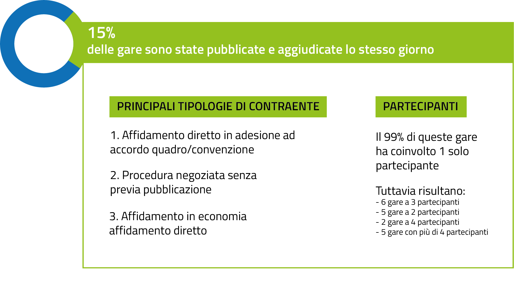
|
|
|

All’interno del *dataset* risulta che il 15 per cento delle gare sono state pubblicate e aggiudicate lo stesso giorno, come si può evincere dalla figura 15. Tra le maggiori tipologie di scelta del contraente spiccano gli affidamenti diretti. La quasi totalità di queste gare ha visto coinvolto un solo partecipante, anche se risultano una ventina di gare in cui il numero dei partecipanti è stato superiore a 1.

.. WARNING::
   Nelle 10 gare bandite e aggiudicate lo stesso giorno, in cui si è verificato, secondo i dati, un significativo rialzo nell’importo di    aggiudicazione rispetto alla base d’asta si riscontrano rialzi che vanno dal 6 per cento fino ad oltre il 24.500 per cento .
   
|
|

.. figure:: imgrel/fig16.png
   :alt: Figura 16
   :align: center
|
|
|

3.2.5 Analisi sui partecipanti alle gare
^^^^^^^^^^^^^^^^^^^^^^^^^
I risultati che seguono riguardano l’analisi dei partecipanti alle gare.
|
|

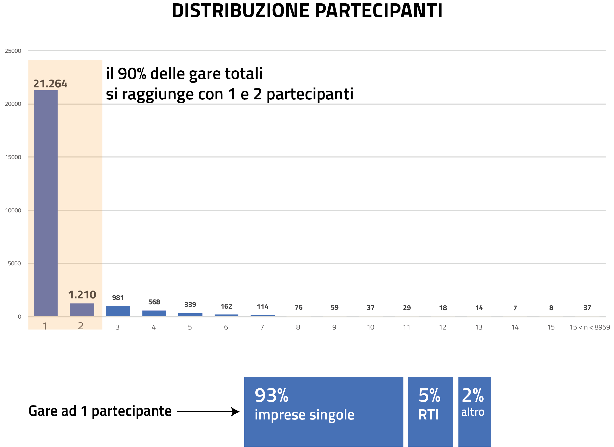
|
|
|   

In Figura 17 è riportata la distribuzione del numero di partecipanti alle gare presenti nel dataset. Le gare con un solo partecipante sono le più frequenti, e sommate alle gare con due partecipanti coprono il 90 per cento delle gare elaborate.
Quando il partecipante è unico, il 93 per cento delle volte si presenta come impresa singola, mentre il 5 per cento delle volte come raggruppamento temporaneo d’impresa (RTI).
Fanno seguito, in ordine decrescente per numero di gare aggiudicate, le principali aziende che hanno partecipato come singole imprese a gare ad un partecipante.

|
|

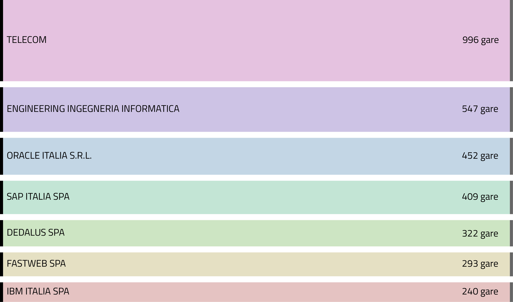
|
|
|   

**Telecom Italia**, si è presentata come unica partecipante 960 volte come impresa singola, 33 volte in un raggruppamento temporaneo d’impresa (20 volte come mandataria, 13 come mandante), 2 volte in un gruppo europeo e 1 volta come consorzio.
**Engineering**, si è presentata come unica partecipante 523 volte come impresa singola, e 24 volte in un raggruppamento temporaneo d’impresa (13 volte come mandataria, 11 come mandante).
**Oracle Italia**, si è presentata come unica partecipante 449 volte come impresa singola, 2 volte in un raggruppamento temporaneo d’impresa (entrambe le volte come mandante) e 1 volta in un gruppo europeo.

In Figura 19, sono invece riportate le aziende che si sono aggiudicate l’importo maggiore, partecipando ad alcune gare come singoli partecipanti.

|
|

.. figure:: imgrel/fig19.png
   :alt: Figura 19
   :align: center
|
|
|   

Dalla Figura 19 emerge come Telecom detenga il primato sia sul numero di gare in cui è stata l’unica partecipante, sia sul totale degli importi aggiudicati.

Al terzo posto compare l’azienda Edil Luca, che, secondo i dati, in una sola gara si è aggiudicata 1.140.000.000,00€, partendo da una base d’asta pari a 62.711,72€. Il CIG di riferimento è: 17208992C7. Anche in questo caso, come in molti altri precedenti, è probabile che ci siano errori, ma il record non era stato segnalato da ANAC tra quelli contenenti errori.

Per quanto riguarda lo studio della correlazione tra il numero dei partecipanti e i giorni di pubblicazione delle gare, alla Commissione non risulta nessun legame significativo, riscontrando che per la maggior parte delle tipologie di scelta del contraente le gare si distribuiscono in maniera uniforme dal lunedì al venerdì, con delle piccole quantità di gare svolte durante il weekend. Molte volte, selezionando una specifica tipologia di scelta del contraente, emerge come la maggior parte delle gare bandite o aggiudicate in uno specifico giorno della settimana possieda un solo partecipante. Questo risultato, che avrebbe potuto rivelarsi interessante nell’intento di individuare un rapporto tra *“specifico giorno della settimana”* e *“gare ad un solo partecipante”*, cessa di essere significativo dal momento che la maggior parte delle gare presenti nel dataset è costituito da gare ad un solo partecipante. Appare quindi ovvio che la predominanza di queste gare riemerga nuovamente anche applicando specifici filtri sui dati.

3.2.6 Analisi sulle pubbliche amministrazioni committenti
^^^^^^^^^^^^^^^^^^^^^^^^^
L’analisi prosegue con uno studio sulle pubbliche amministrazioni committenti presenti nel dataset.
|
|

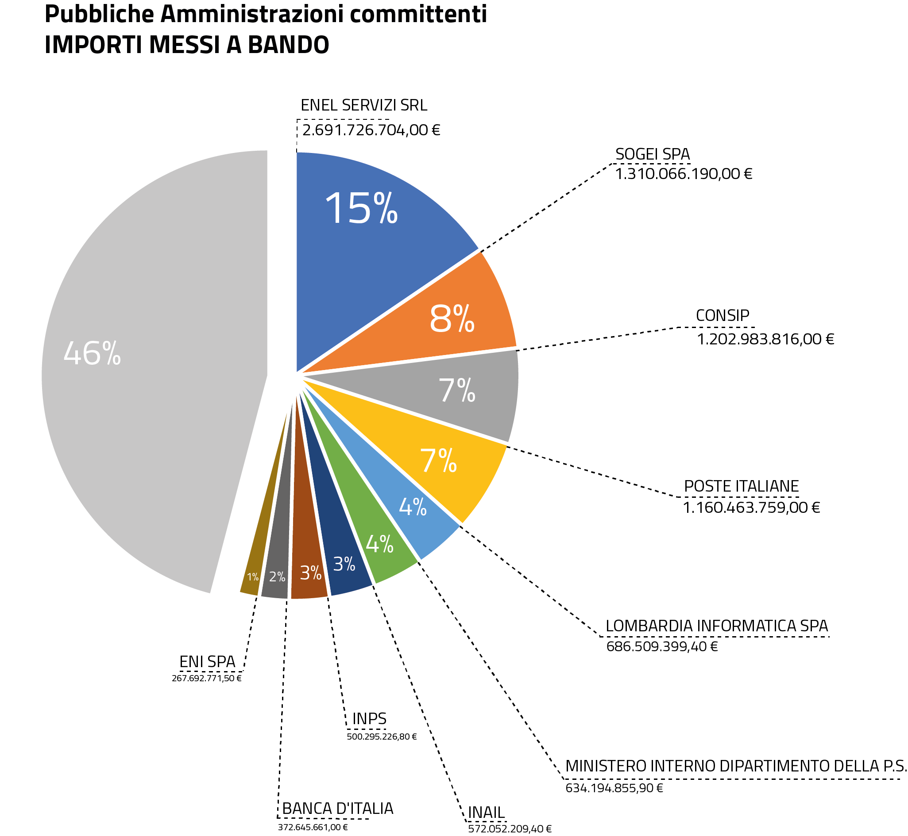
|
|
|   

In Figura 20 sono evidenziate le prime dieci pubbliche amministrazioni in ordine decrescente, per totale degli importi messi a bando. Al primo posto risulta Enel Servizi S.R.L., con un totale di 2.691.726.704,00€ messi a bando per servizi ICT, tra gennaio 2011 e settembre 2017.

Di seguito è riportata la classifica delle prime dieci Pubbliche Amministrazioni che contraggono più gare.

|
|

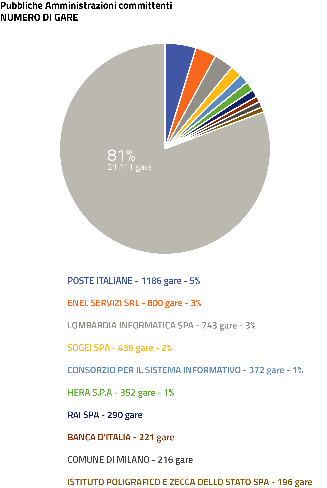
|
|

.. figure:: imgrel/fig22.png
   :alt: Figura 22
   :align: center
|
|
| 

La Figura 22 riporta l’ordine delle tipologie di scelta del contraente delle gare contratte da Poste Italiane, che si pone in vetta alla classifica per numero gare. Come riporta il grafico, la tipologia di scelta del contraente maggiormente utilizzata da Poste Italiane è la *Procedura negoziata senza previa indizione di gara*, seguita dalla *Procedura selettiva* e dalla *Procedura negoziata senza previa pubblicazione.*

|
|

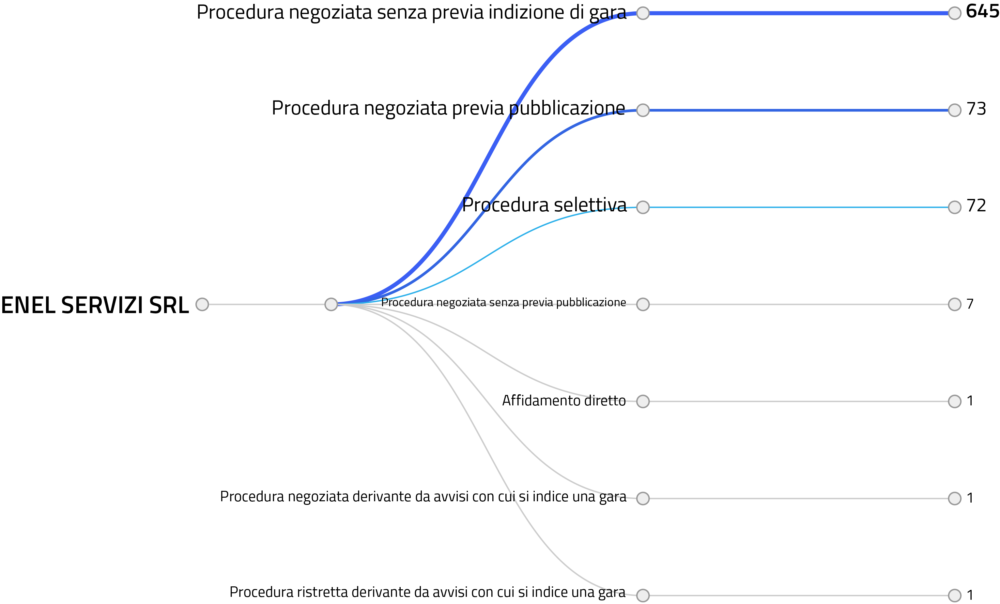
|
|
| 

La Figura 23 riporta l’ordine delle tipologie di scelta del contraente delle gare contratte da Enel Servizi S.r.l., che si attesta al secondo posto per numero di gare. Come riporta il grafico, la tipologia di scelta del contraente maggiormente utilizzata da Enel Servizi S.r.l. è la *Procedura negoziata senza previa indizione di gara*, seguita dalla *Procedura negoziata previa pubblicazione*, e dalla *Procedura selettiva*.

In aggiunta alle analisi esposte, si è proceduto a quantificare le pubbliche amministrazioni che sono state maggiormente coinvolte con il medesimo fornitore. Stabilito il legame *“pubblica amministrazione committente - impresa aggiudicataria”*, è stata calcolata la frequenza con cui lo stesso identico legame si ripeteva all’interno del dataset. L’obiettivo di questa analisi è stato quello di individuare delle **“relazioni di maggioranza”** tra uno specifico fornitore e una specifica azienda. 

.. note::
   Per “relazione di maggioranza” si intende quella relazione che detiene uno specifico fornitore con una specifica amministrazione,      
   quando il fornitore è il soggetto che ha contratto il più alto numero di gare con quella amministrazione, rispetto a tutti gli altri 
   fornitori. In altre parole, se tra l’amministrazione A e il fornitore B intercorre una relazione di maggioranza, significa che la 
   maggior parte delle gare messe a bando dall’amministrazione A sono state aggiudicate dal fornitore B. 

In Figura 24 sono esposti i risultati.

|
|

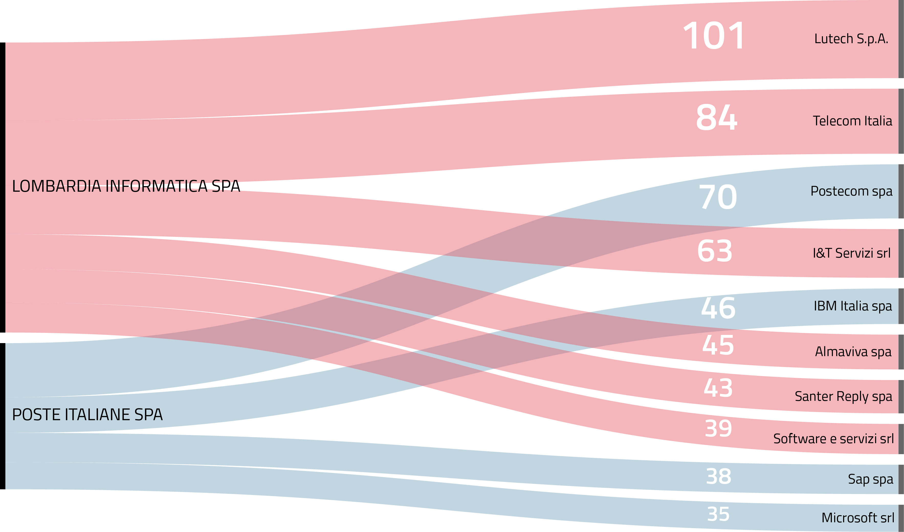
|
|
| 

Dal grafico si osserva come Lutech spa sia risultata aggiudicataria di gare messe a bando da Lombardia Informatica per 101 volte. Telecom Italia 84 volte, I&T Servizi srl 63 volte e così via. Il discorso analogo può essere fatto per i fornitori di Poste Italiane. L’arco che collega Lombardia Informatica con Lutech spa rappresenta la relazione di maggioranza in assoluto più frequente all’interno del dataset considerato. Ciò significa che il numero massimo di gare aggiudicate da un solo fornitore con la stessa pubblica amministrazione, viene totalizzato dall’azienda Lutech spa, che per 101 volte si è aggiudicata una gara con Lombardia Informatica. In figura 24 è riportata la classifica assoluta delle prime dieci relazioni di maggioranza presenti all’interno del dataset.

In Figura 25, invece, sono stati messi in risalto gli importi aggiudicati.

Sulla sinistra della figura sono riportate le pubbliche amministrazioni, Lombardia Informatica e Poste Italiane. Sulla destra della figura sono riportati i loro principali fornitori. Il grafico di Figura 25 è ordinato secondo il totale degli importi aggiudicati dai vari fornitori in riferimento all’amministrazione alla quale sono collegati. Come si evince dalla figura, Lombardia Informatica ha stipulato un certo numero di gare con l’azienda Santer Reply spa, la quale si è aggiudicata un totale di circa 80 milioni di euro. L’azienda I&T Service si è aggiudicata circa 70 milioni di euro, vincendo le gare messe a bando da Lombardia Informatica. La stessa lettura può essere fatta per Poste Italiane: Postecom spa si è aggiudicata 56 milioni di euro lavorando per Poste Italiane, IBM, Microsoft e Sap spa si sono aggiudicate rispettivamente 31, 25 e 22 milioni di euro.

|
|

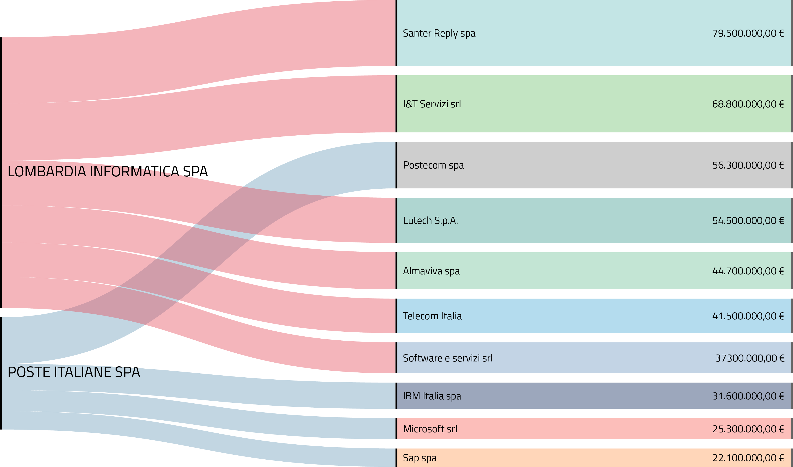
|
|
| 

Nella tabella che segue è riportata una parte più ampia della classifica, presentando le prime 60 *“relazioni di maggioranza”* in ordine decrescente.

[tabella mancante]

La tabella 3.5 risponde alla domanda su quale siano le pubbliche amministrazioni che impiegano più tempo ad aggiudicare le gare che bandiscono. Nella tabella sono riportate in ordine decrescente le prime trenta amministrazioni, ordinate per il tempo medio, calcolato in giorni, di aggiudicazione di una gara.

[tabella mancante]

La stessa interrogazione è stata posta per il tempo medio di aggiudicazione di una gara per i ministeri presenti all’interno del dataset, i cui risultati sono riportati nella tabella seguente e da cui si può dedurre, ancora una volta chi, probabilmente, commette più errori nella comunicazione dei dati ad ANAC.

[tabella mancante]

3.2.7 Analisi sui fornitori e sugli aggiudicatari
^^^^^^^^^^^^^^^^^^^^^^^^^
In questa ultima sezione, le analisi condotte hanno riguardato i fornitori presenti nel database ANAC e gli aggiudicatari delle gare.

|
|

.. figure:: imgrel/fig26.png
   :alt: Figura 26
   :align: center
|
|
| 

Nella figura 27 possiamo osservare i principali raggruppamenti temporanei d’impresa (RTI).

|
|

.. figure:: imgrel/fig27.png
   :alt: Figura 27
   :align: center
|
|
|

In Figura 28 è stata riportata la classifica delle prime dieci aziende che hanno totalizzato il maggior numero di partecipazioni alle gare in raggruppamenti temporanei d’impresa (RTI). La dimensione della torta è proporzionale al numero di gare effettuate. In tutte le torte, lo spicchio minore rappresenta le volte in cui la relativa azienda si è presentata come mandante. In cima alla classifica troviamo Fastweb, che ha partecipato 187 volte (169 come mandataria e 18 come mandante), ad altrettante gare presentandosi come raggruppamento temporaneo d’impresa. Segue Telecom Italia e Engineering. In Figura 27 sono riportate in blu le volte in cui la relativa azienda ha partecipato al raggruppamento come mandataria, mentre in giallo le volte in cui ha partecipato come mandante.

Fastweb, non solo si classifica al primo posto nella classifica che indica le volte in cui un fornitore, appartenendo ad un RTI, si è presentato come mandatario, ma anche nella classifica per importi aggiudicati. Fastweb infatti, si è presentata in 169 gare come mandataria di un RTI, per un volume d’affari totale pari a 1.393.745.420,23€. Segue Vodafone Italia S.p.a., con un totale aggiudicato pari a 966.267.995,86€, presentandosi come mandataria in 30 gare differenti, e Accenture S.p.a., che ha totalizzato 472.308.797,51€ presentandosi come mandataria in 60 differenti gare.

|
|

.. figure:: imgrel/fig28.png
   :alt: Figura 28
   :align: center
|
|
|

La Figura 28 mostra un esempio di analisi sui raggruppamenti temporanei d’impresa. In particolare, in figura sono rappresentate i RTI in cui è stata coinvolta Almaviva S.p.a.. Sono stati evidenziati con un colore i diversi raggruppamenti temporanei. All’interno dei cerchi sono state riportate le imprese mandanti. All’interno dei rettangoli sono state riportate le imprese mandatarie. Ci sono due aziende che frequentemente si trovano in RTI con Almaviva: NPO Sistemi e Bit Media S.p.a.. Tuttavia, in Figura 29 non è stato possibile riportare tutti i casi in cui Almaviva si è trovata coinvolta in un raggruppamento temporaneo d’impresa.

Nel grafico che segue, analogamente per quanto è stato fatto con le analisi rivolte alle Pubbliche Amministrazioni, è riportata la classifica dei fornitori aggiudicatari per numero di gare contratte.

|
|

.. figure:: imgrel/fig29.png
   :alt: Figura 29
   :align: center
|
|
|

Dal grafico in Figura 29 emerge come Telecom sia il fornitore che stipula il maggior numero di gare con le pubbliche amministrazione italiane. Seguono Engineering e Fastweb. Un dato che emerge chiaramente dal dataset è come la maggior parte dei fornitori sia solita stipulare poche centinaia di gare con le pubbliche amministrazioni, come dimostra il fatto che già alla decima posizione (rappresentata dalla Fujitsu spa), raggiungiamo la percentuale dell’1 per cento e da lì a scendere.
All’interno del dataset compaiono spesso le stesse aziende, ma con codici fiscali differenti. Questo è il motivo per cui alcune di esse sono accompagnate dalla dicitura “cf #1” o “cf #2”.

Nell'immagine che segue sono riportati i FORNITORI AGGIUDICATARI e le IMPRESE SINGOLE per totale importi aggiudicati.

|
|

.. figure:: imgrel/fig30.png
   :alt: Figura 30
   :align: center
|
|
|

La figura 30 è complementare alla Figura 29. Nel grafico qui sopra sono elencati i primi dieci fornitori in base al totale degli importi che si sono aggiudicati. In cima spicca sempre Telecom Italia, con un totale aggiudicato pari ad oltre 5 miliardi di euro (nel periodo 2011 - 2017). A questo dato però, va affiancato anche il numero di gare necessarie a Telecom per aggiudicarsi tale importo. Il numero in questione è 1187, che di conseguenza giustifica una cifra così alta. Nella classifica risulta particolarmente anomalo il caso dell’impresa Edil Luca, che in una sola gara si è aggiudicata 1.140.000.000€. La gara in questione ha CIG = 17208992C7, ed è stata messa a bando con un importo pari a 62.711,72€. Va specificato che il grafico di Figura 30 rappresenta esclusivamente gli aggiudicatari che si sono presentati alle gare come imprese singole e non come RTI, poiché sarebbe stato troppo complesso suddividere in maniera corretta l’importo aggiudicato tra i vari componenti del raggruppamento.

3.3 Analisi specifiche sull’Anagrafe nazionale della Popolazione residente
^^^^^^^^^^^^^^^^^^^^^^^^^^^^^^^^^^^^^^^^^^^^^^^^^^^^^^^^^^^^^^^^^^^^
Un tema su cui la Commissione ha concentrato parte delle proprie analisi è stato quello dell’Anagrafe Nazionale della Popolazione Residente (ANPR). A partire dai risultati di un questionario sottoposto ai comuni da parte del Ministero dell’Interno, la Commissione ha elaborato le seguenti analisi.

|
|

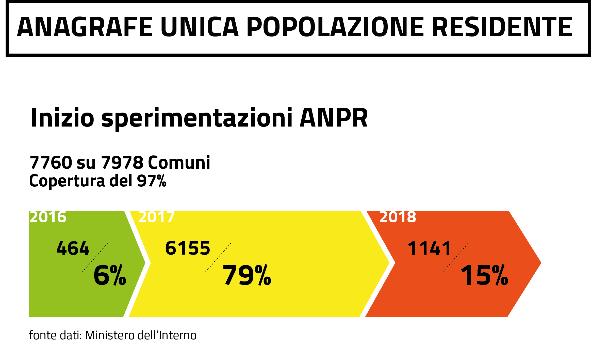
|
|
|

Il questionario da cui sono stati attinti i dati possiede una copertura del campione pari al 97 per cento, considerando le risposte di 7760 comuni su 7978. In figura è rappresentata la suddivisione temporale dell’inizio della sperimentazione, da parte dei comuni, dell’Anagrafe Nazionale della Popolazione Residente. La maggior parte dei comuni comincerà la sperimentazione nel corso dell’anno 2017.

La Figura 32 riassume il numero dei comuni che utilizzano i web services rispetto al numero dei comuni che hanno cominciato a sperimentare la web app prodotta da Sogei. I Comuni sono suddivisi per regioni di appartenenza.

|
|

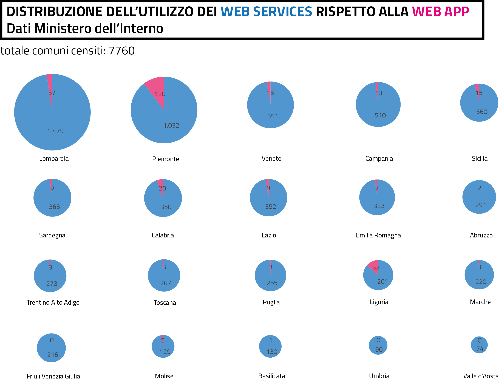
|
|
|

Dal grafico emerge come siano molto basse le percentuali di utilizzo della web app. Il numero di comuni che usano la web app viene sempre rappresentato dallo spicchio più piccolo di ciascuna torta. In Lombardia solo 37 comuni hanno iniziato delle sperimentazioni con la web app contro i 1.479 che invece utilizzano i web services. In Piemonte 120 comuni utilizzano la web app e 1.032 comuni i web services. Nelle Regioni Friuli Venezia Giulia, Umbria e Valle d’Aosta risulta che nessun comune ha avviato, nel momento in cui sono stati raccolti i dati qui elaborati, alcuna sperimentazione della web app erogata da Sogei.

|
|

.. figure:: imgrel/fig33.png
   :alt: Figura 33
   :align: center
|
|
|

Nell’intento di stabilire quali siano i maggiori fornitori di software demografici nelle varie regioni, è stato elaborato il grafico di Figura 33, che evidenzia come siano fondamentalmente sei le *software house* predominanti nel contesto di riferimento: Halley Informatica, Siscom, Maggioli, Studio K S.r.l.,

Insiel spa e Alphasoft S.r.l.. La regione che ha maggiori rapporti con le software house in questione risulta essere la Lombardia.

In Figura 34 sono state messe in evidenza le cinque software house più grandi (per numero di comuni serviti).

|
|

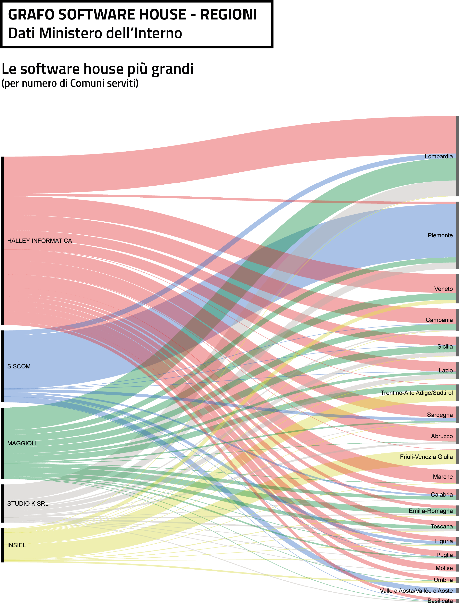
|
|
|

A conclusione di questa breve analisi generale sul progetto ANPR, le mappe che seguono esprimono la distribuzione geografica delle sei principali software house presenti sul mercato dei software demografici.

|
|

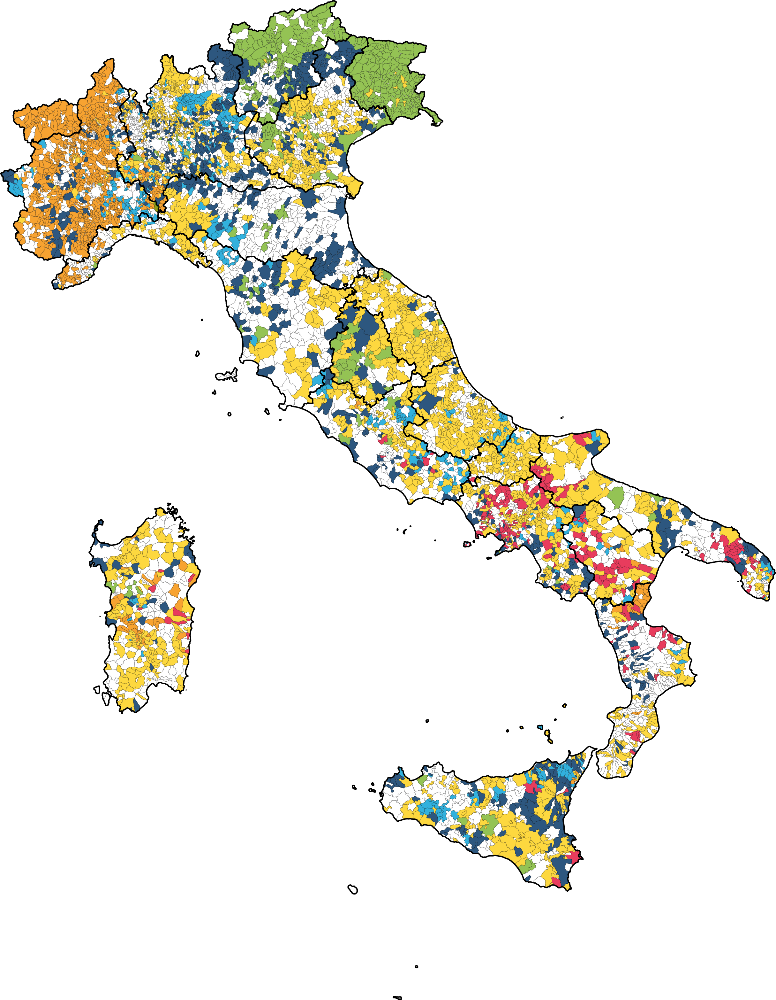
|
|
|

La Figura 35 riporta le seguenti software house:
1. ALPHASOFT - rosso
2. SISCOM - arancione
3. INSIEL - verde
4. HALLEY INFORMATICA - giallo
5. STUDIO K - azzurro
6. MAGGIOLI - blu scuro

Seguono sei mappe, ciascuna rappresentante la distribuzione di una delle sei aziende sopra elencate.

|
|

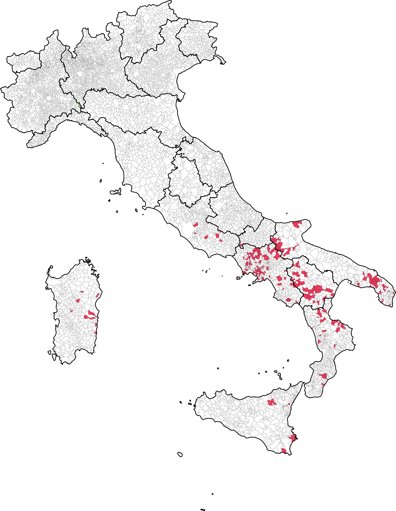
|
|

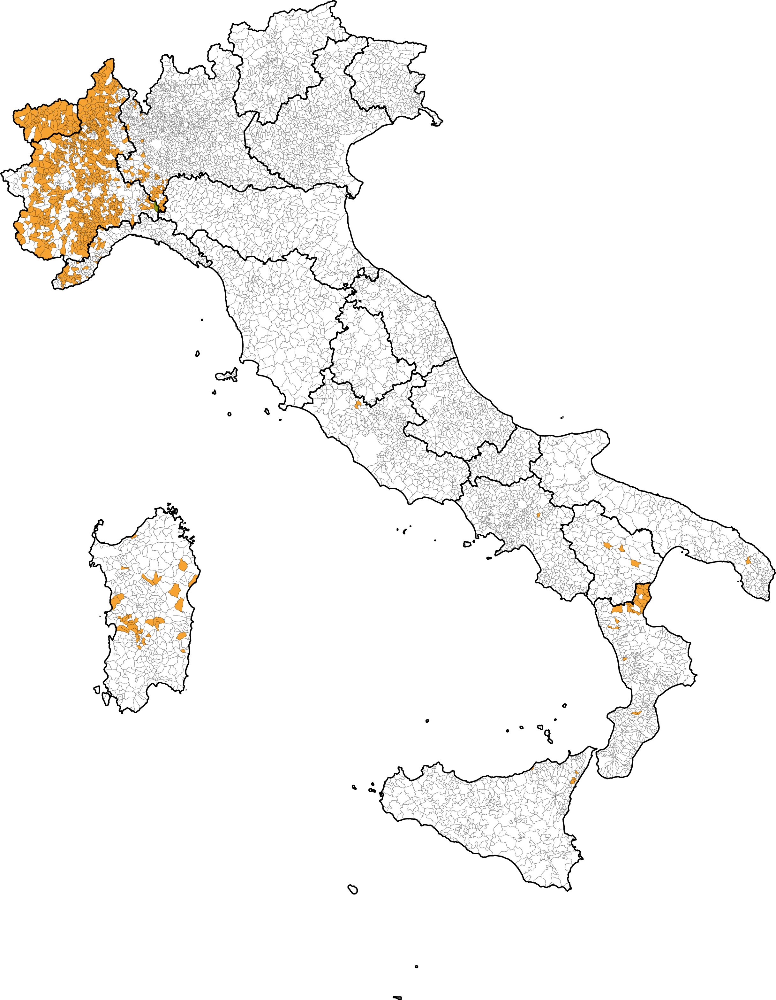
|
|

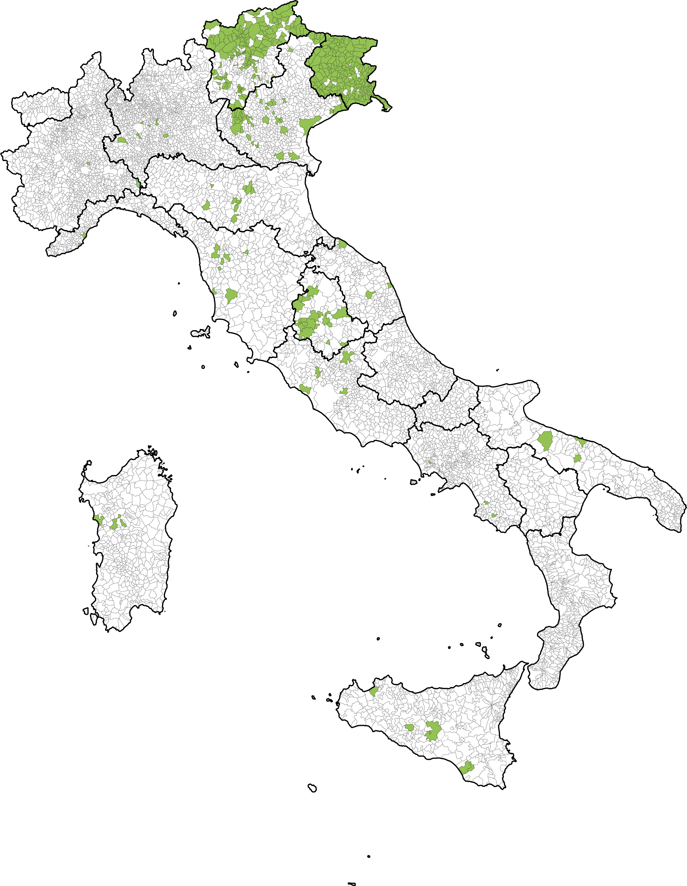
|
|

.. figure:: imgrel/fig39.png
   :alt: Figura 39
   :align: center
|
|

.. figure:: imgrel/fig40.png
   :alt: Figura 40
   :align: center
|
|

.. figure:: imgrel/fig41.png
   :alt: Figura 41
   :align: center
|
|
|
La Commissione, durante i mesi in cui ha lavorato, ha stretto delle collaborazioni con vari soggetti terzi, che hanno collaborato e supportato l’analisi qui esposta. In particolare, la collaborazione stretta con Cerved ci ha permesso di utilizzare un loro portale che permette la ricostruzione dei rapporti che intercorrono tra le aziende dal punto di vista societario e finanziario. L’utilizzo di questo portale ci ha permesso di evidenziare alcuni specifici rapporti che intercorrono tra due o più aziende, col fine di capire meglio alcuni specifici casi analizzati. A titolo d’esempio, riportiamo l’elaborazione ottenuta cercando le relazioni che intercorrono tra due delle sei *software house* sopracitate.

Volendo elaborare le relazioni che intercorrono tra le aziende Maggioli e Studio K, il primo risultato che otteniamo è il seguente:

|
|

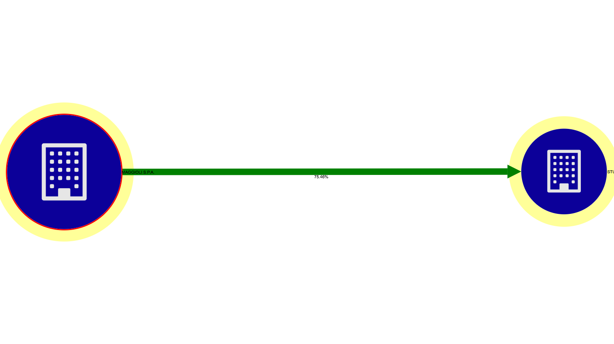
|
|
|
Il primo *ouput* ci informa che il nodo di sinistra, rappresentante della *software house* Maggioli, è legato con una relazione al nodo di destra, rappresentante della *software house* Studio K. L’arco che collega questi nodi rappresenta la relazione “è socio di”, e possiede un peso, che in questo specifico caso ammonta a 75,46 per cento. La lettura che diamo a questo risultato quindi è che la Maggioli è socia della Studio K del 75,46 per cento. L’espansione dei due nodi di Figura 42 nelle loro rispettive reti complete, è riportata nella figura che segue.

|
|

.. figure:: imgrel/fig43.png
   :alt: Figura 43
   :align: center
|
|
|

Una volta che le reti di relazioni delle due aziende sono state espanse, è possibile leggere il tipo di ciascuna relazione e capire così come è strutturata l’azienda. Per la Commissione, è stato particolarmente importante cercare gli “archi ponte”, ovvero quelle relazioni che collegano la rete dell’azienda Maggioli, alla rete dell’azienda Studio K. Quello che emerge è rappresentato nella figura seguente.

|
|

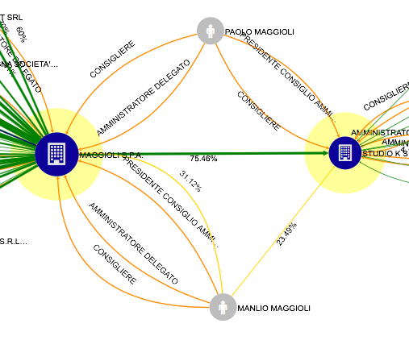
|
|
|

Dalla lettura della Figura 44 apprendiamo che i legami tra la Maggioli S.p.a. e Studio K S.r.l., non riguardano solamente l’essere l’una socia dell’altra, ma considerano anche dei legami tra persone. Paolo Maggioli, Amministratore Delegato della Maggioli S.p.a., è Presidente del Consiglio di Amministrazione della Studio K S.r.l.. Similmente accade per Manlio Maggioli, Amministratore Delegato della Maggioli S.p.a., e titolare effettivo della Studio K S.r.l., con una quota del 23,49 per cento.

Di conseguenza i territori dove opera la Maggioli aumentano, comprendendo anche tutti i territori occupati da Studio K. La figura seguente evidenzia i nuovi territori acquisiti dalla Maggioli.

|
|

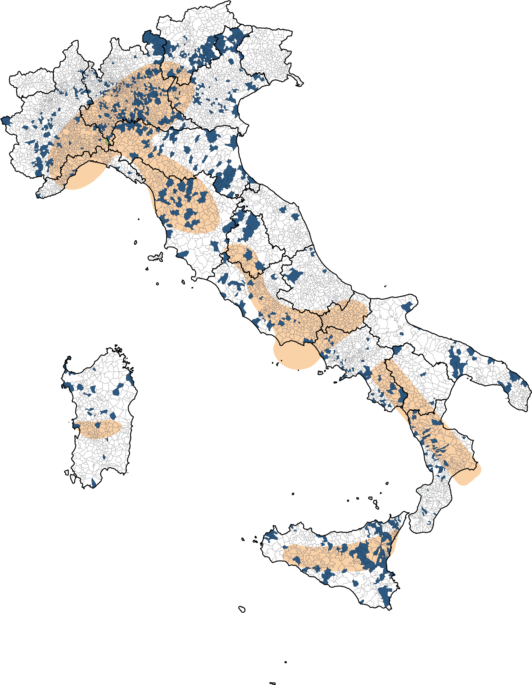
|
|
|

La nuova suddivisione delle software house diventa la seguente:

|
|

.. figure:: imgrel/fig46.png
   :alt: Figura 46
   :align: center
|
|
|

In Figura 46 si nota che la Maggioli (avendo inglobato Studio K), è passata dalla terza posizione (di Figura 34) alla seconda, subito sotto Halley Informatica.

3.4 Un portale per analizzare i contratti pubblici
^^^^^^^^^^^^^^^^^^^^^^^^^^^^^^^^^^^^^^^^^^^^^^^^^^^^^^^^^^^^^^^^^^^^
La Commissione durante il suo periodo di attività si è avvalsa della collaborazione di Synapta, spin-off del Centro Nexa del Politecnico di Torino sul tema dei dati sui contratti pubblici, che ha condotto alla realizzazione di un portale ad hoc per la loro analisi. La piattaforma elabora il dataset fornito da ANAC alla Commissione, aggiornato al mese di settembre 2017. L’intento è quello di far diventare il portale un valido strumento di analisi dei contratti pubblici italiani.

Fanno seguito alcuni screenshot che illustrano alcune delle funzionalità di questo portale.

|
|

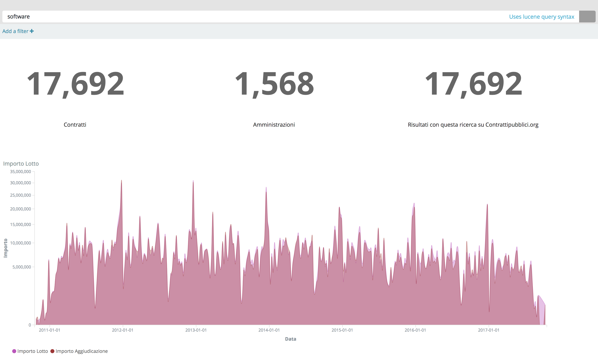
|
|
|

L’immagine di Schermata 1 rappresenta l’*homepage* del portale. Una barra di ricerca in alto permette l’inserimento di una parola chiave che servirà da filtro per l’elaborazione. In questo caso specifico è stata inserita la parola chiave *“software”*, pertanto i risultati esposti dal portale si devono intendere come riferiti ai soli contratti pubblici presenti nel dataset contenenti la *keyword* *“software”*. Dall’homepage si osserva come il numero di contratti legati al *software* (e presenti nel dataset di riferimento) siano 17.692, mentre le Pubbliche Amministrazioni che hanno stipulato delle gare legate al *software* sono 1.568.

Il grafico raffigurato nella Schermata 1 mostra anche l’andamento annuo dell’importo del lotto e contemporaneamente dell’importo aggiudicato dalle singole gare.

Il grafico riportato nella Schermata 2 mostra la suddivisione dei tipi di pubbliche amministrazioni che hanno stipulato delle gare inerenti alla *keyword* inserita (*“software”*). La suddivisione riporta in percentuale il numero di contratti stipulati da Società in Conto Economico Consolidato, da Pubbliche Amministrazioni “standard” e da Gestori di Pubblici Servizi, da Enti Nazionali di Assistenza Sociale in Conto Economico Consolidato.

|
|

.. figure:: imgrel/Schermata2.png
   :alt: Schermata2
   :align: center
|
|
|

La Schermata 3 riporta la *heatmap* geografica dei contratti, dove i colori cambiano a seconda del numero di contratti stipulati dalla relativa città.

|
|

.. figure:: imgrel/Schermata3.png
   :alt: Schermata3
   :align: center
|
|
|

Infine, abbiamo dei grafici che riassumono le categorie merceologiche e le tipologie di scelta del contraente maggiormente utilizzate.

|
|

.. figure:: imgrel/Schermata4.png
   :alt: Schermata4
   :align: center
|
|
|

Chiude l’analisi l’elenco di contratti elaborati.

|
|

.. figure:: imgrel/Schermata5.png
   :alt: Schermata5
   :align: center
|
|
|

La Commissione renderà pubblico questo portale, a beneficio di enti e cittadini che vorranno utilizzarlo. Il portale sarà disponibile sul sito della Commissione.

3.5 La telefonia mobile, i servizi aggiuntivi a pagamento per la pubblica amministrazione
^^^^^^^^^^^^^^^^^^^^^^^^^^^^^^^^^^^^^^^^^^^^^^^^^^^^^^^^^^^^^^^^^^^^
Le attività della Commissione hanno riguardato anche la verifica della spesa delle pubbliche amministrazioni in ICT con l’obiettivo di rilevare eventuali sprechi di risorse pubbliche nel settore. Tra gli ambiti di inchiesta analizzati, la Commissione si è concentrata in particolare sulle spese relative alla telefonia mobile della Pubblica Amministrazione, evidenziando una serie di anomalie riguardo i servizi aggiuntivi a pagamento, la cui presenza è stata riscontrata su un ingente numero di SIM *card* in dotazione alla Pubblica Amministrazione. La Commissione ha infatti richiesto formalmente al gestore TIM il quadro di spesa della Pubblica Amministrazione, riguardo i cosiddetti servizi mobile VAS, ovvero l’insieme di contenuti interattivi, numeri speciali, acquisto di prodotti o servizi che comportano costi aggiuntivi per la Pubblica Amministrazione. Nello specifico, sono stati richiesti la descrizione dei servizi M-VAS attivati da SIM della PA:
- per ogni servizio M-VAS il totale della spesa effettuata negli anni 2012, 2013, 2014, 2015, 2016;
- per ogni servizio M-VAS il numero di utenze della PA che hanno attivato il servizio negli anni 2012, 2013, 2014, 2015, 2016.

I dati sono stati richiesti al gestore TIM, in quanto vincitore delle ultime tre convenzioni per i *“servizi di telefonia mobile per le Pubbliche Amministrazioni”*, bandita da Consip. Pertanto, i dati forniti [23]_ riguardano i contratti relativi alle due Convenzioni di riferimento, ovvero la *Mobile 5* (attiva dal 2012 al 2015) e la *Mobile 6* (attiva dal 2015 ad oggi). La commissione ha quindi verificato come le voci di spesa complessive, riportate dal gestore TIM e inerenti ai servizi aggiuntivi a pagamento a partire dal 2012, ammontino complessivamente a € 8.316.947,34. La ripartizione di questa spesa è così ripartita:

- € 49.332,43 nel 2012 con 1.173 amministrazioni coinvolte;
- € 2.121.248,99 nel 2013 con 4.365 amministrazioni coinvolte;
- € 2.165.358,56 nel 2014 con 4.448 amministrazioni coinvolte;
- € 1.915.541,51 nel 2015 con 4.039 amministrazioni coinvolte;
- € 1.217.494,93 nel 2016;
- € 860.057,92 nel 2017 fino al momento del deposito dei dati in Commissione.

È da intendersi che tali spese sono riferite esclusivamente alle sole direttrici oggetto di approfondimento in relazione alle due convenzioni Consip Mobile 5 e Mobile 6. La richiesta del dettaglio dei dati ha riguardato le direttrici con gli importi più significativi, che sono state classificate nelle seguenti categorie:

- **Numeri speciali**: come descritto da TIM “si tratta delle chiamate alle numerazioni di rete non geografica, secondo il Piano di numerazione nel settore delle telecomunicazioni (delibera AGCOM 8/15/CIR), che iniziano con la cifra 1xxx155 [24]_ o 8xxx156 [25]_ ”;
- **servizi di intrattenimento**: come riporta TIM “sono messaggi inviati/ricevuti a numerazioni che iniziano con la cifra 4xxx (Numerazione per servizi interni di rete e servizi tramite SMS/MMS e trasmissione dati)”;
- **servizi interattivi**, che sono le transizioni dati, gestite con i centri servizi che generano addebito in fattura;

Per quanto riguarda la Convenzione Mobile 6, attivata il 4 aprile 2015 alla scadenza della Mobile 5 e attualmente in vigore, alla Commissione sono stati consegnati da TIM i dati relativi al traffico fatturato fino al terzo bimestre 2017, che comprende il traffico generato fino al 31 marzo 2017. Al terzo bimestre 2017 erano attive 2.820 diverse amministrazioni pubbliche, centrali e locali e la consistenza di SIM Human era pari a 401.839.

Per ottenere una descrizione più precisa delle voci di spesa e per un’informazione puntuale sui consumi, il gestore TIM ha depositato presso la Commissione l’analisi puntuale di tre mesi di traffico (*aprile-giugno* 2017), che consentono di ottenere un’indicazione statistica sui consumi effettuati. Nell’entrare in dettaglio nel traffico dei cosiddetti *“numeri speciali”*, emerge come per il periodo aprile-giugno 2017, sono state registrate numerose chiamate effettuate in direzione di *call center*, relativi ai vettori di trasporto (Trenitalia, Alitalia, NTV-Italo, Meridiana), di compagnie telefoniche ed *helpdesk* (Tre, Italiaon line, Wind, Tiscali, Fastweb), di servizi bancari (Cartasì) e d’intrattenimento (Ticketone, Sky, Edreams, Uci Cinema). 

Per quanto riguarda invece i *“servizi di intrattenimento”*, risultano – come servizio di sms e sempre nel medesimo periodo considerato – soprattutto servizi bancari e di intrattenimento. Dall’analisi dei costi si evidenziano invii di 15.994 sms per un importo di € 52.390,71 dal *provider* di Banca Intesa, 3.612 sms per un importo di € 12.457,93 dal *provider* di Unicredit e 2.653 sms per un importo di € 8.305,03 dal *provider* di Fineco. L’analisi dei dati consente di far emergere anche un notevole numero di servizi di intrattenimento premium: quello più significativo ammonta a € 20.491,00 dal provider Green media per un totale di 1.606 sms. Le voci più consistenti si sono riscontrate sotto la voce *“servizi interattivi”* con una spesa di € 428.210,83, accumulata nei tre mesi presi in considerazione (aprile-giugno 2017). 

L’analisi in dettaglio di questi servizi aggiuntivi ne mettono in luce l’inutilità per l’amministrazione pubblica. **In questa spesa sono compresi giochi e intrattenimento, servizi erotici per adulti, servizi di informazione sportiva, oroscopi, musica ed abbonamenti a riviste, quotidiani e periodici.** L’importo più rilevante riguarda il servizio *“mpay1_beengo_tuk_tuk”* [26]_ , con una spesa pari a € 24.247,83 per un numero di transazioni pari a 6.976. Una spesa di € 23.803,56 è stata registrata per il servizio *“Paywox_abb”* [27]_, con 6.877 transazioni. Analogamente il servizio *“M_pay1_beengo_gocontent”* [28]_ produce 6.485 transazioni, per una spesa di € 22.151,91. 

Questi tre servizi riportati, in ordine di spesa, rientrano, come tipologia, nella categoria mobile pay. Si tratta, precisa il gestore TIM, di un consorzio inter-operatore (TIM, Vodafone e WindH3G), gestito da due *hub* tecnologici per l’erogazione/gestione dei servizi VAS. La spesa complessiva, comprendente numeri speciali, servizi intrattenimento e servizi interattivi per le tre mensilità prese in esame, ammonta a € 600.214,93. Il quadro emerso, di conseguenza, certifica uno spreco di risorse pubbliche. Per evitare un tale spreco di denaro pubblico, sarebbe necessario ed opportuno prevedere, all’interno delle convenzioni con i gestori di telefonia, il blocco automatico dei servizi aggiuntivi descritti per i contratti con la Pubblica Amministrazione. Il fatto che le Pubbliche Amministrazioni non abbiano bloccato, negli anni, l’uso di questi servizi è una indicazione chiara della mancanza di controlli sugli addebiti in fattura.

------------
   
NOTE paragafo 3.5

.. [23] I dati sono stati forniti ufficialmente alla Commissione in data 4 agosto 2017.
.. [24] Numerazione per servizi specifici a numerazione breve, per servizi a sovrapprezzo e per servizi armonizzati europei a valenza sociale
.. [25] Numerazione per servizi con addebito al chiamato, per servizi con addebito ripartito e per servizi a sovrapprezzo
.. [26] Beengo Srl è la società titolare del servizio.
.. [27] Paywox è la società titolare del servizio.
.. [28] Beengo Srl è la società titolare del servizio.

------------

3.6 Gli Accordi Programma Quadro (APQ)
^^^^^^^^^^^^^^^^^^^^^^^^^^^^^^^^^^^^^^^^^^^^^^^^^^^^^^^^^^^^^^^^^^^^

Gli Accordi Programma Quadro sono uno strumento di programmazione attraverso il quale le pubbliche amministrazioni centrali e regionali attuano una strategia comune in specifici settori. Negli APQ vengono definiti gli interventi da realizzare, i relativi tempi, le modalità di attuazione, i soggetti responsabili del progetto, la copertura finanziaria degli interventi, le procedure, gli impegni assunti da ciascun soggetto firmatario e, infine, i procedimenti di conciliazione o di definizione dei conflitti tra i soggetti partecipanti. La genesi normativa degli APQ risale al 1996, con la legge n. 662/1996; [29]_ in seguito, con la delibera CIPE n. 41 del 2012, sono stati introdotti gli APQ rafforzati che prevedono un nuovo sistema di procedure e di regole. Gli APQ rafforzati contengono la definizione di un sistema di indicatori di risultato e di realizzazione; la verifica della sostenibilità finanziaria e gestionale e le modalità di monitoraggio e di valutazione *in intinere* ed *ex post*. Sugli APQ, AgID svolge una duplice funzione: da una parte è investita della funzione di trasferimento dei finanziamenti assegnati alle regioni. La procedura prevede il 20 per cento a titolo di anticipazione entro 60 giorni dalla data di sottoscrizione dell'Accordo e il 70 per cento della copertura relativa sulla base dello stato di avanzamento dei lavori, in coerenza con i piani di attività del singolo progetto esecutivo; infine, il 10 per cento è trasferito a seguito della positiva valutazione di AgID sul raggiungimento dei risultati descritti nel progetto. Di conseguenza, AgID svolge anche una funzione di controllo amministrativo e di verifica che sussistano tutti gli elementi progettuali per saldare. Dall’altra, attraverso il servizio coordinamento Accordi Programma Quadro, AgID ha anche il compito di definire, gestire e monitorare gli APQ con le Regioni e le Province Autonome, in modo da garantire la coerenza programmatica e il rispetto degli indirizzi strategici nazionali.

Per avere contezza degli Accordi Programma Quadro nel settore dell’ICT, anche alla luce delle notizie di stampa che ne avevano denunciato ritardi nella programmazione e nel trasferimento di fondi, la Commissione ha provveduto alla convocazione in audizione del direttore di AgID Antonio Samaritani. Dall’audizione è emerso come i residui ammontino a circa 130 milioni di euro e derivino principalmente dal passaggio ad AgID, alla fine del 2014, delle attività e dei relativi progetti dell’ex Dipartimento per l’Innovazione Tecnologica; progetti che sono stati avviati nel corso degli anni, ma che risalgono anche ad una decina di anni fa. Nel 2015 i residui a bilancio sono stati 269 milioni di euro, che si riferiscono ad una posta generale complessiva del bilancio e riguardano, però, tutte le attività di AgID, che sono essenzialmente due: i fondi da erogare alle amministrazioni per finanziare i progetti e le risorse da utilizzare per le progettualità interne all’Agenzia. I 269 milioni di euro di residui rappresentano la cifra complessiva e si riferiscono ad entrambe le attività. Il direttore Samaritani ha voluto precisare come AgID non sia rimasta ferma, ma in questi anni si sia mossa in due direzioni, per far fronte a tali residui: da una parte ha svolto uno studio di *assessment* per comprendere come lavorare su questi residui; dall’altra ha rafforzato il team della dott.ssa Picot, responsabile del servizio coordinamento Accordi Programma Quadro, assumendo quattro collaboratori esterni, che hanno lavorato sui residui, realizzando un assessment dei residui. Queste azioni hanno consentito ad AgID di ridurre i residui da 269 milioni di euro nel 2015 ai 194 milioni nel 2017. Secondo Samaritani il processo di riduzione resta sotto controllo, mentre il ritardo è imputabile al fatto che l’agenzia abbia ricevuto nel 2015 un insieme di progetti di cui non era titolare e di conseguenza ha dovuto impostare un processo di gestione di questi fondi. L’altro elemento che ha inciso sul ritardo è relativo al fatto che AgID non sia dotata né di poteri, né di struttura organizzativa, in grado di velocizzare i processi delle Regioni. L’unica strumento in possesso di AgID per velocizzare i processi, è quello di inviare una lettera di sollecito, con la quale si avverte l’amministrazione ritardataria, che i finanziamenti saranno bloccati, se non ci saranno progressioni nei progetti. Inoltre, dall’audizione è emerso come la situazione nelle diverse regioni si presenti a macchia di leopardo. Alcune regioni hanno avviato un progetto, ma procedono a rilento. Altre regioni, per disordini amministrativi interni, si sono viste costrette a bloccare i progetti, mentre altre regioni  non hanno avviato significativamente l’attività progettuale. Samaritani ha assicurato la Commissione che AgID si stia impegnando nell’accompagnare queste situazioni di difficoltà, cercando di riconvertire le attività nella logica del piano triennale, utilizzando i fondi già stanziati. In sostanza, quindi, se alcuni dei vecchi progetti vengono stralciati, la loro rimodulazione viene finanziata, reindirizzando i fondi già esistenti.

La Commissione ha rilevato come le Regioni con maggiori residui siano la Sicilia (59 milioni), la Campania (38 milioni), la Calabria (21 milioni), la Puglia (12 milioni) e la Sardegna (12 milioni). Permane il problema per alcune regioni, che non hanno elaborato la documentazione necessaria per la rendicontazione e non l’hanno inviata correttamente ad AgID, bloccando in questo modo il trasferimento dei fondi. Dall’audizione di Samaritani emerge anche un problema di contabilità, con molti progetti regionali avviati, conclusi nella maggior parte dei casi intorno all’88-90 per cento con le fatture liquidate, ma i cui fondi non possono essere trasferiti da AgID. In questi casi le Regioni hanno utilizzato la propria liquidità per far fronte alle fatture, ma non ricevono i fondi da AgID, perché non hanno prodotto i documenti necessari che consentono una correttezza amministrativa. Nel corso delle rispettive audizioni, la Commissione ha anche richiesto alle Regioni Campania e Sicilia ulteriori dettagli e comunicazioni, che tuttavia non sono state fornite. Un ultimo problema riconosciuto da Samaritani è relativo ai fondi, che AgID non riceve più dal 2012, per coordinare e supervisionare i progetti delle amministrazioni, mentre di fatto l’agenzia continua a svolgere un controllo dei fondi strutturali, POR e PON, e dell’agenda digitale, cercando di indirizzare le progettualità di una logica di coerenza con l’agenda digitale e con il piano triennale.

------------
   
NOTE paragafo 3.6

.. [29] Legge n. 662/1996, art. 2, comma 203, lettera c).

------------

